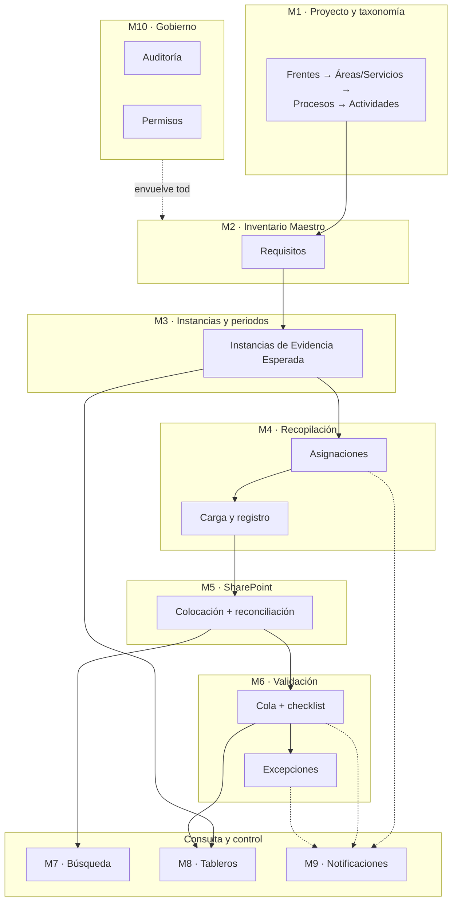
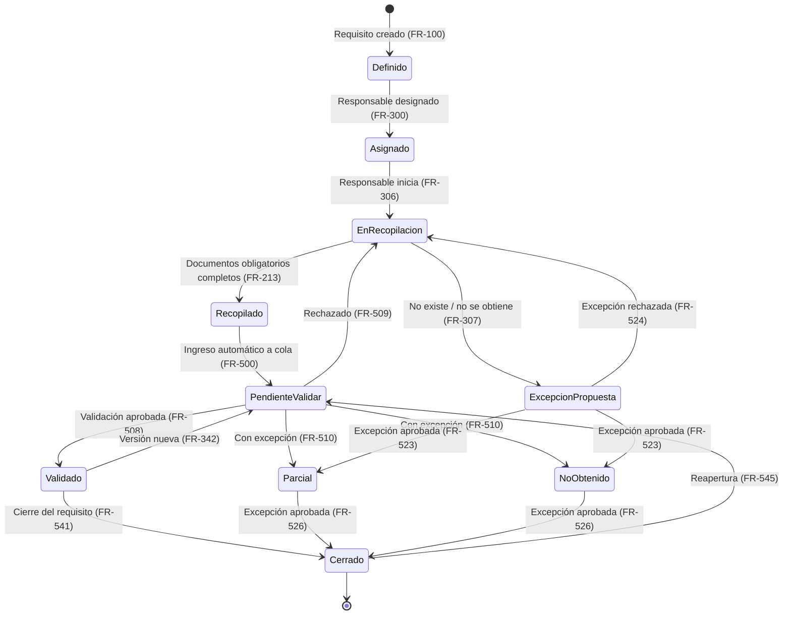
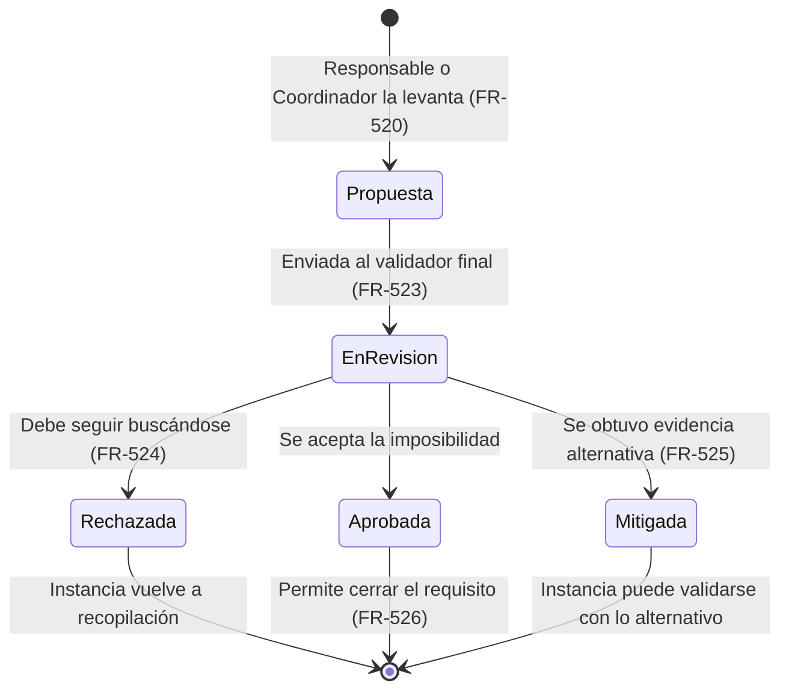

# 01 — Product Requirements Document (PRD)

**Portal de Materialidad y Expediente MSS**
Versión 1.0 · 17 de agosto de 2026 · Estado: base para backlog

> **Fuente de verdad.** Este documento es la referencia de alcance del producto. Los documentos 02 (UX/UI), 03 (Arquitectura), 04 (Modelo de Datos y API) y 05 (Pruebas) derivan de aquí y citan los identificadores `FR-###` definidos en la sección 9. Todo término usado aquí está definido en [00_GLOSARIO.md](00_GLOSARIO.md); todo supuesto no resuelto está en [DECISIONES_ABIERTAS.md](DECISIONES_ABIERTAS.md).

---

## Índice

1. [Descripción del producto](#1-descripción-del-producto)
2. [Problema de negocio](#2-problema-de-negocio)
3. [Objetivo del producto](#3-objetivo-del-producto)
4. [Contexto del proyecto](#4-contexto-del-proyecto)
5. [Usuarios y roles](#5-usuarios-y-roles)
6. [Alcance](#6-alcance)
7. [Fuera de alcance](#7-fuera-de-alcance)
8. [Módulos funcionales](#8-módulos-funcionales)
9. [Requisitos funcionales detallados](#9-requisitos-funcionales-detallados)
10. [Gestión del Inventario Maestro](#10-gestión-del-inventario-maestro)
11. [Flujo de recopilación documental](#11-flujo-de-recopilación-documental)
12. [Requisitos de integración con SharePoint](#12-requisitos-de-integración-con-sharepoint)
13. [Flujo de validación](#13-flujo-de-validación)
14. [Gestión de excepciones](#14-gestión-de-excepciones)
15. [Búsqueda y recuperación documental](#15-búsqueda-y-recuperación-documental)
16. [Tableros y analítica](#16-tableros-y-analítica)
17. [Notificaciones](#17-notificaciones)
18. [Administración y configuración](#18-administración-y-configuración)
19. [Bitácora de auditoría](#19-bitácora-de-auditoría)
20. [Seguridad y permisos](#20-seguridad-y-permisos)
21. [Requisitos no funcionales](#21-requisitos-no-funcionales)
22. [Historias de usuario](#22-historias-de-usuario)
23. [Criterios de aceptación](#23-criterios-de-aceptación)
24. [Métricas de éxito](#24-métricas-de-éxito)
25. [Supuestos clave](#25-supuestos-clave)
26. [Decisiones y preguntas abiertas](#26-decisiones-y-preguntas-abiertas)

---

## 1. Descripción del producto

El **Portal de Materialidad y Expediente MSS** es una aplicación web interna que opera el proyecto de integración y resguardo del expediente histórico de MSS antes del cierre de la compañía.

El Portal **no es un gestor documental**. Es la capa de control, workflow, metadatos y analítica que se coloca encima de SharePoint. SharePoint sigue siendo el repositorio oficial de archivos; el Portal es lo que sabe qué debe existir, qué se recibió, quién lo entregó, si fue validado, dónde quedó y cuánto falta.

Tres capacidades definen el producto:

1. **Convierte el Inventario Maestro en un sistema operable.** Deja de ser una hoja de cálculo compartida y se vuelve un universo documental estructurado, con responsables, estados y cobertura medible por periodo.
2. **Coloca cada documento en su lugar correcto de SharePoint sin que el usuario navegue carpetas.** El usuario responde "¿qué requisito estás cubriendo?" y el Portal deriva ruta, nombre y metadatos.
3. **Mide el avance real del proyecto por cobertura del universo definido**, no por cantidad de archivos subidos, y permite rastrear cualquier número del tablero hasta los registros que lo componen.

---

## 2. Problema de negocio

MSS cierra como entidad. Antes del cierre debe quedar recopilada, validada, organizada y resguardada toda su documentación histórica: contable, fiscal, legal, laboral, operativa, tecnológica y transaccional, más la evidencia de materialidad de los servicios que prestó a GM y partes relacionadas.

El Paso 0 del proyecto ya resolvió el marco conceptual: dos frentes, taxonomía, campos del Inventario Maestro, estructura de folders, estándar de nombres, criterios de cierre e indicadores. Lo que no existe es la herramienta para ejecutarlo. Sin ella, el proyecto enfrenta cinco fallas concretas:

**No se sabe qué falta.** El universo documental se define en el Paso 1, pero un requisito mensual de siete años son 84 documentos esperados. Una hoja de cálculo con un renglón por requisito no puede decir que faltan los meses de marzo a julio de 2022. La cobertura por periodo —que es la métrica que el Plan Macro exige— es imposible de mantener a mano.

**La coordinación no escala.** Once áreas del Expediente y nueve servicios de Materialidad, con equipos distintos entregando durante meses. Con una hoja compartida no hay asignación, no hay cola de trabajo, no hay seguimiento de quién debe qué, y el estado real vive en cadenas de correo.

**Los archivos terminan en el lugar equivocado.** Pedirle a cada colaborador que navegue una estructura de tres a cinco niveles y aplique una convención de nombres de cinco campos produce, previsiblemente, archivos mal ubicados y mal nombrados. Corregirlos después cuesta más que la recopilación original.

**La validación no es rastreable.** El Plan Macro define un checklist de validación (documento correcto, periodo correcto, abre, legible, ubicación correcta, formato nativo, metadatos, relación transaccional). Ejecutado en correo y comentarios de Excel, no queda evidencia de quién validó qué ni contra qué criterio. Un cierre sin esa evidencia no sostiene una revisión externa.

**El avance no es defendible.** Reportar "3,400 archivos cargados" no dice nada sobre si el universo está cubierto. Y si dirección pregunta de dónde sale un 62 %, tiene que haber forma de llegar a las instancias que lo componen.

A esto se suma una restricción operativa: **SharePoint va a recibir archivos también por fuera de la aplicación** —carga directa, sincronización de OneDrive, entregas masivas de despachos—. Un diseño que asuma que el Portal es la única puerta de entrada queda desalineado de la realidad desde el primer mes.

---

## 3. Objetivo del producto

Permitir que el proyecto de cierre de MSS termine con una afirmación verificable:

> *El universo documental definido quedó recopilado, validado, ubicado y resguardado; las excepciones están documentadas y formalmente aprobadas; y cualquier persona puede localizar y explicar la información sin depender de quienes participaron en la operación.*

Objetivos específicos:

| # | Objetivo | Se logra con |
|---|---|---|
| O-1 | Definir y mantener el universo documental completo, con granularidad de periodo | Inventario Maestro operable + generación de instancias |
| O-2 | Distribuir y dar seguimiento a la recopilación entre múltiples áreas y personas | Asignaciones, colas de trabajo, seguimiento por responsable |
| O-3 | Colocar cada documento en su ubicación canónica de SharePoint sin navegación manual | Plantillas de ruta + reglas de nombrado + integración Graph |
| O-4 | Reconocer y absorber los documentos que llegan a SharePoint por fuera del Portal | Registro de existentes + reconciliación |
| O-5 | Ejecutar y evidenciar la validación documental bajo criterio uniforme | Checklist de validación + cola + historial |
| O-6 | Medir el avance por cobertura y validación, con reconciliación hasta el registro base | Analítica sobre instancias + drill-down |
| O-7 | Localizar cualquier documento sin conocer su origen ni su ubicación histórica | Búsqueda facetada + trazabilidad transaccional |
| O-8 | Sostener el cierre ante una revisión externa | Auditoría completa + excepciones aprobadas + exportación final |

---

## 4. Contexto del proyecto

### 4.1 El proyecto de cierre

El proyecto se ejecuta en cuatro pasos. El Portal se construye durante el Paso 1 y opera durante los Pasos 2 y 3.

| Paso | Trabajo | Relación con el Portal |
|---|---|---|
| **Paso 0** — Definir el macro | Alcance, frentes, taxonomía, campos del Inventario, estructura de folders, estándares, criterios de cierre | **Concluido.** Es la fuente de la configuración semilla del Portal |
| **Paso 1** — Detallar el inventario | Convertir procesos y actividades en una lista exhaustiva de documentos a recopilar por periodo | El Portal debe **recibir** este inventario (importación masiva) y permitir que siga evolucionando |
| **Paso 2** — Recuperar y estructurar | Recopilar desde despachos, correos, sistemas, repositorios, computadoras y proveedores; nombrar y colocar | **Uso principal del Portal.** Carga, colocación, registro |
| **Paso 3** — Validar y cerrar | Validar cobertura, legibilidad, organización, trazabilidad y respaldo; documentar excepciones | Cola de validación, excepciones, cierre, exportación final |

Consecuencia de diseño: **el Portal debe ser útil antes de que el Paso 1 esté completo.** La taxonomía y el inventario se cargan de forma incremental, área por área, y la recopilación de un área puede arrancar mientras otra sigue definiéndose.

### 4.2 Los dos frentes

Definidos en [Glosario §2](00_GLOSARIO.md). El Portal los trata como un único universo bajo un solo Inventario Maestro, con reportes separables por frente.

- **Expediente MSS** — 11 áreas semilla. Pregunta: *¿podemos reconstruir y demostrar la operación histórica de MSS?*
- **Materialidad de Servicios** — 9 servicios semilla, derivados de la Matriz de Servicios existente. Pregunta: *¿podemos demostrar de forma ordenada la realidad de los servicios y operaciones soportadas por la facturación?*

### 4.3 El principio rector

Del Plan Macro: *todo elemento definido en el Inventario Maestro debe terminar recopilado, estructurado y validado. Si algún documento solo puede recuperarse parcialmente o no puede obtenerse, deberá quedar identificado como excepción y riesgo documental; no se considera una condición normal del proyecto.*

El Portal materializa esto en tres reglas de producto:

1. No existe estado terminal "no aplica" fuera del proceso de excepción. Lo que no se obtuvo es una excepción con causa, impacto y tratamiento.
2. Una excepción sin aprobación formal impide el cierre del requisito que la contiene, y por rollup el del área y el del frente.
3. El tablero muestra las excepciones abiertas con la misma prominencia que el porcentaje de avance.

---

## 5. Usuarios y roles

Cinco roles. Definidos en [Glosario §4.6](00_GLOSARIO.md); aquí se detalla su relación con el producto.

### 5.1 Administrador / Dueño del Proyecto (`admin`)

**Quién es.** El líder del proyecto de cierre y su equipo cercano. Dos o tres personas.

**Qué necesita.** Ver el estado global del proyecto en un vistazo. Configurar la taxonomía conforme el Paso 1 la va produciendo. Importar el inventario desde Excel. Nombrar coordinadores y validadores. Saber dónde está atorado el proyecto y por qué.

**Cómo mide su éxito.** Porcentaje de cobertura y validación global; número de áreas cerradas; número de excepciones abiertas.

### 5.2 Coordinador de Área (`area_coordinator`)

**Quién es.** El responsable operativo de un área del Expediente o de un servicio de Materialidad. Entre 15 y 20 personas.

**Qué necesita.** Mantener el inventario de su área conforme lo va detallando. Asignar requisitos a las personas que tienen la información. Ver quién va tarde. **Proponer** una excepción cuando algo no aparece — resuelto en `DA-009`, el Coordinador propone pero no aprueba: la aprobación de toda excepción, sin importar su impacto, es exclusiva del validador final (§5.4).

**Cómo mide su éxito.** Cobertura de su área; requisitos sin asignar; pendientes vencidos de su equipo.

> Este rol no venía en el planteamiento original. Se agrega porque 20 áreas y servicios con un solo `admin` haciendo toda la asignación y el mantenimiento del inventario es un cuello de botella desde el primer mes.

### 5.3 Responsable / Colaborador (`contributor`)

**Quién es.** Quien tiene o puede conseguir la información: contadores, analistas de nómina, tesorería, RH, IT, backoffice. El grupo más numeroso, entre 40 y 80 personas, con uso intermitente.

**Qué necesita.** Una lista clara de lo que le toca entregar, con periodos concretos. Cargar archivos sin pensar en carpetas ni en nombres. Saber qué le rechazaron y por qué. Decir "esto no existe" cuando efectivamente no existe.

**Cómo mide su éxito.** Su lista de pendientes vacía.

**Restricción de diseño.** Es el rol con menor tolerancia a la fricción. Usa el Portal pocas horas al mes y no va a leer un manual. Si cargar un documento toma más de un minuto o exige entender la taxonomía, la información se va a seguir entregando por correo.

### 5.4 Validador / Revisor (`validator`)

Resuelto en `DA-003`, el rol se divide en dos ámbitos con responsabilidades distintas — mismo `role_code`, distinto `scope_type`.

**Validador de área** (`scope_type = 'area'`)
**Quién es.** Revisor designado por cada área o servicio. Entre 15 y 20 personas.
**Qué necesita.** Una cola priorizada de su área. Ver el documento y los metadatos de la instancia sin cambiar de aplicación. Ejecutar el checklist rápido. Validar, rechazar con motivo, o marcar Parcial / No obtenido — lo que genera una excepción **propuesta**, no aprobada por él.
**Cómo mide su éxito.** Cola vacía; tiempo promedio de validación; tasa de rechazo.
**Restricción de diseño.** El volumen es alto: decenas de miles de instancias. La pantalla de validación debe permitir despachar una instancia en menos de un minuto, con atajos de teclado y avance automático a la siguiente.

**Validador final** (`scope_type = 'project'`)
**Quién es.** El Dueño del Proyecto y una segunda persona que designe. Exactamente estas dos, no un equipo central de validación.
**Qué necesita.** No revisa documentos individuales de forma rutinaria — esa carga la absorben los validadores de área. Su trabajo son tres cosas: (1) dar el visto bueno de cierre de requisitos, áreas y del proyecto completo; (2) resolver **toda** excepción, sin importar su impacto (`FR-523`, `DA-009`); (3) revisar casos críticos puntuales cuando algo les preocupe, fuera del flujo normal.
**Cómo mide su éxito.** Excepciones pendientes de resolución; áreas listas para cerrar.

### 5.5 Consulta / Dirección (`viewer`)

**Quién es.** Dirección, socios, auditores internos, asesores externos con acceso limitado.

**Qué necesita.** El estado del proyecto sin detalle operativo. Poder preguntar "¿por qué Fiscal va en 40 %?" y llegar a la respuesta. Localizar un documento concreto cuando surge una consulta.

**Restricción de diseño.** Nunca ve controles que no puede usar. Su acceso al contenido está limitado por clasificación de sensibilidad.

### 5.6 Combinación de roles

Los roles no son excluyentes ni globales. Un usuario puede ser `contributor` en Nómina y `validator` en Tesorería. Los permisos efectivos son la unión de sus asignaciones de rol por ámbito (proyecto, frente, área o servicio).

---

## 6. Alcance

### En alcance para la versión 1

**Configuración del universo**
- Taxonomía configurable de frentes, áreas/servicios, procesos/subservicios y actividades.
- Inventario Maestro con los 18 campos del Plan Macro más campos de extensión definidos por administrador.
- Importación masiva desde Excel, con validación por renglón.
- Generación automática de instancias esperadas a partir de periodicidad y rango.
- Bases de cálculo para periodicidades no enumerables.

**Recopilación**
- Asignación de requisitos e instancias a responsables, con fecha objetivo.
- Carga de documentos contra instancias, con propuesta automática de ruta y nombre.
- Registro de documentos que ya existen en SharePoint.
- Vinculación de un documento a varias instancias sin duplicar el archivo.
- Detección de duplicados por hash.
- Versionado de documentos.
- Captura de referencias transaccionales (factura, pago, proveedor, empleado, cliente, proyecto).

**SharePoint**
- Colocación automática vía Microsoft Graph, con creación de carpetas bajo demanda.
- Retención de identificadores (`site_id`, `drive_id`, `item_id`, `etag`, ruta, URL, hash).
- Reconciliación periódica: archivos huérfanos y enlaces rotos.
- Reintentos con retroceso exponencial y cola de fallidos.

**Validación y cierre**
- Cola de validación filtrable por ámbito.
- Checklist de validación configurable.
- Validar / Rechazar / Parcial / No obtenido, con comentarios.
- Gestión de excepciones con flujo de aprobación por impacto.
- Cierre de requisito, área/servicio, frente y proyecto con verificación de criterios.

**Consulta y control**
- Búsqueda facetada por los 14 criterios del Plan Macro.
- Acceso directo al documento en SharePoint respetando permisos.
- Tableros de proyecto, frente, área/servicio, proceso, periodo y responsable.
- Drill-down desde cualquier indicador hasta los registros base.
- Notificaciones para los siete eventos accionables.
- Bitácora de auditoría completa.
- Exportación del Inventario Maestro, del registro de excepciones y del mapa de ubicaciones.

### En alcance para fases posteriores (diseñado, no construido)

- Acceso de colaboradores externos vía enlaces de carga (`DA-010`).
- Extracción de adjuntos de correos como documentos independientes (`DA-012`).
- Sincronización bidireccional de permisos con SharePoint (`DA-005`, opción C).
- OCR y extracción automática de metadatos del contenido de los documentos.
- Modo archivo de solo lectura para la vida del Portal después del cierre (`DA-006`).

---

## 7. Fuera de alcance

| No se construye | Por qué | Qué se hace en su lugar |
|---|---|---|
| Visor/editor de documentos propio | SharePoint y Office Online ya lo hacen mejor y respetan sus permisos | Vista previa embebida cuando es posible; enlace directo siempre |
| Almacenamiento de archivos en la base de datos | Rompe la frontera de [Glosario §1.6](00_GLOSARIO.md) | Solo referencias a SharePoint |
| Reemplazo del versionado nativo de SharePoint | Duplicar el historial de versiones crea dos verdades | El Portal registra sus versiones lógicas y apunta al historial nativo |
| Firma electrónica de documentos | No es requisito del proyecto de cierre | — |
| Flujo de aprobación de gasto o contable | El Portal resguarda evidencia, no opera procesos de negocio | — |
| Migración masiva automática desde despachos | Requiere acuerdos y formatos que no existen todavía | Importación de inventario + registro de existentes + reconciliación |
| Retención legal y disposición automática | Es política corporativa, no funcionalidad del Portal | El Portal registra la clasificación; la política la aplica Sistemas |
| Aplicación móvil nativa | El trabajo real es sobre tablas densas en escritorio | Web responsiva; móvil para consulta y aprobación ligera |
| Sistema de mensajería interna | Duplica Teams y correo | Comentarios en la instancia y notificaciones por correo |
| Traducción de contenido documental | — | — |

---

## 8. Módulos funcionales

| # | Módulo | Rango `FR-` | Qué resuelve |
|---|---|---|---|
| M1 | Proyecto y taxonomía | `FR-001`–`FR-099` | La estructura configurable del universo |
| M2 | Inventario Maestro y requisitos | `FR-100`–`FR-199` | Qué debe recopilarse |
| M3 | Instancias y periodos | `FR-200`–`FR-299` | Cuántas veces y para qué periodos |
| M4 | Recopilación, asignación y carga | `FR-300`–`FR-399` | Quién entrega y cómo |
| M5 | Integración con SharePoint | `FR-400`–`FR-499` | Dónde queda el archivo |
| M6 | Validación y excepciones | `FR-500`–`FR-599` | Si sirve y qué hacer si no |
| M7 | Búsqueda y trazabilidad | `FR-600`–`FR-699` | Cómo se encuentra después |
| M8 | Analítica y tableros | `FR-700`–`FR-799` | Cuánto falta |
| M9 | Notificaciones | `FR-800`–`FR-899` | Quién se entera de qué |
| M10 | Administración, auditoría y seguridad | `FR-900`–`FR-999` | Quién puede qué y quién hizo qué |

### Diagrama de módulos



---

## 9. Requisitos funcionales detallados

Convenciones: **Debe** = obligatorio para la versión 1. **Debería** = deseable, negociable si compromete el calendario. **Podrá** = fase posterior.

---

### M1 — Proyecto y taxonomía (`FR-001`–`FR-099`)

| ID | Requisito | Prioridad |
|---|---|---|
| `FR-001` | El sistema debe soportar un Proyecto como contenedor raíz, con nombre, descripción, fecha objetivo de cierre y estado (`activo`, `en cierre`, `cerrado`, `archivado`). | Debe |
| `FR-002` | El sistema debe soportar exactamente dos Frentes por proyecto: Expediente MSS y Materialidad de Servicios, no eliminables ni ampliables por el usuario. | Debe |
| `FR-003` | El sistema debe permitir crear, editar, reordenar y desactivar Áreas/Servicios dentro de un frente, sin cambios de código. | Debe |
| `FR-004` | El sistema debe permitir crear, editar, reordenar y desactivar Procesos/Subservicios dentro de un área/servicio. | Debe |
| `FR-005` | El sistema debe permitir crear, editar, reordenar y desactivar Actividades/Transacciones dentro de un proceso. | Debe |
| `FR-006` | Cada nodo de la taxonomía debe tener: código, nombre, descripción, orden de despliegue, estado activo/inactivo y segmento de carpeta asociado. | Debe |
| `FR-007` | El sistema debe impedir eliminar un nodo de taxonomía que tenga requisitos asociados; solo permite desactivarlo. Un nodo inactivo no admite requisitos nuevos pero conserva los existentes visibles. | Debe |
| `FR-008` | El sistema debe permitir mover un Proceso o una Actividad a otro padre, recalculando las rutas canónicas de los requisitos afectados y registrando la desviación de ubicación de los documentos ya colocados, sin moverlos automáticamente. | Debe |
| `FR-009` | El sistema debe cargar los catálogos semilla del Plan Macro en el despliegue inicial: 2 frentes, 11 áreas, 9 servicios con sus subservicios, tipos de información, periodicidades, clasificaciones de sensibilidad y papeles de documento. | Debe |
| `FR-010` | El sistema debe permitir definir un rango de periodo predeterminado por área/servicio, que los requisitos heredan y pueden sobrescribir (ver `DA-004`). | Debe |
| `FR-011` | El sistema debe permitir asignar una clasificación de sensibilidad predeterminada por área/servicio, heredable y sobrescribible a nivel de requisito. | Debe |
| `FR-012` | El sistema debe permitir importar la taxonomía completa desde Excel, con validación de jerarquía y reporte de errores por renglón. | Debe |
| `FR-013` | El sistema debe exportar la taxonomía vigente a Excel. | Debe |
| `FR-014` | El sistema debería permitir clonar la estructura de procesos y actividades de un área a otra como punto de partida. | Debería |
| `FR-015` | Todo cambio en la taxonomía debe generar un evento de auditoría con usuario, marca de tiempo, valor anterior y valor nuevo. | Debe |

---

### M2 — Inventario Maestro y requisitos (`FR-100`–`FR-199`)

#### Definición del requisito

| ID | Requisito | Prioridad |
|---|---|---|
| `FR-100` | El sistema debe permitir crear un Requisito asociado obligatoriamente a una Actividad, que a su vez determina proceso, área/servicio y frente. | Debe |
| `FR-101` | Cada Requisito debe tener un identificador único legible y estable, con formato `{FRENTE}-{AREA}-{PROCESO}-{consecutivo}` (p. ej. `EXP-04-TES-0017`), que no cambia aunque el requisito se edite o se mueva. | Debe |
| `FR-102` | El sistema debe capturar los campos del Inventario Maestro definidos en el Plan Macro: frente, área/servicio, proceso/subservicio, actividad/transacción, documento/evidencia requerida, tipo de información, periodo requerido, periodicidad, responsable de entrega, referencias relacionadas, estatus de recopilación, estatus de validación, ubicación final, excepción/riesgo, observaciones. Los campos "entregado por" y "fecha de entrega" se registran a nivel de instancia, no de requisito. | Debe |
| `FR-103` | El sistema debe permitir describir el requisito en lenguaje natural (qué documento se necesita y para qué), como campo obligatorio distinto del nombre corto. | Debe |
| `FR-104` | El sistema debe permitir declarar qué documentos componen una instancia completa, con papel y obligatoriedad de cada uno (p. ej. contrato *obligatorio*, factura *obligatorio*, entregable *opcional*). | Debe |
| `FR-105` | El sistema debe permitir declarar si el requisito exige conservación en formato nativo y cuáles extensiones son aceptables. | Debe |
| `FR-106` | El sistema debe permitir marcar un requisito como crítico, lo que eleva su prioridad en colas y tableros. | Debería |
| `FR-107` | El sistema debe permitir definir campos de extensión a nivel de proyecto (texto, número, fecha, lista, booleano) disponibles en todos los requisitos, sin cambios de código. | Debe |
| `FR-108` | El sistema debe permitir marcar un campo de extensión como obligatorio para un área/servicio específico. | Debería |

#### Periodo y periodicidad

| ID | Requisito | Prioridad |
|---|---|---|
| `FR-110` | El sistema debe permitir seleccionar la periodicidad del requisito entre las diez definidas en [Glosario §1.3](00_GLOSARIO.md). | Debe |
| `FR-111` | Para periodicidades enumerables el sistema debe exigir un rango de periodo (inicio y fin) y validar que el fin no sea anterior al inicio. | Debe |
| `FR-112` | Para periodicidades no enumerables el sistema debe operar por defecto con marcado manual progresivo (`progressive`, resuelto en `DA-001`): sin número declarado al crear el requisito, con instancias que se agregan y se marcan manualmente como recopiladas conforme llegan documentos. | Debe |
| `FR-113` | Todo requisito con base `progressive` debe llevar una bandera de enumeración (`enumeration_status`: `open`/`closed`). Mientras esté `open`, el requisito se excluye del cálculo de porcentaje de cobertura y se reporta aparte como indicador de volumen ("N instancias marcadas, enumeración en progreso"). | Debe |
| `FR-113b` | El sistema debe permitir al responsable **cerrar la enumeración** de un requisito `progressive` de forma explícita. Al cerrarla, el conteo de instancias marcadas hasta ese momento se congela como el denominador final del requisito, que a partir de ahí participa en el % de cobertura como cualquier otro. Reabrir la enumeración es una acción explícita y auditable. | Debe |
| `FR-114` | El sistema debe permitir, como alternativa a `progressive`, la base `driver_list`: cargar un padrón real (empleados, proveedores, facturas) desde Excel o CSV, con al menos un identificador y una etiqueta por renglón, y generar una instancia por renglón desde el inicio. | Debe |
| `FR-115` | Mientras un requisito `progressive` tenga `enumeration_status = 'open'`, el sistema debe excluirlo del cálculo de porcentaje de cobertura del proyecto y reportarlo por separado. | Debe |
| `FR-116` | El sistema debe advertir al usuario, antes de guardar, cuántas instancias va a generar el requisito, y pedir confirmación explícita cuando supere un umbral configurable (predeterminado 200). | Debe |

#### Operación del inventario

| ID | Requisito | Prioridad |
|---|---|---|
| `FR-120` | El sistema debe presentar el Inventario Maestro como una tabla filtrable, ordenable y paginada, con selección de columnas visibles y densidad ajustable. | Debe |
| `FR-121` | El sistema debe permitir filtrar el inventario por frente, área/servicio, proceso, actividad, tipo de información, periodicidad, responsable, estatus derivado, sensibilidad, criticidad y texto libre. | Debe |
| `FR-122` | El sistema debe mostrar por cada requisito su avance derivado: instancias esperadas, recopiladas, validadas, con excepción, y porcentaje de cobertura y validación. | Debe |
| `FR-123` | El sistema debe permitir edición en lote de campos no estructurales (responsable, fecha objetivo, criticidad, observaciones, sensibilidad) sobre una selección de requisitos. | Debe |
| `FR-124` | El sistema debe permitir duplicar un requisito como base para uno nuevo. | Debería |
| `FR-125` | El sistema debe impedir eliminar un requisito que tenga instancias con documentos vinculados, validaciones o excepciones; en su lugar permite darlo de baja con motivo obligatorio, conservando su historial. | Debe |
| `FR-126` | El sistema debe registrar el historial completo de cambios de cada requisito, consultable desde su ficha. | Debe |
| `FR-127` | El sistema debe permitir agregar comentarios con hilo a un requisito, visibles para todos los usuarios con acceso a él. | Debe |

#### Importación y exportación

| ID | Requisito | Prioridad |
|---|---|---|
| `FR-130` | El sistema debe permitir importar requisitos masivamente desde Excel, usando una plantilla descargable que refleje los campos del Inventario Maestro. | Debe |
| `FR-131` | La importación debe validar cada renglón antes de aplicar nada: existencia del nodo de taxonomía, periodicidad válida, rango coherente, base de cálculo presente cuando aplica, responsable existente. | Debe |
| `FR-132` | La importación debe presentar una vista previa con el conteo de renglones válidos, con error y con advertencia, y el total de instancias que se generarían, antes de confirmar. | Debe |
| `FR-133` | La importación debe ser transaccional: o se aplican todos los renglones válidos, o ninguno, a elección explícita del usuario. No debe dejar importaciones a medias. | Debe |
| `FR-134` | La importación debe generar un archivo de resultados descargable con el estatus de cada renglón y el motivo de cada rechazo. | Debe |
| `FR-135` | El sistema debe permitir reimportar para **actualizar** requisitos existentes, identificándolos por su identificador legible, sin duplicarlos ni destruir instancias existentes. | Debe |
| `FR-136` | El sistema debe exportar el Inventario Maestro completo a Excel, con los campos de definición, los estatus derivados, los conteos de cobertura y las ubicaciones finales. | Debe |
| `FR-137` | La exportación debe poder ejecutarse sobre el resultado de un filtro, no solo sobre el inventario completo. | Debe |
| `FR-138` | El sistema debe permitir exportar el inventario a nivel de instancia (un renglón por instancia esperada), no solo a nivel de requisito. | Debe |

---

### M3 — Instancias y periodos (`FR-200`–`FR-299`)

| ID | Requisito | Prioridad |
|---|---|---|
| `FR-200` | El sistema debe generar automáticamente las Instancias de Evidencia Esperada de un requisito al crearlo o activarlo, según su periodicidad y su rango o base de cálculo. | Debe |
| `FR-201` | Cada instancia debe llevar: requisito padre, etiqueta de periodo, fecha de inicio y fin del periodo, driver asociado si aplica, estatus de recopilación, estatus de validación, responsable efectivo, fecha objetivo y marca de fuera de alcance. | Debe |
| `FR-202` | La etiqueta de periodo debe ser legible y ordenable: `2021-03` para mensual, `2021-Q2` para trimestral, `2021` para anual, `2020-01–2026-12` para rango, `Permanente` para único, y la etiqueta del driver para instancias por padrón. | Debe |
| `FR-203` | El sistema debe recalcular las instancias cuando cambie el rango de periodo o la periodicidad de un requisito. | Debe |
| `FR-204` | Al recalcular, el sistema **nunca** debe eliminar instancias que tengan documentos vinculados, validaciones, excepciones o historial. Las que salen del nuevo alcance se marcan `fuera de alcance` con motivo, se excluyen del denominador y permanecen visibles y auditables (ver `DA-011`). | Debe |
| `FR-205` | Antes de aplicar un recálculo, el sistema debe mostrar el efecto: cuántas instancias se crean, cuántas salen de alcance, y cómo cambia el porcentaje del requisito. Requiere confirmación explícita. | Debe |
| `FR-206` | El sistema debe permitir agregar manualmente una instancia a un requisito, con motivo obligatorio, para cubrir casos que la generación automática no anticipa. | Debe |
| `FR-207` | El sistema debe permitir marcar una instancia individual como fuera de alcance, con motivo obligatorio, excluyéndola del denominador sin borrarla. | Debe |
| `FR-208` | Para requisitos sin denominador, el sistema debe crear instancias conforme se registran documentos, permitiendo al usuario declarar el periodo de cada una. | Debe |
| `FR-209` | El sistema debe presentar las instancias de un requisito en una vista de cobertura por periodo (rejilla año × mes para mensuales, lista para las demás), con el estatus visible por celda. | Debe |
| `FR-210` | La vista de cobertura debe distinguir visualmente: no iniciada, en recopilación, recopilada, validada, parcial, no obtenida, fuera de alcance y vencida. | Debe |
| `FR-211` | El sistema debe permitir seleccionar varias instancias en la vista de cobertura y aplicarles acciones en lote: asignar responsable, fijar fecha objetivo, cargar un mismo documento contra todas, marcar fuera de alcance. | Debe |
| `FR-212` | El sistema debe calcular y exponer, por requisito, el conjunto de periodos faltantes como lista legible (p. ej. "faltan 2022-03 a 2022-07 y 2024-11"). | Debe |
| `FR-213` | El estatus de recopilación de una instancia debe derivarse de los documentos vinculados y de la composición declarada en `FR-104`: recopilada solo cuando todos los documentos obligatorios están presentes. | Debe |
| `FR-214` | El sistema debe permitir forzar el estatus de recopilación de una instancia a *Recopilado* con justificación, cuando la composición declarada no aplique a ese periodo concreto. La acción queda en auditoría. | Debería |
| `FR-215` | El sistema debe marcar una instancia como vencida cuando su fecha objetivo pasó y su recopilación no está completa. | Debe |

---

### M4 — Recopilación, asignación y carga (`FR-300`–`FR-399`)

#### Asignación

| ID | Requisito | Prioridad |
|---|---|---|
| `FR-300` | El sistema debe permitir asignar un responsable de entrega a un requisito, que se propaga a todas sus instancias como responsable efectivo. | Debe |
| `FR-301` | El sistema debe permitir asignar un responsable distinto a instancias individuales o a un subconjunto de periodos, sobrescribiendo el del requisito. | Debe |
| `FR-302` | El sistema debe permitir asignar una fecha objetivo a nivel de requisito o de instancia. | Debe |
| `FR-303` | El sistema debe permitir asignación en lote sobre el resultado de un filtro del inventario. | Debe |
| `FR-304` | El sistema debe permitir que un responsable reasigne o delegue una instancia a otro usuario, con motivo, notificando a ambos y al coordinador del área. | Debe |
| `FR-305` | El sistema debe mostrar a cada usuario su lista de trabajo: instancias asignadas, agrupables por área, requisito, periodo o fecha objetivo, con los vencidos destacados. | Debe |
| `FR-306` | El sistema debe permitir que un responsable marque una instancia como *En recopilación* con una nota de avance y una fecha estimada, sin haber cargado nada aún. | Debe |
| `FR-307` | El sistema debe permitir que un responsable declare que un documento no existe o no puede obtenerse, lo que genera una propuesta de excepción dirigida a su coordinador; el responsable no puede fijar por sí mismo el estatus *No obtenido*. | Debe |

#### Carga de documentos (camino A)

| ID | Requisito | Prioridad |
|---|---|---|
| `FR-310` | El sistema debe permitir cargar uno o varios archivos contra una instancia seleccionada, indicando el papel de cada uno según `FR-104`. | Debe |
| `FR-311` | Antes de la carga, el sistema debe mostrar la ruta de SharePoint destino y el nombre de archivo propuesto, ambos derivados de la plantilla de ruta y la regla de nombrado aplicables. | Debe |
| `FR-312` | El sistema debe permitir editar el nombre propuesto dentro de las restricciones del patrón vigente, y rechazar nombres que no lo cumplan (ver `DA-008`). | Debe |
| `FR-313` | El sistema debe conservar siempre el nombre original del archivo como metadato, sin excepción y sin posibilidad de suprimirlo. | Debe |
| `FR-314` | El sistema debe calcular un hash del contenido de cada archivo cargado y usarlo para detectar duplicados. | Debe |
| `FR-315` | Al detectar que el archivo ya existe en el sistema (por hash), el sistema debe ofrecer dos opciones, sin exigir motivo en ninguna: vincular el documento existente a esta instancia sin volver a subirlo, o cargar de todas formas como copia adicional. El sistema **no** obliga a elegir una sola copia maestra (`DA-002`); ambas quedan registradas como documentos válidos. | Debe |
| `FR-315b` | Cuando dos o más documentos activos comparten el mismo hash de contenido, el sistema debe marcarlos entre sí como "contenido duplicado — también existe en: [rutas]", visible en la ficha de cada uno, sin bloquear ni exigir consolidación. | Debe |
| `FR-316` | El sistema debe soportar archivos de al menos 250 MB, con carga por partes, indicador de progreso y capacidad de reanudar tras una interrupción de red. | Debe |
| `FR-317` | El sistema debe permitir cancelar una carga en curso sin dejar archivos parciales en SharePoint ni registros huérfanos en la base de datos. | Debe |
| `FR-318` | El sistema debe permitir cargar un archivo comprimido y registrarlo como un único documento, sin descomprimirlo automáticamente. | Debe |
| `FR-319` | El sistema debe rechazar extensiones no permitidas según una lista negra configurable (ejecutables, scripts) y advertir —sin bloquear— cuando la extensión no corresponde a las esperadas para el tipo de información del requisito. | Debe |
| `FR-320` | El sistema debe permitir cargar un mismo archivo contra varias instancias en una sola operación, creando **un** documento y N vínculos. | Debe |
| `FR-321` | El sistema debe capturar, en el momento de la carga, los metadatos requeridos por el requisito, incluidos los campos de extensión obligatorios, y bloquear el envío si falta alguno. | Debe |
| `FR-322` | Para archivos `.msg` y `.eml`, el sistema debe extraer y almacenar remitente, destinatarios, fecha, asunto y nombres de adjuntos como metadatos buscables, conservando el archivo íntegro (ver `DA-012`). | Debe |

#### Registro de documentos existentes (camino B)

| ID | Requisito | Prioridad |
|---|---|---|
| `FR-330` | El sistema debe permitir registrar contra una instancia un documento que ya existe en SharePoint, sin volver a cargarlo. | Debe |
| `FR-331` | El registro debe admitir la selección del archivo mediante un explorador del sitio dentro del Portal, o pegando su URL o ruta. | Debe |
| `FR-332` | Al registrar, el sistema debe capturar los mismos identificadores que en la carga (`site_id`, `drive_id`, `item_id`, `etag`, ruta, URL) y calcular el hash cuando el tamaño lo permita. | Debe |
| `FR-333` | El sistema debe calcular la ruta canónica que le correspondería y registrar si hay desviación de ubicación, sin mover el archivo y sin bloquear el registro (ver `DA-002`). | Debe |
| `FR-334` | El sistema debe conservar el nombre existente del archivo, calcular el nombre canónico y registrar la desviación de nombre si la hay. | Debe |
| `FR-335` | El sistema debe ofrecer una acción explícita de *normalizar ubicación* —individual y en lote— que mueve el archivo a su ruta canónica y actualiza los identificadores. | Debe |
| `FR-336` | El sistema debe ofrecer una acción explícita de *normalizar nombre* con el mismo comportamiento. | Debería |
| `FR-337` | El sistema debe detectar si el archivo registrado ya está vinculado a otra instancia y, en ese caso, agregar el vínculo en lugar de crear un documento nuevo. | Debe |

#### Versiones y correcciones

| ID | Requisito | Prioridad |
|---|---|---|
| `FR-340` | El sistema debe permitir cargar una versión nueva de un documento existente, incrementando su versión lógica y conservando la anterior accesible. | Debe |
| `FR-341` | Una versión nueva debe conservar todos los vínculos a instancias de la versión previa, sin requerir revinculación manual. | Debe |
| `FR-342` | Cuando un documento validado recibe una versión nueva, todas las instancias vinculadas deben volver a *Pendiente de validar*, notificando a sus validadores. | Debe |
| `FR-343` | El sistema debe exigir un motivo al cargar una versión nueva. | Debe |
| `FR-344` | El sistema debe permitir desvincular un documento de una instancia sin eliminar el documento ni sus otros vínculos, con motivo obligatorio. | Debe |
| `FR-345` | El sistema debe permitir marcar un documento como reemplazado o retirado, con motivo, conservándolo en SharePoint y visible en el historial. | Debe |
| `FR-346` | El sistema **no** debe permitir la eliminación de documentos desde el Portal. La eliminación en SharePoint la ejecuta un administrador de la plataforma y el Portal la detecta como enlace roto. | Debe |

#### Referencias transaccionales

| ID | Requisito | Prioridad |
|---|---|---|
| `FR-350` | El sistema debe permitir asociar a una instancia o a un documento referencias tipadas: factura, pago, proveedor, empleado, cliente, proyecto, contrato, póliza u otro. | Debe |
| `FR-351` | Cada referencia debe tener tipo, identificador, etiqueta descriptiva y campos opcionales de fecha y monto. | Debe |
| `FR-352` | El sistema debe permitir declarar referencias obligatorias por requisito, bloqueando la carga si faltan. | Debe |
| `FR-353` | El sistema debe permitir navegar desde una referencia a todas las instancias y documentos que la mencionan (p. ej. desde una factura a todo su soporte). | Debe |
| `FR-354` | El sistema debería permitir cargar catálogos de referencias (proveedores, empleados, facturas) para autocompletado y validación. | Debería |

---

### M5 — Integración con SharePoint (`FR-400`–`FR-499`)

| ID | Requisito | Prioridad |
|---|---|---|
| `FR-400` | El sistema debe integrarse con SharePoint Online mediante Microsoft Graph para creación de carpetas, carga de archivos, lectura de metadatos y consulta de contenido. | Debe |
| `FR-401` | El sistema debe determinar la carpeta destino de cada carga a partir de los metadatos de la instancia y la plantilla de ruta aplicable, sin requerir navegación manual del usuario. | Debe |
| `FR-402` | El sistema debe crear las carpetas faltantes de la ruta destino en el momento de la carga, si tiene permiso. Las carpetas no se pre-crean vacías. | Debe |
| `FR-403` | El sistema debe registrar de cada documento: `site_id`, `drive_id`, `item_id`, `etag`, `ctag`, ruta relativa al drive, URL web, tamaño, tipo MIME y hash de contenido. | Debe |
| `FR-404` | El sistema debe usar el `item_id` como referencia estable del archivo. La ruta se trata como informativa y se refresca al detectar cambios. | Debe |
| `FR-405` | El sistema debe usar sesiones de carga por partes para archivos grandes, con reanudación tras interrupción. | Debe |
| `FR-406` | El sistema debe ser idempotente ante reintentos: un reintento de una carga que ya se completó no debe producir un archivo duplicado en SharePoint. | Debe |
| `FR-407` | El sistema debe manejar la limitación de tasa de Graph respetando el encabezado `Retry-After`, con retroceso exponencial y aleatorización. | Debe |
| `FR-408` | El sistema debe mantener una cola de operaciones fallidas, visible para administradores, con el error, el número de intentos y una acción de reintento manual. | Debe |
| `FR-409` | El sistema debe notificar al usuario cuando una carga que él inició falla definitivamente, con un mensaje comprensible y la acción sugerida. | Debe |
| `FR-410` | El sistema debe detectar conflictos de nombre en el destino y resolverlos según la política configurada: sufijo consecutivo, versión nueva del documento existente, o rechazo con aviso. | Debe |
| `FR-411` | El sistema debe conservar el archivo en su formato original, sin conversión, compresión ni alteración de ningún tipo. | Debe |
| `FR-412` | El sistema debe ofrecer un enlace directo al documento en SharePoint que respete los permisos del usuario que hace clic; el Portal no otorga acceso al contenido por sí mismo. | Debe |
| `FR-413` | El sistema debe mostrar vista previa embebida del documento cuando SharePoint la soporte, respetando permisos. | Debería |

#### Reconciliación (camino C)

| ID | Requisito | Prioridad |
|---|---|---|
| `FR-420` | El sistema debe ejecutar periódicamente un proceso de reconciliación que recorra el sitio de SharePoint y compare su contenido contra los documentos registrados. | Debe |
| `FR-421` | La reconciliación debe identificar **archivos huérfanos**: archivos presentes en el sitio que ningún documento del Portal referencia. | Debe |
| `FR-422` | La reconciliación debe identificar **enlaces rotos**: documentos registrados cuyo `item_id` ya no existe o es inaccesible. | Debe |
| `FR-423` | La reconciliación debe detectar **movimientos**: documentos cuyo `item_id` existe pero cuya ruta cambió, actualizando la ruta y marcando la desviación respecto de la canónica. | Debe |
| `FR-424` | La reconciliación debe detectar **modificaciones externas**: documentos cuyo `etag` cambió sin que el Portal generara una versión, marcando la instancia vinculada para revalidación. | Debe |
| `FR-425` | El sistema debe presentar los archivos huérfanos como una cola de trabajo, con acciones: vincular a una instancia existente, crear un requisito nuevo a partir de él, marcar como no relevante con motivo, o escalar. | Debe |
| `FR-426` | El sistema debe presentar los enlaces rotos como una cola de trabajo, con acciones: buscar el archivo movido, marcar como eliminado y reabrir la instancia, o registrar excepción. | Debe |
| `FR-427` | La reconciliación debe ser incremental, usando el mecanismo de cambios de Graph cuando esté disponible, y debe poder ejecutarse completa a demanda por un administrador. | Debe |
| `FR-428` | La reconciliación debe producir un reporte de cada corrida: archivos revisados, huérfanos nuevos, enlaces rotos nuevos, movimientos y modificaciones, con marca de tiempo y duración. | Debe |
| `FR-429` | El sistema debe permitir excluir rutas de la reconciliación (p. ej. carpetas de trabajo temporal) mediante patrones configurables. | Debería |

#### Plantillas y reglas

| ID | Requisito | Prioridad |
|---|---|---|
| `FR-440` | El sistema debe permitir definir plantillas de ruta con los tokens especificados en [Glosario §5.2](00_GLOSARIO.md). | Debe |
| `FR-441` | Las plantillas deben poder definirse a nivel de frente, área/servicio, proceso o requisito, resolviéndose por el nivel más específico disponible. | Debe |
| `FR-442` | El sistema debe validar una plantilla al guardarla y mostrar una vista previa de la ruta resultante con datos de ejemplo. | Debe |
| `FR-443` | El sistema debe normalizar rutas y nombres: sin acentos, sin caracteres inválidos de SharePoint, espacios a guion bajo, y longitud total de ruta dentro del límite de la plataforma. | Debe |
| `FR-444` | El sistema debe advertir cuando una ruta resuelta se aproxime al límite de longitud de SharePoint y proponer una abreviación. | Debe |
| `FR-445` | El sistema debe permitir definir reglas de nombrado con la misma lógica de herencia, siguiendo el patrón del Plan Macro. | Debe |
| `FR-446` | El sistema debe omitir los tokens sin valor junto con su separador, sin producir carpetas vacías ni separadores duplicados. | Debe |
| `FR-447` | El sistema debe permitir simular en masa el resultado de una plantilla sobre un conjunto de requisitos antes de aplicarla. | Debería |

---

### M6 — Validación y excepciones (`FR-500`–`FR-599`)

#### Cola y proceso de validación

| ID | Requisito | Prioridad |
|---|---|---|
| `FR-500` | El sistema debe colocar automáticamente en la cola de validación toda instancia que alcance el estatus *Recopilado*. | Debe |
| `FR-501` | La cola debe filtrarse por frente, área/servicio, proceso, responsable, periodo, criticidad, antigüedad y tipo de información. | Debe |
| `FR-502` | La cola debe ordenarse de forma predeterminada por criticidad y luego por antigüedad de espera, y permitir otros criterios. | Debe |
| `FR-503` | Cada validador debe ver solo las instancias dentro de su ámbito de rol asignado. | Debe |
| `FR-504` | El sistema debe impedir que un usuario valide una instancia en la que él registró o cargó alguno de los documentos (ver `DA-003`). | Debe |
| `FR-505` | La pantalla de validación debe mostrar simultáneamente: la definición del requisito, el periodo de la instancia, los documentos vinculados con vista previa, los metadatos capturados, las referencias transaccionales, la ubicación en SharePoint y el historial de la instancia. | Debe |
| `FR-506` | El sistema debe presentar el checklist de validación con los puntos del Plan Macro: documento correcto, periodo correcto, el archivo abre, está completo y legible, ubicación correcta en SharePoint, formato nativo conservado cuando se exige, metadatos capturados, y relación transaccional correcta cuando aplica. | Debe |
| `FR-507` | El checklist debe ser configurable por administrador: agregar, quitar y reordenar puntos, y marcar cuáles son obligatorios por área o por tipo de información. | Debe |
| `FR-508` | El sistema debe permitir cuatro resultados: Validado, Rechazado (devuelve a recopilación), Parcial, No obtenido. | Debe |
| `FR-509` | Rechazar debe exigir un motivo de una lista configurable más comentario libre, y debe devolver la instancia a *En recopilación* con *Pendiente de validar*, notificando al responsable. | Debe |
| `FR-510` | Marcar Parcial o No obtenido debe exigir la creación o vinculación de una excepción, sin la cual el estatus no se puede fijar. | Debe |
| `FR-511` | El sistema debe permitir validar en lote un conjunto de instancias que compartan requisito y hayan pasado el mismo checklist, con confirmación explícita y registro individual por instancia. | Debería |
| `FR-512` | El sistema debe registrar de cada validación: validador, marca de tiempo, resultado, respuestas del checklist, motivo y comentarios. | Debe |
| `FR-513` | El sistema debe permitir revertir una validación con motivo, devolviendo la instancia a *Pendiente de validar* y dejando ambos registros en el historial. | Debe |
| `FR-514` | La pantalla de validación debe soportar atajos de teclado y avance automático a la siguiente instancia de la cola. | Debe |
| `FR-515` | El sistema debe permitir al validador agregar comentarios dirigidos al responsable sin cambiar el estatus. | Debe |

#### Excepciones

| ID | Requisito | Prioridad |
|---|---|---|
| `FR-520` | El sistema debe permitir crear una Excepción/Riesgo vinculada a una instancia, a varias instancias o a un requisito completo. | Debe |
| `FR-521` | Cada excepción debe capturar: qué falta, por qué no pudo recuperarse, impacto (alto/medio/bajo), tratamiento acordado, quién la propone y fecha. | Debe |
| `FR-522` | La excepción debe seguir un flujo de estados: propuesta → en revisión → aprobada / rechazada / mitigada. | Debe |
| `FR-523` | Toda excepción, sin importar su nivel de impacto, debe resolverse exclusivamente por un usuario con rol `validator` de ámbito `project` (los "validadores finales", resuelto en `DA-009`). No existe nivel de aprobación por Coordinador de Área ni escalonamiento por impacto: el Coordinador puede proponer una excepción, nunca aprobarla. | Debe |
| `FR-524` | Una excepción rechazada debe devolver la instancia a *En recopilación*, notificando al responsable con el motivo del rechazo. | Debe |
| `FR-525` | Una excepción mitigada debe registrar qué evidencia alternativa se obtuvo y permitir vincular los documentos que la sustentan. | Debe |
| `FR-526` | El sistema debe impedir el cierre de un requisito que contenga excepciones no aprobadas. | Debe |
| `FR-527` | El sistema debe mantener un registro consolidado de excepciones, filtrable y exportable, que constituye el anexo de excepciones del cierre del proyecto. | Debe |
| `FR-528` | El sistema debe mostrar el conteo de excepciones abiertas en el tablero principal, con la misma prominencia que el porcentaje de avance. | Debe |
| `FR-529` | El sistema debe permitir adjuntar documentos a una excepción como sustento de por qué la información no pudo obtenerse. | Debería |

#### Cierre

| ID | Requisito | Prioridad |
|---|---|---|
| `FR-540` | El sistema debe calcular automáticamente si un requisito cumple los criterios de cierre: todas sus instancias validadas, o con excepción aprobada, y sin instancias pendientes. | Debe |
| `FR-541` | El cierre de un requisito debe requerir una acción explícita de un validador o coordinador, no ocurrir de forma automática, y debe registrar quién lo cerró y cuándo. | Debe |
| `FR-542` | El sistema debe calcular y mostrar el cumplimiento de los criterios de cierre a nivel de área/servicio: todos sus requisitos cerrados, sin registros pendientes de recopilar ni en recopilación, excepciones documentadas y aprobadas, y estructura de folders coincidente con el inventario. | Debe |
| `FR-543` | El sistema debe calcular y mostrar el cumplimiento de los criterios de cierre del proyecto: ambos frentes validados, repositorio y respaldo verificados, versión final del Inventario Maestro generada y registro de excepciones consolidado. | Debe |
| `FR-544` | El cierre de un área o del proyecto debe generar un paquete de cierre descargable: Inventario Maestro final, registro de excepciones, mapa de ubicaciones y reporte de cobertura. | Debe |
| `FR-545` | El sistema debe permitir reabrir un requisito cerrado con motivo obligatorio, dejando registro en auditoría. | Debe |

---

### M7 — Búsqueda y trazabilidad (`FR-600`–`FR-699`)

| ID | Requisito | Prioridad |
|---|---|---|
| `FR-600` | El sistema debe ofrecer búsqueda global con filtros facetados por: frente, área/servicio, proceso/subservicio, actividad, tipo de documento, periodo, responsable, estatus, factura, pago, proveedor, empleado, proyecto y palabra clave. | Debe |
| `FR-601` | La búsqueda por palabra clave debe cubrir: nombre del requisito, descripción, nombre del documento, nombre original del archivo, observaciones, comentarios, metadatos de correo y valores de referencias relacionadas. | Debe |
| `FR-602` | La búsqueda debe devolver resultados de tres tipos claramente diferenciados: requisitos, instancias y documentos. | Debe |
| `FR-603` | Los resultados deben respetar los permisos del usuario: la existencia de un registro se muestra siempre, pero los metadatos sensibles y el acceso al contenido se restringen por clasificación (ver [Glosario §4.5](00_GLOSARIO.md) y `DA-005`). | Debe |
| `FR-604` | El sistema debe permitir guardar búsquedas con nombre y reutilizarlas. | Debería |
| `FR-605` | El sistema debe permitir exportar el resultado de una búsqueda a Excel. | Debe |
| `FR-606` | Cada resultado debe ofrecer acceso directo al documento en SharePoint cuando los permisos lo permitan, y una indicación clara cuando no. | Debe |
| `FR-607` | El sistema debe permitir navegar desde un documento a todas las instancias que satisface y a sus requisitos. | Debe |
| `FR-608` | El sistema debe permitir navegar desde una instancia a todos sus documentos, su requisito, su validación, sus excepciones y su historial completo. | Debe |
| `FR-609` | El sistema debe permitir navegar desde una referencia transaccional a todo lo que la menciona. | Debe |
| `FR-610` | El sistema debe ofrecer una vista de trazabilidad de una instancia que muestre en una sola pantalla la cadena frente → área → proceso → actividad → requisito → instancia → documentos → ubicación SharePoint → validación → excepciones. | Debe |
| `FR-611` | El sistema debe responder a una búsqueda facetada típica en menos de dos segundos con el volumen esperado del proyecto. | Debe |
| `FR-612` | La búsqueda debe tolerar diferencias de acentuación y mayúsculas. | Debe |

---

### M8 — Analítica y tableros (`FR-700`–`FR-799`)

#### Principios

| ID | Requisito | Prioridad |
|---|---|---|
| `FR-700` | Todos los indicadores primarios de avance deben calcularse sobre **instancias**, nunca sobre requisitos ni sobre documentos. | Debe |
| `FR-701` | Los indicadores de volumen documental deben presentarse en una sección visualmente separada y etiquetada como complementaria, sin sumar al porcentaje de avance. | Debe |
| `FR-702` | Todo indicador numérico debe ser navegable: un clic lleva a la lista de registros que lo componen, con el filtro aplicado. | Debe |
| `FR-703` | Todo tablero debe indicar la fecha y hora del último cálculo de sus agregados. | Debe |
| `FR-704` | Los requisitos `progressive` con `enumeration_status = 'open'` deben excluirse de los porcentajes de cobertura y reportarse en un indicador propio de volumen ("enumeración en progreso"), hasta que su enumeración se cierre (`DA-001`). | Debe |
| `FR-705` | El avance de un requisito `progressive` con enumeración cerrada debe marcarse visualmente como "denominador por enumeración cerrada" (distinto de un requisito enumerable con rango de fechas), para que quede claro que el total se determinó por lo encontrado y no por un rango calculado (`DA-001`). | Debe |

#### Indicadores del proyecto

| ID | Requisito | Prioridad |
|---|---|---|
| `FR-710` | El tablero de proyecto debe mostrar: total de requisitos, total de instancias esperadas, instancias recopiladas, instancias validadas, pendientes de recopilar, pendientes de validar, parciales, no obtenidas, excepciones abiertas, requisitos cerrados. | Debe |
| `FR-711` | El tablero debe mostrar: % de recopilación, % de validación y % de completitud global, con la fórmula de cada uno consultable desde la interfaz. | Debe |
| `FR-712` | El tablero debe mostrar el desglose por frente, con los mismos indicadores. | Debe |
| `FR-713` | El tablero debe mostrar el avance por área/servicio, ordenable por porcentaje y por pendientes, con posibilidad de drill-down. | Debe |
| `FR-714` | El sistema debe permitir drill-down hasta proceso, actividad y requisito individual conservando los filtros aplicados. | Debe |
| `FR-715` | El sistema debe mostrar cobertura por periodo: para cada año y mes, cuántas instancias esperadas, recopiladas y validadas hay, destacando periodos con cobertura incompleta. | Debe |
| `FR-716` | El sistema debe identificar y listar los periodos con mayor faltante, como herramienta de priorización. | Debe |
| `FR-717` | El tablero por responsable debe mostrar, por persona: requisitos e instancias asignadas, pendientes, vencidas, entregadas, validadas y rechazadas. | Debe |
| `FR-718` | El sistema debe mostrar indicadores de volumen: número de documentos, por tipo, por periodo, por área/servicio, y volumen de almacenamiento. | Debe |
| `FR-719` | El sistema debe mostrar la evolución del avance en el tiempo, con al menos un punto diario, para hacer visible el ritmo del proyecto. | Debería |
| `FR-720` | El sistema debe mostrar indicadores de salud operativa: instancias vencidas, tiempo promedio en cola de validación, tasa de rechazo, operaciones de SharePoint fallidas, archivos huérfanos sin resolver. | Debe |
| `FR-721` | Todo tablero debe ser exportable a Excel con el detalle que lo sustenta, no solo con las cifras agregadas. | Debe |
| `FR-722` | El sistema debe garantizar que la suma de los desgloses de cualquier indicador coincida exactamente con su total, sin diferencias por redondeo ni por doble conteo. | Debe |
| `FR-723` | El sistema debería permitir comparar el avance contra una línea base o meta por área, definida por el administrador. | Debería |

---

### M9 — Notificaciones (`FR-800`–`FR-899`)

| ID | Requisito | Prioridad |
|---|---|---|
| `FR-800` | El sistema debe notificar exclusivamente los siete eventos accionables: requisito o instancia asignada, documentación pendiente por vencer o vencida, entrega recibida (al validador), entrega rechazada (al responsable), validación concluida, excepción creada o resuelta, y requisito cerrado. | Debe |
| `FR-801` | El sistema debe agrupar notificaciones del mismo tipo en un resumen periódico en lugar de enviar un mensaje por evento. | Debe |
| `FR-802` | El sistema debe permitir a cada usuario configurar la frecuencia de su resumen: inmediato, diario o semanal, por tipo de evento. | Debe |
| `FR-803` | El sistema debe enviar notificaciones por correo electrónico y mostrarlas también dentro del Portal. | Debe |
| `FR-804` | Cada notificación debe incluir un enlace directo al registro que la origina. | Debe |
| `FR-805` | El sistema debe permitir a un coordinador enviar un recordatorio manual a los responsables de un conjunto filtrado de instancias pendientes. | Debe |
| `FR-806` | El sistema debe registrar cada notificación enviada, con destinatario, tipo, canal, marca de tiempo y estado de entrega. | Debe |
| `FR-807` | El sistema debe suprimir notificaciones redundantes: no notificar dos veces el mismo evento al mismo usuario. | Debe |
| `FR-808` | El sistema no debe notificar cambios de estatus derivados por rollup, solo los eventos que requieren acción humana. | Debe |
| `FR-809` | El sistema debería permitir configurar los días de anticipación del aviso de vencimiento. | Debería |

---

### M10 — Administración, auditoría y seguridad (`FR-900`–`FR-999`)

#### Administración

| ID | Requisito | Prioridad |
|---|---|---|
| `FR-900` | El sistema debe permitir gestionar usuarios: alta desde el directorio corporativo, asignación de roles por ámbito, desactivación. | Debe |
| `FR-901` | El sistema debe permitir asignar un rol a un usuario con un ámbito determinado: proyecto completo, un frente, o un área/servicio específico. | Debe |
| `FR-902` | El sistema debe permitir gestionar los catálogos configurables: tipos de información, papeles de documento, motivos de rechazo, clasificaciones de sensibilidad, niveles de impacto y campos de extensión. | Debe |
| `FR-903` | El sistema debe permitir configurar la conexión a SharePoint: sitio, biblioteca y carpeta raíz, con prueba de conectividad y de permisos desde la interfaz. | Debe |
| `FR-904` | El sistema debe permitir gestionar plantillas de ruta y reglas de nombrado con vista previa. | Debe |
| `FR-905` | El sistema debe permitir designar qué usuarios ocupan el rol de validador final (ámbito `project`), que son quienes resuelven toda excepción sin importar su impacto (`DA-009`). No hay niveles de aprobación que configurar más allá de esa lista. | Debe |
| `FR-906` | El sistema debe permitir configurar el checklist de validación por área o tipo de información. | Debe |
| `FR-907` | El sistema debe permitir configurar parámetros del proyecto: fecha objetivo de cierre, umbral de advertencia de generación de instancias, días de anticipación de vencimiento, frecuencia de reconciliación. | Debe |
| `FR-908` | El sistema debe ofrecer un panel de salud operativa: estado de trabajos en segundo plano, cola de fallidos, última reconciliación, conectividad con Graph, uso de límites de tasa. | Debe |
| `FR-909` | El sistema debe permitir a un administrador reintentar o descartar operaciones de la cola de fallidos. | Debe |
| `FR-910` | El sistema debe soportar un modo archivo de solo lectura a nivel de proyecto, que preserva consulta y búsqueda pero bloquea toda escritura (ver `DA-006`). | Debe |
| `FR-911` | El sistema debe permitir exportar la totalidad de los datos de control del proyecto en formato abierto, para su conservación independiente del Portal. | Debe |

#### Auditoría

| ID | Requisito | Prioridad |
|---|---|---|
| `FR-920` | El sistema debe registrar un evento de auditoría inmutable por cada operación relevante: creación y modificación de requisito, asignación, carga, registro de existente, reemplazo de archivo, colocación en SharePoint, cambio de metadatos, validación, rechazo, cambio de estatus, creación y resolución de excepción, cierre, reapertura, cambio de taxonomía, cambio de permisos y cambio de configuración. | Debe |
| `FR-921` | Cada evento debe registrar: usuario, marca de tiempo, tipo de evento, entidad afectada, valores anterior y nuevo, y origen (interfaz, importación, trabajo automático). | Debe |
| `FR-922` | Los eventos de auditoría no deben poder modificarse ni eliminarse desde ninguna función de la aplicación. | Debe |
| `FR-923` | El sistema debe permitir consultar la auditoría filtrada por usuario, entidad, tipo de evento y rango de fechas. | Debe |
| `FR-924` | Cada requisito, instancia y documento debe mostrar su historial de eventos en su propia ficha, en orden cronológico legible. | Debe |
| `FR-925` | El sistema debe permitir exportar la bitácora de auditoría de un rango de fechas o de una entidad. | Debe |
| `FR-926` | El sistema debe registrar los accesos de lectura a documentos de clasificación confidencial. | Debe |

#### Seguridad y permisos

| ID | Requisito | Prioridad |
|---|---|---|
| `FR-930` | El sistema debe autenticar exclusivamente contra el directorio corporativo mediante inicio de sesión único. No debe existir gestión de contraseñas propia. | Debe |
| `FR-931` | El sistema debe resolver los permisos efectivos de un usuario como la unión de sus asignaciones de rol por ámbito. | Debe |
| `FR-932` | El sistema debe aplicar los permisos en el servidor en toda operación; la interfaz oculta lo que el usuario no puede hacer, pero la interfaz no es el control de acceso. | Debe |
| `FR-933` | El sistema debe aplicar la clasificación de sensibilidad de forma que la existencia del registro sea siempre visible pero los metadatos sensibles y el acceso al contenido queden restringidos, conforme al Plan Macro. | Debe |
| `FR-934` | El sistema no debe otorgar por sí mismo acceso al contenido de un documento: el acceso lo resuelve SharePoint con la identidad del usuario. | Debe |
| `FR-935` | El sistema debe ofrecer un reporte de conciliación de permisos que señale divergencias entre lo que el Portal declara y lo que SharePoint aplica (ver `DA-005`). | Debe |
| `FR-936` | El sistema debe cerrar sesiones inactivas conforme a la política corporativa. | Debe |
| `FR-937` | El sistema debe validar todos los archivos cargados contra una lista de extensiones prohibidas y, si el entorno lo ofrece, contra análisis antimalware. | Debe |
| `FR-938` | El sistema no debe exponer identificadores internos que permitan enumerar registros de otros ámbitos. | Debe |
| `FR-939` | El sistema debe registrar los intentos de acceso denegados. | Debe |

---

## 10. Gestión del Inventario Maestro

Amplía `FR-100`–`FR-138` y `FR-200`–`FR-215`.

### 10.1 Qué es el Inventario Maestro en el Portal

En el Plan Macro, el Inventario Maestro es una hoja de control con un renglón por documento o familia documental requerida. En el Portal se descompone en dos niveles, y esa descomposición es la decisión de diseño más importante del producto:

- El **Requisito** conserva los campos de definición del renglón original.
- La **Instancia** conserva los campos operativos: entregado por, fecha, estatus de recopilación, estatus de validación, ubicación final.

El Inventario Maestro exportado (`FR-136`, `FR-138`) puede producirse en cualquiera de los dos niveles, lo que permite seguir entregando a dirección el formato que el Plan Macro describe, sin renunciar a la granularidad interna.

### 10.2 Los campos, y dónde vive cada uno

| Campo del Plan Macro | Vive en | Nota |
|---|---|---|
| ID | Requisito | `FR-101`. La instancia hereda el ID del requisito más su etiqueta de periodo |
| Frente | Taxonomía | Derivado de la actividad |
| Área / Servicio | Taxonomía | Derivado |
| Proceso / Subservicio | Taxonomía | Derivado |
| Actividad / Transacción | Taxonomía | Referencia directa del requisito |
| Documento / Evidencia requerida | Requisito | Nombre corto + descripción (`FR-103`) |
| Tipo de información | Requisito | Del catálogo, configurable |
| Periodo requerido | Requisito (rango) → Instancia (periodo concreto) | Es el campo que se descompone |
| Periodicidad | Requisito | Determina la generación de instancias |
| Responsable de entrega | Requisito, sobrescribible en instancia | `FR-300`, `FR-301` |
| Entregado por / fecha | **Instancia** | Se registra al vincular el documento |
| Factura / pago relacionado | Instancia o Documento | Referencias tipadas, `FR-350` |
| Estatus de recopilación | **Instancia** | Derivado de los documentos, `FR-213` |
| Estatus de validación | **Instancia** | De la validación, `FR-512` |
| Ubicación final | Documento | Identificadores de SharePoint, `FR-403` |
| Excepción / riesgo | Excepción vinculada | Entidad propia, `FR-520` |
| Observaciones | Requisito e Instancia | Comentarios con hilo, `FR-127` |

### 10.3 Cómo llega el inventario del Paso 1

El Paso 1 va a producir el inventario detallado en Excel, área por área, a lo largo de semanas. El Portal lo recibe por importación (`FR-130`–`FR-135`).

Ciclo esperado por área:

1. El Coordinador descarga la plantilla.
2. Trabaja el inventario de su área fuera del Portal, con su equipo.
3. Importa. El Portal valida cada renglón y muestra la vista previa con el conteo de instancias que se generarían.
4. Corrige lo rechazado y reimporta.
5. Al confirmar, se crean requisitos e instancias, y el área queda lista para asignar y recopilar.
6. Conforme el inventario se afine, reimporta para actualizar (`FR-135`), sin destruir lo ya recopilado (`FR-204`).

El paso 3 es donde el Portal aporta más valor en esta etapa: es el primer momento en que alguien ve que "estado de cuenta mensual 2018-2026" son 108 documentos, no uno.

### 10.4 Composición de una instancia

El Plan Macro incluye ejemplos donde la evidencia es un conjunto: *"contrato/cotización + factura + autorización + entregable + comprobante de pago"*. Por eso `FR-104` permite declarar la composición con papel y obligatoriedad.

Consecuencia en `FR-213`: la instancia solo llega a *Recopilado* cuando todos los documentos marcados como obligatorios están presentes. Si faltan piezas, permanece *En recopilación* y la interfaz muestra exactamente cuáles faltan. Es la diferencia entre "hay algo cargado" y "está completo".

---

## 11. Flujo de recopilación documental

Amplía `FR-300`–`FR-354`.

### 11.1 Ciclo de vida



### 11.2 Los tres caminos de ingesta

| | Camino A · Carga | Camino B · Registro | Camino C · Reconciliación |
|---|---|---|---|
| Punto de partida | Archivo en el equipo del usuario | Archivo ya en SharePoint | Archivo detectado por barrido |
| Quién lo inicia | Responsable | Responsable o Coordinador | El sistema |
| Ruta y nombre | El Portal los impone | Se conservan; se marca desviación | Se calculan al vincular |
| Mueve el archivo | N/A, lo coloca | No, salvo normalización explícita | No |
| Requisitos | `FR-310`–`FR-322` | `FR-330`–`FR-337` | `FR-420`–`FR-429` |

El camino C existe porque **la ingesta por el Portal es opcional**. Es la red de seguridad del sistema: garantiza que lo que llega a SharePoint por otras vías no quede invisible para el control del proyecto.

### 11.3 Un documento, varias instancias

Del Plan Macro: *"cuando el mismo archivo soporte más de un proceso o servicio, conservar una copia maestra y relacionarla desde los registros correspondientes"*.

El Portal lo implementa con la relación N:M (`FR-320`, `FR-337`). Casos típicos:

- Una factura intercompañía que soporta la facturación en Expediente MSS y la materialidad de tres servicios distintos.
- Un contrato marco que aplica a todos los periodos de un requisito por evento.
- Un reporte anual de agencia que cubre las doce instancias mensuales de un requisito.

**Un solo archivo en SharePoint. N vínculos en el Portal.** Cada vínculo lleva su propio papel (`FR-104`) y las instancias mantienen sus estatus de forma independiente: una puede estar validada y otra rechazada, aunque compartan documento.

---

## 12. Requisitos de integración con SharePoint

Amplía `FR-400`–`FR-447`.

### 12.1 Reparto de responsabilidades

| Responsabilidad | Portal | SharePoint |
|---|---|---|
| Decidir dónde va el archivo | ✔ | |
| Decidir cómo se llama | ✔ | |
| Almacenar los bytes | | ✔ |
| Historial de versiones del archivo | | ✔ |
| Versión lógica y motivo del cambio | ✔ | |
| Permisos sobre el contenido | | ✔ |
| Permisos sobre metadatos de control | ✔ | |
| Saber qué requisito satisface el archivo | ✔ | |
| Búsqueda por taxonomía, periodo y referencias | ✔ | |
| Búsqueda por contenido del archivo | | ✔ |

### 12.2 Qué se conserva de cada archivo

`FR-403` lista los identificadores. El principio es que el Portal debe poder resolver el archivo **aunque lo muevan o renombren en SharePoint**, y detectarlo si lo modifican por fuera.

- `item_id` — el ancla. Sobrevive a movimientos y renombrados.
- `drive_id`, `site_id` — contexto necesario para resolver el `item_id`.
- `etag`, `ctag` — detección de modificación externa (`FR-424`).
- Ruta y URL — informativas, refrescadas al detectar movimiento (`FR-423`).
- Hash de contenido — detección de duplicados (`FR-314`) e integridad.

### 12.3 Situaciones que la integración debe resolver

| Situación | Comportamiento | Requisito |
|---|---|---|
| La carpeta destino no existe | Se crea la ruta completa | `FR-402` |
| Ya existe un archivo con ese nombre | Según política: sufijo, versión nueva, o rechazo | `FR-410` |
| El archivo pesa 400 MB | Carga por partes con reanudación | `FR-405`, `FR-316` |
| Graph responde con límite de tasa | Espera `Retry-After`, retroceso exponencial | `FR-407` |
| La carga falla a mitad | Reintento idempotente, sin duplicar | `FR-406` |
| Falla definitivamente | Cola de fallidos + aviso al usuario | `FR-408`, `FR-409` |
| Alguien mueve el archivo en SharePoint | Reconciliación actualiza ruta, marca desviación | `FR-423` |
| Alguien edita el archivo en SharePoint | Reconciliación detecta `etag` distinto, marca revalidación | `FR-424` |
| Alguien elimina el archivo | Reconciliación lo marca como enlace roto, reabre la instancia | `FR-422`, `FR-426` |
| Alguien sube un archivo por fuera | Reconciliación lo detecta como huérfano, entra a cola | `FR-421`, `FR-425` |
| La ruta excede el límite de longitud | Advertencia y propuesta de abreviación | `FR-444` |

---

## 13. Flujo de validación

Amplía `FR-500`–`FR-515`.

### 13.1 Qué se valida

El checklist de `FR-506` traduce directamente los criterios del Plan Macro:

| Punto del checklist | Qué confirma | Cómo lo asiste el Portal |
|---|---|---|
| Documento correcto | Corresponde a lo que el requisito pide | Muestra la descripción del requisito junto al documento |
| Periodo correcto | Corresponde al periodo de la instancia | Muestra el periodo de la instancia y el detectado en el nombre |
| El archivo abre | No está corrupto ni protegido | Vista previa; si no carga, es señal |
| Completo y legible | Contiene lo que debe contener | Requiere revisión humana |
| Ubicación correcta | Está donde el inventario dice | Compara ruta real contra canónica y muestra la desviación |
| Formato nativo conservado | Excel con fórmulas, correo con encabezados, etc. | Advierte si la extensión no es la esperada (`FR-105`) |
| Metadatos capturados | Los campos obligatorios están llenos | Bloquea la carga si faltan (`FR-321`) |
| Relación transaccional | La referencia a factura/pago/proveedor existe | Muestra las referencias vinculadas (`FR-350`) |

Cinco de los ocho puntos los pre-verifica el sistema. El validador se concentra en los tres que exigen criterio humano.

### 13.2 Los cuatro resultados

| Resultado | Cuándo | Efecto | Exige |
|---|---|---|---|
| **Validado** | Cumple todo el checklist obligatorio | Instancia validada; cuenta para cobertura | Checklist completo |
| **Rechazado** | Hay un problema corregible | Vuelve a *En recopilación*; notifica al responsable | Motivo + comentario |
| **Parcial** | Solo pudo recuperarse parte | Instancia parcial; no cuenta como validada | Excepción con causa, impacto y tratamiento |
| **No obtenido** | No pudo recuperarse | Instancia no obtenida | Excepción con causa, impacto y tratamiento |

**Rechazado no es un estatus de validación.** Es una transición que devuelve la instancia al ciclo de recopilación. Los estatus terminales de validación son cuatro: pendiente, validado, parcial, no obtenido — exactamente los del Plan Macro.

### 13.3 Volumen

Con decenas de miles de instancias, la validación es el cuello de botella previsible del proyecto. Tres decisiones de producto lo atacan:

- **Pre-verificación automática** (§13.1): el sistema resuelve cinco de ocho puntos.
- **Validación en lote** (`FR-511`): instancias del mismo requisito que comparten checklist se despachan juntas, con registro individual.
- **Cola optimizada** (`FR-502`, `FR-514`): ordenada por criticidad y antigüedad, con atajos de teclado y avance automático.

---

## 14. Gestión de excepciones

Amplía `FR-520`–`FR-529`.

### 14.1 Por qué es un módulo propio

Del Plan Macro: una excepción *"no se considera una condición normal del proyecto"*. Al final del proyecto, **la lista de excepciones aprobadas es la declaración formal de qué no se pudo resguardar**. Es el documento que leería un tercero si alguna vez se cuestiona la integridad del cierre. Merece un flujo con la misma seriedad que la validación.

### 14.2 Flujo



### 14.3 Quién aprueba

Resuelto en `DA-009`, sin escalonamiento por impacto: **toda excepción, sin importar qué tan grave sea, la resuelve un validador final** (rol `validator` de ámbito `project` — el Dueño del Proyecto y una segunda persona designada, ver §5.6 y `DA-003`).

| Quién | Puede | No puede |
|---|---|---|
| Responsable / Colaborador | Declarar que un documento no existe (`FR-307`), lo que genera una propuesta | Aprobarla |
| Coordinador de Área | Proponer una excepción sobre su área | Aprobarla, sin importar el impacto |
| Validador de área | Marcar una instancia `Parcial`/`No obtenido` al validar, lo que exige la excepción (`FR-510`) | Aprobar la excepción resultante |
| **Validador final** (Dueño del Proyecto + 1) | **Aprobar, rechazar o marcar mitigada cualquier excepción** | — |

No existe un nivel intermedio "impacto bajo → Coordinador". La razón, tal como la planteó el Dueño del Proyecto: el riesgo documental solo existe formalmente cuando alguien con visión del proyecto completo confirma que la información en verdad no se pudo obtener — eso no varía con el tamaño del impacto, varía con la certeza de la imposibilidad.

### 14.4 Qué captura una excepción

Los cuatro campos que el Plan Macro exige, todos obligatorios (`FR-521`): **qué falta**, **por qué no pudo recuperarse** (con el detalle de dónde se buscó), **impacto** (qué no se puede demostrar si esto falta), y **tratamiento acordado** (qué se hizo o se hará al respecto).

---

## 15. Búsqueda y recuperación documental

Amplía `FR-600`–`FR-612`.

La prueba funcional de esta sección es la del Plan Macro: *"la información puede ser localizada y explicada sin depender de las personas que participaron originalmente en la operación"*.

### 15.1 Escenarios de referencia

| Quién pregunta | Qué pregunta | Cómo lo resuelve el Portal |
|---|---|---|
| Auditor externo | "Enséñame el soporte de la factura A-4471" | Búsqueda por referencia de factura → instancias y documentos vinculados (`FR-609`) |
| Fiscal | "¿Qué tenemos de precios de transferencia de 2022?" | Filtro área Fiscal + periodo 2022 + palabra clave (`FR-600`) |
| Dirección | "¿Por qué Nómina va en 45 %?" | Drill-down desde el tablero hasta las instancias faltantes (`FR-714`) |
| Legal | "¿Qué evidencia hay de que el servicio de reclutamiento se prestó en 2021?" | Frente Materialidad + Atracción de Talento + periodo 2021 (`FR-600`) |
| Coordinador | "¿Qué le falta a Juan?" | Tablero por responsable (`FR-717`) |
| Quien sea | "Aquí hay un archivo, ¿qué es?" | Búsqueda por nombre → documento → instancias → requisito (`FR-607`) |

### 15.2 Sensibilidad

`FR-603` implementa la instrucción del Plan Macro de restringir sin impedir la localización:

| Nivel de acceso | Ve que existe | Ve metadatos básicos | Ve metadatos sensibles | Abre el contenido |
|---|---|---|---|---|
| Sin permiso sobre el área | ✔ | ✔ | ✘ | ✘ |
| Con permiso sobre el área | ✔ | ✔ | ✔ | Lo decide SharePoint |
| Confidencial sin acceso nominal | ✔ | Parcial | ✘ | ✘ |

Alguien siempre puede saber que el documento existe y a quién pedirlo. Nunca puede abrirlo sin permiso de SharePoint.

---

## 16. Tableros y analítica

Amplía `FR-700`–`FR-723`.

### 16.1 Fórmulas

Todas sobre instancias, excluyendo las marcadas fuera de alcance y las de requisitos sin denominador.

```
Instancias en alcance   = instancias del proyecto − fuera de alcance − sin denominador

% de recopilación       = (recopiladas + validadas + parciales + no obtenidas) / en alcance
% de validación         = validadas / en alcance
% de completitud        = (validadas + parciales aprobadas + no obtenidas aprobadas) / en alcance

Cobertura de periodo P  = instancias validadas con periodo P / instancias esperadas con periodo P
```

**Por qué `% de completitud` incluye parciales y no obtenidas aprobadas:** el proyecto termina cuando cada elemento del universo tiene un desenlace formal. Una excepción aprobada es un desenlace: se buscó, no se encontró, se documentó y alguien lo aceptó. Contarla como pendiente eternamente haría imposible llegar al 100 % y ocultaría el avance real. Se reportan siempre por separado (`FR-710`) para que nunca se confundan con documentación efectivamente recopilada.

### 16.2 Reconciliación

`FR-702` y `FR-722` son requisitos de auditabilidad, no de conveniencia. La prueba: seleccionar cualquier cifra del tablero, hacer clic, y obtener la lista exacta de instancias que la componen, con el mismo conteo. Sin diferencias por redondeo, sin doble conteo de documentos vinculados a varias instancias, sin registros invisibles por permisos que descuadren el total.

El plan de pruebas dedica una sección entera a esto.

### 16.3 Volumen frente a cobertura

`FR-701` obliga a separarlos visualmente. La razón es que son fáciles de confundir y llevan a conclusiones opuestas: un área con 5,000 archivos cargados y 30 % de cobertura está peor que un área con 400 archivos y 95 %.

---

## 17. Notificaciones

Amplía `FR-800`–`FR-809`.

La instrucción de diseño es explícita: *"no diseñar notificaciones excesivas; enfocarse en eventos que requieren acción"*. El riesgo real es que los colaboradores —que usan el Portal pocas horas al mes— filtren los correos del sistema y dejen de ver también los importantes.

Tres reglas:

1. **Solo eventos accionables.** Un cambio de estatus derivado por rollup no genera notificación (`FR-808`).
2. **Agrupación por defecto.** Un resumen diario con "tienes 12 pendientes, 3 vencidos" en vez de 15 correos (`FR-801`).
3. **Cada notificación lleva a una acción concreta**, con enlace directo al registro (`FR-804`).

| Evento | Destinatario | Predeterminado |
|---|---|---|
| Requisito o instancia asignada | Responsable | Resumen diario |
| Pendiente por vencer / vencido | Responsable + Coordinador | Resumen diario |
| Entrega recibida | Validador del ámbito | Resumen diario |
| Entrega rechazada | Responsable | **Inmediato** |
| Validación concluida | Responsable | Resumen semanal |
| Excepción creada / resuelta | Coordinador y aprobador | **Inmediato** |
| Requisito cerrado | Coordinador | Resumen semanal |

---

## 18. Administración y configuración

Amplía `FR-900`–`FR-911`.

Principio: **si el Paso 1 puede cambiarlo, tiene que ser configuración, no código.** El inventario detallado no existe todavía y va a evolucionar durante todo el proyecto.

| Configurable sin desarrollo | Requiere desarrollo |
|---|---|
| Áreas, servicios, procesos, actividades | Los dos frentes |
| Tipos de información, papeles de documento | Las periodicidades disponibles |
| Campos de extensión del requisito | Los modelos de estatus |
| Plantillas de ruta y reglas de nombrado | La lógica de generación de periodos |
| Checklist de validación | El motor de analítica |
| Motivos de rechazo, niveles de impacto | El esquema de permisos |
| Lista de validadores finales | La integración con Graph |
| Usuarios, roles y ámbitos | |
| Parámetros del proyecto y frecuencias | |
| Clasificaciones de sensibilidad | |

---

## 19. Bitácora de auditoría

Amplía `FR-920`–`FR-926`.

El proyecto de cierre puede ser revisado por un tercero años después. La auditoría es lo que sostiene el resultado.

Se registran los eventos que el master prompt enumera: creación y modificación de requisito, asignación, carga, reemplazo de archivo, colocación en SharePoint, cambio de metadatos, validación, rechazo, cambio de estatus, creación de excepción y cierre. Se agregan: registro de documento existente, resolución de huérfano, reapertura, cambio de taxonomía, cambio de permisos, cambio de configuración e importación masiva.

Dos propiedades no negociables: los eventos son **inmutables** (`FR-922`) y **completos** — si una acción cambió datos, dejó rastro, sin excepciones para acciones automáticas, importaciones ni operaciones administrativas.

---

## 20. Seguridad y permisos

Amplía `FR-930`–`FR-939`.

### 20.1 Matriz de permisos

| Acción | admin | area_coordinator | contributor | validator | viewer |
|---|:---:|:---:|:---:|:---:|:---:|
| Configurar taxonomía | ✔ | Su ámbito | | | |
| Crear/editar requisitos | ✔ | Su ámbito | | | |
| Importar inventario | ✔ | Su ámbito | | | |
| Asignar responsables | ✔ | Su ámbito | | | |
| Ver inventario | ✔ | ✔ | Sus asignaciones | Su ámbito | ✔ |
| Cargar documentos | ✔ | Su ámbito | Sus asignaciones | | |
| Registrar existentes | ✔ | Su ámbito | Sus asignaciones | | |
| Validar | | | | Su ámbito | |
| Rechazar | | | | Su ámbito | |
| Proponer excepción | ✔ | Su ámbito | Sus asignaciones | Su ámbito | |
| Aprobar excepción | Según impacto | Impacto bajo | | | |
| Cerrar requisito | ✔ | Su ámbito | | Su ámbito | |
| Resolver huérfanos | ✔ | Su ámbito | | | |
| Ver tableros | ✔ | ✔ | Los suyos | Su ámbito | ✔ |
| Ver auditoría | ✔ | Su ámbito | | | |
| Configurar el sistema | ✔ | | | | |
| Exportar | ✔ | Su ámbito | Sus asignaciones | Su ámbito | ✔ |

"Su ámbito" = las áreas o servicios donde tiene el rol asignado. Un usuario con varios roles obtiene la unión de sus permisos (`FR-931`).

### 20.2 Restricción invariante

`FR-504`: **quien registró o cargó un documento no puede validar la instancia que ese documento satisface.** Es la única regla de segregación que el sistema impone de forma dura, porque un cierre auto-validado no sostiene una revisión externa. Si el negocio decide permitirla (`DA-003`), se vuelve un parámetro con registro explícito en auditoría.

---

## 21. Requisitos no funcionales

| ID | Requisito | Criterio medible |
|---|---|---|
| `NFR-001` | Rendimiento de listados | El Inventario Maestro con 5,000 requisitos y 200,000 instancias responde en < 2 s con filtros aplicados |
| `NFR-002` | Rendimiento de búsqueda | Búsqueda facetada típica en < 2 s (`FR-611`) |
| `NFR-003` | Rendimiento de tableros | Tablero de proyecto en < 3 s usando agregados precalculados |
| `NFR-004` | Carga de archivos | 100 MB en < 3 min con conexión corporativa; progreso visible cada 2 s |
| `NFR-005` | Volumen documental | ≥ 500,000 documentos y ≥ 300,000 instancias sin degradación funcional |
| `NFR-006` | Concurrencia | 50 usuarios simultáneos, 10 de ellos cargando archivos, sin degradación perceptible |
| `NFR-007` | Disponibilidad | 99 % en horario laboral; el mantenimiento se programa fuera de él |
| `NFR-008` | Durabilidad | Ningún documento colocado en SharePoint puede quedar sin registro en el Portal, ni viceversa sin ser detectado por reconciliación |
| `NFR-009` | Consistencia de analítica | Los agregados no pueden desviarse más de 15 minutos del estado real; los totales cuadran exactamente con el detalle |
| `NFR-010` | Respaldo | RPO ≤ 1 hora, RTO ≤ 4 horas para la base de datos del Portal |
| `NFR-011` | Retención de auditoría | Los eventos se conservan durante toda la vida del proyecto y sobreviven a su archivado |
| `NFR-012` | Navegadores | Últimas dos versiones de Edge y Chrome; Safari razonable |
| `NFR-013` | Responsividad | Funcional desde 1280 px; consulta y aprobación ligera desde 375 px |
| `NFR-014` | Accesibilidad | WCAG 2.1 AA en navegación, contraste, foco y etiquetas de formulario |
| `NFR-015` | Idioma | Interfaz en español; arquitectura preparada para internacionalización sin rediseño |
| `NFR-016` | Cifrado | TLS en tránsito; cifrado en reposo para base de datos y SharePoint |
| `NFR-017` | Secretos | Ninguna credencial en código ni en configuración versionada |
| `NFR-018` | Trazabilidad técnica | Toda llamada a Graph queda registrada con correlación al evento de negocio que la originó |
| `NFR-019` | Portabilidad de datos | La totalidad de los datos de control se exporta a formatos abiertos (`FR-911`) |
| `NFR-020` | Mantenibilidad | La configuración de taxonomía, plantillas, checklist y catálogos no requiere despliegue |
| `NFR-021` | Capacidad de archivo | El Portal puede entrar en modo solo lectura conservando toda su funcionalidad de consulta (`FR-910`) |
| `NFR-022` | Registro de errores | Todo error visible al usuario tiene un identificador correlacionable con la traza del servidor |

---

## 22. Historias de usuario

### Administrador / Dueño del Proyecto

| ID | Historia | FR |
|---|---|---|
| `US-001` | Como administrador quiero configurar áreas, procesos y actividades sin depender de desarrollo, para que el Portal siga el inventario conforme se detalla. | `FR-003`–`FR-005` |
| `US-002` | Como administrador quiero importar el inventario de un área desde Excel y ver qué renglones fallaron y por qué, para cargarlo sin capturar uno por uno. | `FR-130`–`FR-134` |
| `US-003` | Como administrador quiero ver cuántas instancias va a generar un requisito antes de guardarlo, para no crear 3,000 pendientes por error. | `FR-116` |
| `US-004` | Como administrador quiero asignar roles por área, para que cada coordinador opere lo suyo sin tocar el resto. | `FR-901` |
| `US-005` | Como administrador quiero configurar la ruta de SharePoint y probar la conexión desde la interfaz, para verificar la integración sin ayuda técnica. | `FR-903` |
| `US-006` | Como administrador quiero ver la cola de operaciones fallidas y reintentarlas, para que ninguna carga se pierda en silencio. | `FR-408`, `FR-909` |
| `US-007` | Como administrador quiero exportar el paquete de cierre, para entregar el resultado del proyecto en formato consultable sin el Portal. | `FR-544`, `FR-911` |

### Coordinador de Área

| ID | Historia | FR |
|---|---|---|
| `US-010` | Como coordinador quiero ver la cobertura de mi área por periodo, para saber qué meses están descubiertos. | `FR-209`, `FR-715` |
| `US-011` | Como coordinador quiero asignar en lote un responsable a un conjunto filtrado de requisitos, para no hacerlo uno por uno. | `FR-303` |
| `US-012` | Como coordinador quiero ver quién de mi equipo va vencido, para dar seguimiento donde importa. | `FR-717` |
| `US-013` | Como coordinador quiero enviar un recordatorio a los responsables de un conjunto de pendientes, para no escribir correos manuales. | `FR-805` |
| `US-014` | Como coordinador quiero revisar los archivos huérfanos de mi área y vincularlos, para absorber lo que llegó por fuera del Portal. | `FR-425` |
| `US-015` | Como coordinador quiero corregir el rango de un requisito y ver el efecto antes de confirmar, para no destruir trabajo ya hecho. | `FR-205` |

### Responsable / Colaborador

| ID | Historia | FR |
|---|---|---|
| `US-020` | Como responsable quiero ver una lista clara de lo que me toca entregar con sus periodos, para saber exactamente qué buscar. | `FR-305` |
| `US-021` | Como responsable quiero cargar un archivo sin decidir carpeta ni nombre, para no equivocarme en la estructura. | `FR-310`, `FR-311` |
| `US-022` | Como responsable quiero cargar un archivo contra doce meses de una vez, para no repetir la misma operación doce veces. | `FR-320` |
| `US-023` | Como responsable quiero vincular un archivo que ya está en SharePoint, para no volver a subir lo que ya existe. | `FR-330` |
| `US-024` | Como responsable quiero saber por qué me rechazaron algo y volver a entregarlo desde ahí, para corregir sin buscar a nadie. | `FR-509` |
| `US-025` | Como responsable quiero declarar que un documento no existe y explicar dónde busqué, para que quede registrado y no me lo sigan pidiendo. | `FR-307` |
| `US-026` | Como responsable quiero que el sistema me avise si el archivo ya está cargado, para no duplicar. | `FR-315` |
| `US-027` | Como responsable quiero un resumen diario de mis pendientes en vez de un correo por cada cosa, para no ignorar las notificaciones. | `FR-801`, `FR-802` |

### Validador / Revisor

| ID | Historia | FR |
|---|---|---|
| `US-030` | Como validador quiero una cola ordenada por prioridad, para trabajar en lo que más importa. | `FR-502` |
| `US-031` | Como validador quiero ver el documento y los datos del requisito en la misma pantalla, para no cambiar de aplicación. | `FR-505` |
| `US-032` | Como validador quiero que el sistema pre-verifique ubicación, formato y metadatos, para concentrarme en el contenido. | `FR-506` |
| `US-033` | Como validador quiero rechazar con motivo de una lista, para que el responsable entienda qué corregir. | `FR-509` |
| `US-034` | Como validador quiero marcar Parcial levantando la excepción en el mismo paso, para no dejar el registro incompleto. | `FR-510` |
| `US-035` | Como validador quiero validar en lote instancias del mismo requisito, para despachar volumen sin repetir el checklist. | `FR-511` |
| `US-036` | Como validador quiero atajos de teclado y avance automático, para no usar el ratón en cada instancia. | `FR-514` |

### Consulta / Dirección

| ID | Historia | FR |
|---|---|---|
| `US-040` | Como dirección quiero ver el avance del proyecto en una pantalla, para saber si llegamos a la fecha de cierre. | `FR-710`, `FR-711` |
| `US-041` | Como dirección quiero hacer clic en un porcentaje y ver de dónde sale, para confiar en el número. | `FR-702` |
| `US-042` | Como dirección quiero ver las excepciones abiertas con su impacto, para conocer el riesgo documental. | `FR-528` |
| `US-043` | Como auditor quiero encontrar todo el soporte de una factura sin saber quién lo generó, para revisar una operación completa. | `FR-609` |
| `US-044` | Como dirección quiero exportar el estado del proyecto a Excel, para presentarlo fuera del Portal. | `FR-721` |

---

## 23. Criterios de aceptación

### 23.1 Por módulo

**M1 — Proyecto y taxonomía**
- Se crea un área nueva con procesos y actividades, y aparece disponible para requisitos sin desplegar código.
- Un nodo con requisitos asociados no puede eliminarse; solo desactivarse.
- Los catálogos semilla del Plan Macro están cargados: 2 frentes, 11 áreas, 9 servicios.

**M2 — Inventario Maestro**
- Un requisito mensual de ene-2020 a dic-2026 genera exactamente 84 instancias.
- La importación de un Excel con 200 renglones, 12 de ellos inválidos, reporta los 12 con su motivo y no aplica nada hasta que el usuario confirme.
- Reimportar el mismo archivo corregido actualiza sin duplicar y sin destruir instancias con documentos.
- El identificador legible de un requisito no cambia al editarlo ni al moverlo.

**M3 — Instancias y periodos**
- Ampliar el rango de un requisito de 2020-2026 a 2018-2026 genera 24 instancias nuevas sin tocar las existentes.
- Reducir el rango marca las sobrantes como fuera de alcance conservando sus documentos, validaciones e historial.
- La vista de cobertura muestra los ocho estados con distinción visual clara.
- El sistema lista los periodos faltantes de un requisito en texto legible.

**M4 — Recopilación y carga**
- Un archivo cargado contra doce instancias produce **un** documento en SharePoint y doce vínculos.
- Cargar un archivo idéntico a uno existente ofrece vincular en lugar de duplicar.
- Un archivo de 250 MB se carga con progreso visible y se reanuda tras una interrupción de red.
- Registrar un archivo existente en una ubicación no canónica lo acepta y marca la desviación sin moverlo.
- El nombre original del archivo está siempre disponible como metadato.

**M5 — SharePoint**
- La carpeta destino se crea sola cuando no existe.
- Un reintento tras un fallo de red no produce archivo duplicado en SharePoint.
- La reconciliación detecta un archivo subido por fuera y lo pone en la cola de huérfanos.
- La reconciliación detecta un archivo movido y actualiza su ruta conservando el vínculo.
- La reconciliación detecta un archivo modificado externamente y marca su instancia para revalidación.
- Una carga fallida definitivamente aparece en la cola de fallidos y notifica a quien la inició.

**M6 — Validación y excepciones**
- Quien cargó el documento no puede validar esa instancia.
- Marcar Parcial sin excepción es imposible.
- Rechazar devuelve la instancia a *En recopilación* y notifica al responsable con el motivo.
- Una versión nueva de un documento validado devuelve todas sus instancias a pendiente de validar.
- Un requisito con una excepción no aprobada no puede cerrarse.

**M7 — Búsqueda**
- Buscar el folio de una factura devuelve todas las instancias y documentos que la referencian.
- Un usuario sin permiso sobre un área ve que el registro existe pero no sus metadatos sensibles ni su contenido.
- La búsqueda encuentra "Tesorería" escribiendo "tesoreria".

**M8 — Analítica**
- La suma de las instancias de todas las áreas es igual al total del proyecto.
- Un clic en cualquier cifra lleva a la lista exacta de registros que la componen, con el mismo conteo.
- Un documento vinculado a doce instancias cuenta una vez en volumen y doce en cobertura.
- Un requisito sin denominador no altera el porcentaje global y aparece en su indicador propio.

**M9 — Notificaciones**
- Un rechazo llega de inmediato; una asignación llega en el resumen diario.
- Un cambio de estatus por rollup no genera notificación.

**M10 — Administración y auditoría**
- Toda acción que modifica datos deja evento de auditoría con usuario, momento y valores anterior y nuevo.
- Ningún evento de auditoría puede modificarse ni eliminarse desde la aplicación.
- El modo archivo bloquea toda escritura conservando consulta y búsqueda.

### 23.2 Aceptación integral

El producto se acepta cuando este recorrido funciona de extremo a extremo sin intervención técnica:

1. Un administrador importa el inventario de un área desde Excel.
2. El sistema genera las instancias esperadas por periodo.
3. Un coordinador asigna responsables en lote.
4. Los responsables reciben su notificación y ven sus pendientes.
5. Un responsable carga un documento; el sistema lo coloca en la ruta canónica con el nombre canónico.
6. Otro responsable registra un documento que ya estaba en SharePoint.
7. Alguien sube un archivo directo a SharePoint; la reconciliación lo detecta y un coordinador lo vincula.
8. Un validador despacha su cola: valida, rechaza uno y marca otro como Parcial con excepción.
9. El responsable corrige lo rechazado y vuelve a entregar.
10. Un aprobador resuelve la excepción.
11. El tablero refleja el avance, y cada cifra se puede rastrear hasta sus registros.
12. El requisito cumple criterios de cierre y se cierra.
13. Se genera el paquete de cierre del área.
14. La bitácora de auditoría contiene todos los eventos anteriores.

---

## 24. Métricas de éxito

### Del producto

| Métrica | Meta | Cómo se mide |
|---|---|---|
| Adopción de la ingesta por el Portal | ≥ 80 % de los documentos entran por el camino A o B | Documentos por camino de ingesta |
| Archivos huérfanos sin resolver | < 5 % del total, resueltos en ≤ 7 días | Cola de reconciliación |
| Tiempo de carga por documento | < 90 s desde abrir la instancia hasta confirmar | Instrumentación de la interfaz |
| Tiempo en cola de validación | Mediana < 5 días hábiles | `validated_at − collected_at` |
| Tasa de rechazo | < 15 % de forma estable | Validaciones rechazadas / total |
| Desviaciones de ubicación | < 10 % de los documentos | Ruta real ≠ ruta canónica |
| Confianza en el tablero | Cero discrepancias reportadas entre tablero y detalle | Reconciliación mensual |
| Uso autónomo | < 1 solicitud de soporte por usuario por mes | Registro de soporte |

### Del proyecto (que el Portal habilita medir)

| Métrica | Meta | Origen |
|---|---|---|
| % de inventario detallado | 100 % antes de terminar el Paso 1 | Requisitos definidos vs. universo esperado por área |
| % de recopilación | 100 % antes del cierre | `FR-711` |
| % de validación | 100 % antes del cierre | `FR-711` |
| Áreas y servicios cerrados | 20 de 20 | `FR-542` |
| Cobertura por periodo | Sin periodos descubiertos sin excepción | `FR-715` |
| Excepciones | Todas con causa, impacto, tratamiento y aprobación | `FR-527` |
| Requisitos sin denominador | Minimizado y justificado por área | `FR-704` |

---

## 25. Supuestos clave

Las doce decisiones de negocio que sustentaban estos supuestos ya fueron resueltas por el Dueño del Proyecto el 17 de agosto de 2026 (ver §26 y [DECISIONES_ABIERTAS.md](DECISIONES_ABIERTAS.md)). Lo que queda aquí son los supuestos técnicos u operativos que **siguen abiertos** porque dependen de información que todavía no existe, no de una decisión pendiente.

**S-1 — SharePoint Online con Microsoft Graph disponible.** El sitio `MSS_Cierre_2026` existe o se crea antes del despliegue, y el Portal obtiene permisos de escritura acotados a él.

**S-3 — El inventario del Paso 1 llega en Excel, por área y de forma incremental.** El Portal no lo genera; lo recibe y lo mantiene.

**S-4 — La taxonomía va a cambiar durante el proyecto.** Todo el diseño lo asume (`FR-003`–`FR-008`, `FR-203`–`FR-205`).

**S-5 — SharePoint recibe archivos por fuera del Portal.** Por eso existen los caminos B y C. No se asume control exclusivo de la ingesta.

**S-6 — El volumen esperado es de miles de requisitos, cientos de miles de instancias y cientos de miles de documentos.** Sustenta los `NFR-001`–`NFR-006`. Debe confirmarse al terminar el Paso 1.

**S-11 — El correo corporativo es el canal de notificación.** No se asume Teams ni otro canal.

---

## 26. Decisiones resueltas y su efecto sobre el PRD

Las doce decisiones de negocio quedaron resueltas por el Dueño del Proyecto el 17 de agosto de 2026. Viven completas, con contexto y opciones descartadas, en [DECISIONES_ABIERTAS.md](DECISIONES_ABIERTAS.md). Esta tabla resume qué cambió en este PRD como consecuencia de cada una — **ya no son supuestos, son requisitos firmes**.

| ID | Decisión tomada | Requisitos afectados en este PRD |
|---|---|---|
| `DA-001` | Sin denominador declarado; marcado manual progresivo con enumeración abierta/cerrada por requisito | `FR-112`–`FR-115`, `FR-704` reescritos |
| `DA-002` | Se aceptan copias múltiples de un mismo contenido en SharePoint, marcadas como duplicado, sin forzar consolidación | `FR-315`, `FR-315b` reescritos |
| `DA-003` | Híbrido por área; validador final (Dueño del Proyecto + 1) solo cierra, aprueba excepciones y revisa casos críticos | §5.4 reescrita; sin cambio en `FR-504` (auto-validación sigue prohibida) |
| `DA-004` | Rango por área según obligación legal; documentación fundacional sin requerimiento de fecha (periodicidad `permanent`) | `FR-010` sin cambio; nota agregada sobre Corporativo y Legal |
| `DA-005` | Ambos sistemas de permisos por separado, con reporte semanal de conciliación | `FR-933`, `FR-935` confirmados sin cambio |
| `DA-006` | El Portal se apaga al concluir el proyecto; SharePoint continúa como repositorio vivo | `FR-911` se vuelve el mecanismo de cierre planeado, no una red de seguridad |
| `DA-007` | Respaldo de SharePoint fuera del alcance de la app (gestión personal del Dueño del Proyecto); base de datos del Portal sí se respalda | `NFR-010` confirmado; criterio de cierre `FR-543` ajustado |
| `DA-008` | Nombre propuesto y editable con validación de patrón | `FR-312`, `FR-334` confirmados sin cambio |
| `DA-009` | Toda excepción, sin importar impacto, la resuelve el validador final — sin nivel de Coordinador de Área | `FR-523`, `FR-905` reescritos; §14.3 reescrita |
| `DA-010` | Colaboradores externos entregan por fuera del Portal; un interno carga en su nombre | Confirmado sin cambio, alcance de versión 1 |
| `DA-011` | Nunca se destruye información recopilada; se marca fuera de alcance | `FR-204`, `FR-205` confirmados sin cambio |
| `DA-012` | Correo íntegro en formato nativo + metadatos extraídos; adjuntos no se separan por defecto | `FR-322` confirmado sin cambio |

### Preguntas que siguen abiertas para el negocio

Estas no son decisiones de diseño — son datos operativos que el proyecto todavía no tiene y que no bloquean el desarrollo, pero sí la planeación fina del calendario y del volumen:

1. **¿Cuál es la fecha objetivo de cierre del proyecto?** Define la urgencia de toda la planeación y los avisos de vencimiento.
2. **¿Cuántas personas van a operar el Portal por rol?** Sustenta `NFR-006` y el modelo de licenciamiento.
3. **¿Existe ya el sitio de SharePoint, o hay que crearlo?** Define el trabajo previo al despliegue.
4. **¿Hay documentación ya cargada en SharePoint que deba registrarse retroactivamente?** Si el volumen es grande, la primera reconciliación podría producir decenas de miles de huérfanos y hay que diseñar una vinculación asistida en lote.
5. **¿Qué pasa si el proyecto no llega al 100 % en la fecha de cierre?** ¿Se extiende, se cierra con excepciones masivas, o hay un umbral aceptable? Cambia el diseño del cierre del proyecto.
6. **¿Se requiere reporte formal periódico a un comité?** Definiría un formato de exportación específico.

---

## Referencias

- [00_GLOSARIO.md](00_GLOSARIO.md) — terminología canónica
- [DECISIONES_ABIERTAS.md](DECISIONES_ABIERTAS.md) — decisiones de negocio pendientes
- [02_UX_UI_FLUJOS.md](02_UX_UI_FLUJOS.md) — pantallas y flujos que implementan estos requisitos
- [03_ARQUITECTURA_TECNICA.md](03_ARQUITECTURA_TECNICA.md) — cómo se construye
- [04_MODELO_DATOS_API.md](04_MODELO_DATOS_API.md) — entidades y endpoints
- [05_PLAN_PRUEBAS_UAT.md](05_PLAN_PRUEBAS_UAT.md) — cómo se verifica
- `Plan_Macro_Integracion_Expediente_MSS.docx` — Paso 0 del proyecto
