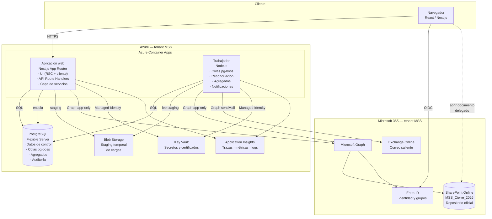
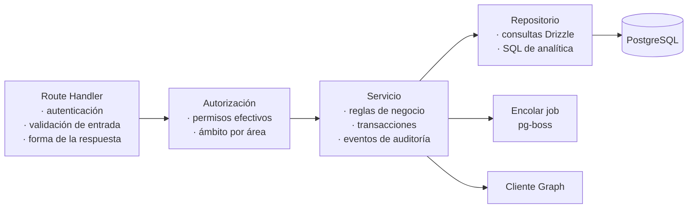
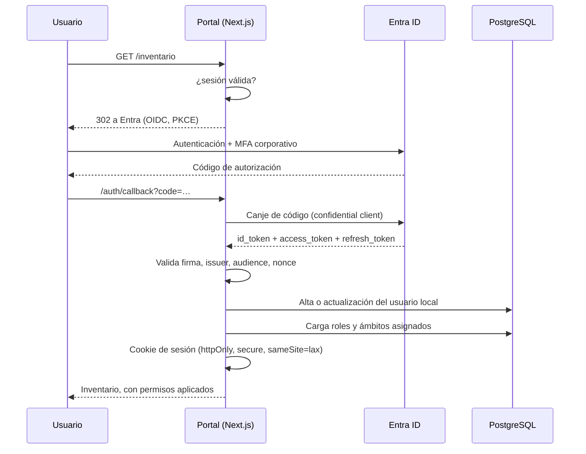
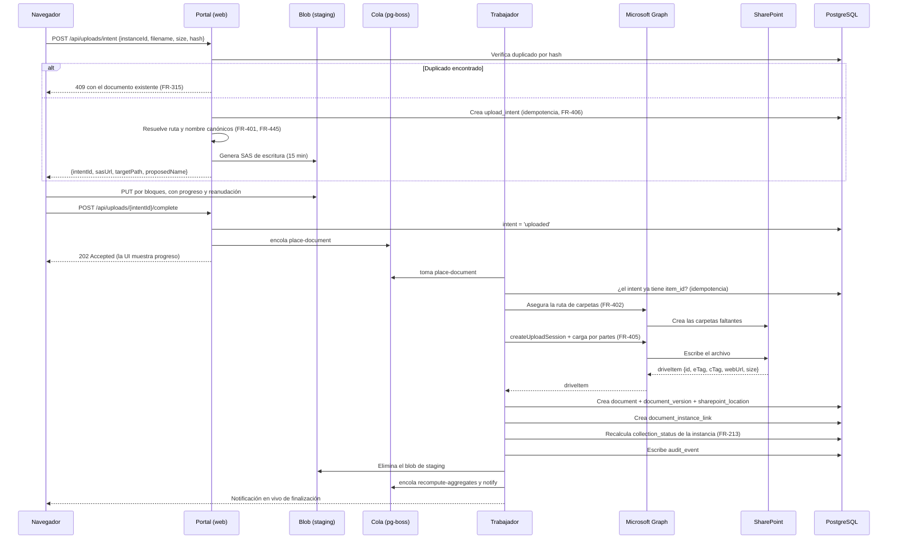
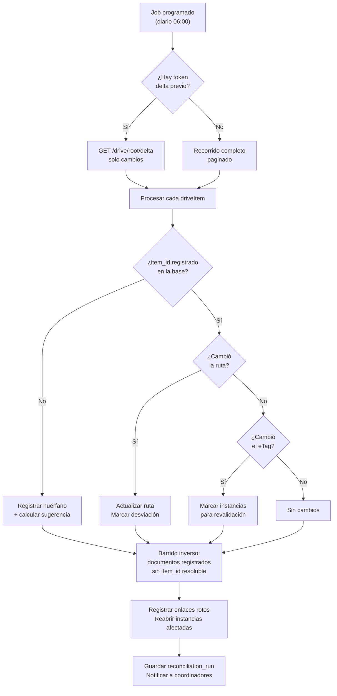
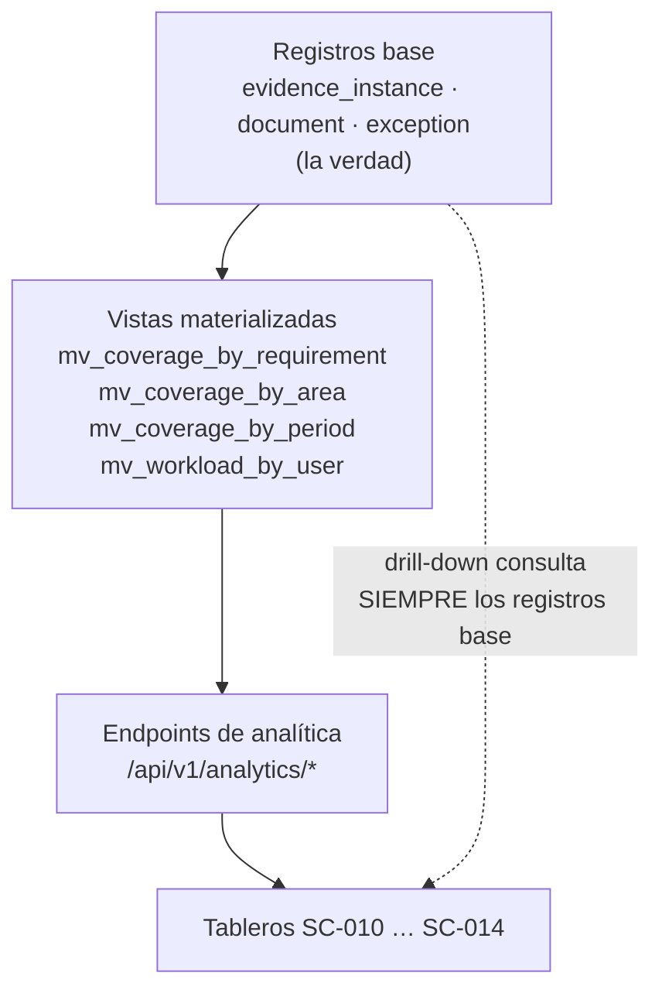
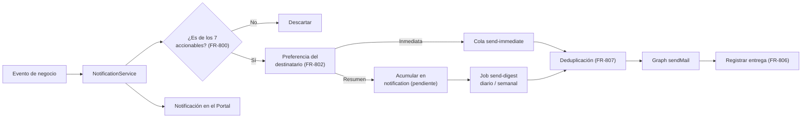
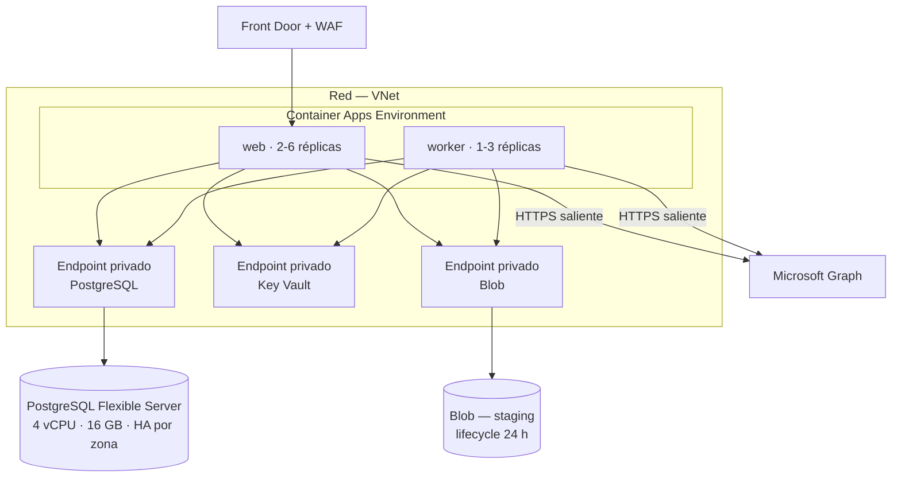
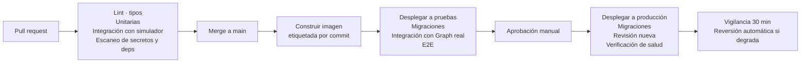

# 03 — Diseño técnico y arquitectura

**Portal de Materialidad y Expediente MSS**
Versión 1.0 · 17 de agosto de 2026

> Deriva de [01_PRD.md](01_PRD.md) y [02_UX_UI_FLUJOS.md](02_UX_UI_FLUJOS.md). Terminología en [00_GLOSARIO.md](00_GLOSARIO.md). Las entidades y endpoints se especifican en [04_MODELO_DATOS_API.md](04_MODELO_DATOS_API.md).

---

## Índice

1. [Arquitectura propuesta](#1-arquitectura-propuesta)
2. [Frontend](#2-frontend)
3. [Backend](#3-backend)
4. [Base de datos](#4-base-de-datos)
5. [Autenticación](#5-autenticación)
6. [Integración con Microsoft 365 / Entra ID](#6-integración-con-microsoft-365--entra-id)
7. [Integración con SharePoint](#7-integración-con-sharepoint)
8. [Uso de Microsoft Graph](#8-uso-de-microsoft-graph)
9. [Arquitectura de la API](#9-arquitectura-de-la-api)
10. [Procesamiento de archivos](#10-procesamiento-de-archivos)
11. [Gestión de metadatos](#11-gestión-de-metadatos)
12. [Trabajos en segundo plano](#12-trabajos-en-segundo-plano)
13. [Arquitectura analítica](#13-arquitectura-analítica)
14. [Bitácora de auditoría](#14-bitácora-de-auditoría)
15. [Notificaciones](#15-notificaciones)
16. [Permisos y seguridad](#16-permisos-y-seguridad)
17. [Gestión de secretos](#17-gestión-de-secretos)
18. [Manejo de errores](#18-manejo-de-errores)
19. [Estrategia de reintentos](#19-estrategia-de-reintentos)
20. [Registro y monitoreo](#20-registro-y-monitoreo)
21. [Entorno de desarrollo](#21-entorno-de-desarrollo)
22. [Entorno de pruebas](#22-entorno-de-pruebas)
23. [Entorno de producción](#23-entorno-de-producción)
24. [Estrategia de despliegue](#24-estrategia-de-despliegue)
25. [Respaldo y recuperación](#25-respaldo-y-recuperación)
26. [Escalabilidad](#26-escalabilidad)
27. [Riesgos técnicos](#27-riesgos-técnicos)

---

## 0. Fuerzas que determinan el diseño

Antes del stack, las restricciones reales del problema. Cada una descarta alternativas que, sin ellas, serían razonables.

**F-1 · La integridad relacional es el producto.** Requisito → Instancia → Documento con relación N:M, rollups en cascada y cobertura por periodo. No es un almacén de documentos con metadatos: es un modelo relacional con reglas de negocio densas. Esto descarta un backend orientado a documentos y descarta listas de SharePoint como capa de control.

**F-2 · SharePoint no es de confianza como fuente de estado.** El repositorio recibe archivos por fuera del Portal (`FR-420`–`FR-429`). El sistema debe **detectar** ese estado, no asumirlo. Requiere reconciliación periódica como componente de primera clase, no como script auxiliar.

**F-3 · El número del tablero debe poder rastrearse.** `FR-702` y `FR-722` obligan a que todo agregado sea reproducible desde los registros base. Descarta agregados calculados en el cliente o en una capa de BI desacoplada.

**F-4 · La taxonomía cambia durante la vida del sistema.** Nada de la jerarquía puede ser un `enum` en código (`FR-003`–`FR-008`). Configuración como datos, siempre.

**F-5 · Escala moderada de usuarios, alta de datos.** 50 usuarios concurrentes, ~300,000 instancias, ~500,000 documentos. No justifica microservicios; sí justifica índices y agregados bien pensados.

**F-6 · Tenant Microsoft 365 existente.** La identidad es Entra ID, el repositorio es SharePoint Online. Alejarse de ese ecosistema agrega fricción sin beneficio.

**F-7 · Vida útil acotada e incierta.** El Portal existe para el cierre de MSS (`DA-006`). Penaliza la complejidad operativa: cada componente adicional es algo que alguien tendrá que mantener durante un proyecto que va a terminar.

---

## 1. Arquitectura propuesta

### 1.1 Forma general

Aplicación web monolítica y modular, con un proceso trabajador separado, sobre una base de datos relacional única. Sin microservicios, sin bus de eventos, sin capa de BI externa.

La justificación es F-5 y F-7: 50 usuarios concurrentes y una vida útil acotada no pagan el costo operativo de un sistema distribuido. Lo que sí se separa es el trabajador, porque las operaciones contra Graph son lentas, sujetas a límites de tasa y deben sobrevivir a un despliegue del frontend.

### 1.2 Diagrama de componentes



### 1.3 Regla de reparto de datos

Es la decisión estructural del sistema, tomada de [Glosario §1.6](00_GLOSARIO.md).

| Dato | Base de datos | SharePoint |
|---|:---:|:---:|
| Taxonomía (frentes, áreas, procesos, actividades) | ✔ | |
| Requisitos e Instancias | ✔ | |
| Vínculos documento–instancia (N:M) | ✔ | |
| Estatus de recopilación y validación | ✔ | |
| Asignaciones, fechas objetivo | ✔ | |
| Validaciones y respuestas del checklist | ✔ | |
| Excepciones y su flujo de aprobación | ✔ | |
| Referencias transaccionales | ✔ | |
| Metadatos de control (quién, cuándo, papel, versión lógica) | ✔ | |
| Auditoría | ✔ | |
| Agregados analíticos | ✔ | |
| **Bytes del archivo** | | ✔ |
| Historial de versiones del archivo | | ✔ |
| Permisos sobre el contenido | | ✔ |
| Búsqueda de texto completo dentro del archivo | | ✔ |
| Identificadores del archivo (`item_id`, `drive_id`, `etag`, ruta, URL) | ✔ (copia) | ✔ (origen) |

**Corolarios operativos.** La base de datos no almacena archivos, ni siquiera temporalmente. SharePoint no almacena estatus de control. Los identificadores de SharePoint se copian a la base de datos porque son el mecanismo de resolución, y se refrescan por reconciliación cuando cambian.

**Consecuencia de recuperación:** si se pierde SharePoint, se conserva el índice completo de qué debía existir y dónde estaba, pero no los archivos — la copia independiente del repositorio queda fuera del alcance de la aplicación (`DA-007`, §25). Si se pierde la base de datos, se conservan los archivos pero se pierde el universo documental y la trazabilidad; por eso **sí** lleva respaldo automático como parte de la infraestructura del Portal (§25).

### 1.4 Stack y justificación

| Capa | Elección | Por qué esta, y no otra |
|---|---|---|
| Frontend | **Next.js 15 (App Router) + TypeScript + React** | Los Server Components resuelven el problema dominante de esta aplicación: tablas de decenas de miles de renglones con filtros, paginación y permisos, sin enviar todo al cliente. Un SPA puro obligaría a construir esa paginación y ese filtrado en dos lugares |
| UI | **Tailwind + shadcn/ui + TanStack Table** | Componentes con el código en el repositorio, no una dependencia opaca — importa en un sistema con vida útil incierta. TanStack Table cubre virtualización, columnas configurables y densidad, que son ~60 % de las pantallas |
| Backend | **Route Handlers de Next.js + capa de servicios explícita** | Un servicio backend separado agregaría un despliegue, un contrato y una superficie de red sin resolver nada a esta escala. La capa de servicios mantiene la lógica de negocio fuera de los handlers, así que extraerla después es viable |
| Base de datos | **PostgreSQL 16 (Azure Database for PostgreSQL Flexible Server)** | F-1 y F-3. Necesitamos llaves foráneas reales, N:M, CTEs recursivos para rollups jerárquicos, vistas materializadas para agregados y JSONB para campos de extensión (`FR-107`). Postgres da las cinco cosas en un solo motor |
| Acceso a datos | **Drizzle ORM + SQL crudo para analítica** | Migraciones versionadas y tipadas; SQL transparente donde la exactitud de los números importa (`FR-722`). Un ORM que oculte el SQL de los agregados dificultaría auditar la fórmula |
| Colas y jobs | **pg-boss sobre el mismo PostgreSQL** | Evita Redis. Un segundo datastore es un segundo respaldo, un segundo modo de falla y un segundo componente que mantener. pg-boss da reintentos, programación, deduplicación y visibilidad — suficiente para nuestro volumen de jobs |
| Autenticación | **Entra ID vía OIDC (MSAL / Auth.js con proveedor Entra)** | F-6. SSO corporativo, cero gestión de contraseñas (`FR-930`), y los grupos de Entra alimentan la asignación de roles |
| SharePoint | **Microsoft Graph. App-only con `Sites.Selected` para escritura; delegado para lectura del usuario** | Mínimo privilegio real: la app solo puede escribir en el sitio `MSS_Cierre_2026`. La escritura app-only hace la colocación determinista y auditable; la lectura delegada preserva los permisos del usuario (`FR-934`) |
| Staging de cargas | **Azure Blob Storage con lifecycle de 24 h** | Permite reanudar cargas y desacoplar la subida del usuario de la colocación en SharePoint. No es almacenamiento de documentos: es un búfer efímero |
| Hosting | **Azure Container Apps** | Mismo tenant, Managed Identity nativa, dos revisiones (web y trabajador) desde un mismo repositorio, escala a cero fuera de horario. Menos configuración que AKS, más control que App Service para el trabajador |
| Secretos | **Azure Key Vault + Managed Identity + credencial federada** | Ninguna credencial en código ni en variables de entorno versionadas (`NFR-017`) |
| Observabilidad | **Application Insights + pino (JSON estructurado)** | Correlación entre el evento de negocio y la llamada a Graph que lo originó (`NFR-018`) |
| Correo | **Graph `sendMail` desde un buzón de servicio** | Reutiliza la misma integración y la misma identidad; sin proveedor SMTP externo |

### 1.5 Alternativas evaluadas y descartadas

| Alternativa | Por qué se descartó |
|---|---|
| **Power Apps + Dataverse + Power Automate + Power BI** | Es la opción obvia en una tienda Microsoft y sería más rápida de arrancar. Se descarta por F-1 y F-3: el modelo Requisito ≠ Instancia ≠ Documento con N:M, generación de periodos y rollups en cascada empuja a Dataverse fuera de su zona cómoda, y la analítica reconciliable de `FR-722` acaba requiriendo desarrollo de todas formas. Además, la lógica queda repartida entre flujos y fórmulas, lo que dificulta probarla (documento 05) |
| **Listas de SharePoint como capa de control** | Sin integridad referencial, sin N:M real, límite práctico de vista en 5,000 elementos, y agregación sobre 300,000 instancias inviable. Además viola la frontera del §1.3: mezclaría control y repositorio |
| **Azure SQL en lugar de PostgreSQL** | Perfectamente defendible en este tenant. Se elige Postgres por JSONB (más natural que las columnas JSON de SQL Server para `FR-107`), por pg-boss (que evita Redis) y por costo. Si la política corporativa exige Azure SQL, el cambio es acotado: afecta la capa de migraciones y algunas expresiones de agregación, no la arquitectura |
| **Backend separado (NestJS / .NET) con SPA** | Dos despliegues, un contrato entre ellos y duplicación de tipos, sin beneficio a 50 usuarios concurrentes. Se reevaluaría si el Portal se abriera a colaboradores externos (`DA-010`) |
| **Redis + BullMQ para colas** | Mejor rendimiento del que necesitamos, a cambio de un segundo datastore. pg-boss cubre nuestro volumen (cientos de jobs por hora, no miles por segundo) |
| **Almacenar archivos en la base de datos o en Blob como repositorio** | Rompe la premisa del proyecto: SharePoint es el repositorio oficial |
| **Capa de BI externa (Power BI, Fabric) para la analítica** | Introduce un desfase y una segunda verdad. `FR-702` exige drill-down desde el número hasta el registro dentro de la misma aplicación. Power BI puede consumir la base como reporte complementario, no como fuente del tablero |
| **Búsqueda con motor dedicado (Elastic, Azure AI Search)** | El índice de texto completo de Postgres cubre `FR-601` a este volumen. Un motor externo se justificaría si se agregara búsqueda dentro del contenido de los archivos, que hoy resuelve SharePoint |

---

## 2. Frontend

### 2.1 Estructura

```
app/
├── (auth)/                      # login, callback, error
├── (app)/
│   ├── inicio/                  SC-001
│   ├── mi-trabajo/              SC-030, SC-031, SC-032, SC-033, SC-034
│   ├── inventario/              SC-020, SC-021, SC-022, SC-023, SC-024
│   ├── validacion/              SC-040, SC-041
│   ├── excepciones/             SC-050, SC-051, SC-052
│   ├── reconciliacion/          SC-070, SC-071
│   ├── busqueda/                SC-060, SC-061, SC-062
│   ├── analitica/               SC-010, SC-011, SC-012, SC-013, SC-014
│   ├── cierre/                  SC-100
│   ├── admin/                   SC-080 … SC-086
│   └── perfil/                  SC-090, SC-091
├── api/                         # Route handlers (§9)
└── layout.tsx
lib/
├── services/                    # lógica de negocio (§3.2)
├── db/                          # esquema y migraciones Drizzle
├── graph/                       # cliente de Microsoft Graph
├── auth/                        # sesión y autorización
└── shared/                      # tipos y validadores Zod compartidos
components/
├── ui/                          # shadcn
├── inventario/ validacion/ analitica/ …
```

### 2.2 Decisiones

**Server Components por defecto.** Las tablas del Inventario Maestro se renderizan en el servidor con el filtro y la paginación ya aplicados, y con los permisos ya resueltos. El cliente recibe la página visible, no 5,000 renglones. Los componentes de cliente se reservan para interacción real: filtros, selección múltiple, arrastre de archivos, atajos de teclado de la pantalla de validación.

**El estado de filtros vive en la URL.** Toda combinación de filtros es una URL compartible (`FR-702`, `SC-060`). Además hace que el botón "atrás" del navegador funcione como el usuario espera en el drill-down analítico.

**Virtualización en las tablas grandes.** TanStack Virtual sobre la rejilla de cobertura (`SC-024`) y el Inventario. Una rejilla de 108 periodos × cientos de requisitos no puede renderizarse completa.

**Cargas desde el cliente hacia Blob, no hacia el servidor.** El navegador sube directamente a Azure Blob con una SAS de escritura de corta vida, y luego notifica al servidor. Evita que archivos de 250 MB pasen por el proceso web, y permite reanudar (`FR-316`).

**Validación compartida.** Los esquemas Zod de `lib/shared` se usan en el formulario del cliente y en el handler del servidor. La interfaz da retroalimentación inmediata; el servidor vuelve a validar siempre, porque la interfaz no es control de acceso (`FR-932`).

**Accesibilidad.** Componentes con primitivas Radix (base de shadcn), navegación completa por teclado, y estados de la rejilla de cobertura comunicados con símbolo además de color (`NFR-014`).

---

## 3. Backend

### 3.1 Capas



La regla es estricta: **un Route Handler nunca contiene lógica de negocio y nunca toca la base de datos directamente.** Esto mantiene el sistema probable a nivel de servicio (documento 05) y permite que el trabajador reutilice exactamente los mismos servicios que la web.

### 3.2 Servicios

| Servicio | Responsabilidad | Requisitos |
|---|---|---|
| `TaxonomyService` | Alta, baja, movimiento y activación de nodos; validación de jerarquía | `FR-003`–`FR-014` |
| `RequirementService` | Ciclo de vida del requisito; cálculo de impacto de cambios | `FR-100`–`FR-127` |
| `ImportService` | Análisis, validación y aplicación transaccional de importaciones | `FR-130`–`FR-135` |
| `PeriodService` | Generación y recálculo de instancias; bases de cálculo | `FR-200`–`FR-215` |
| `AssignmentService` | Asignación individual y en lote; delegación | `FR-300`–`FR-307` |
| `DocumentService` | Carga, registro de existentes, vínculos N:M, versiones, duplicados | `FR-310`–`FR-346` |
| `PlacementService` | Resolución de ruta y nombre; colocación en SharePoint | `FR-401`, `FR-440`–`FR-447` |
| `SharePointService` | Envoltura de Graph: carpetas, sesiones de carga, metadatos, cambios | `FR-400`–`FR-413` |
| `ReconciliationService` | Barrido, detección de huérfanos, rotos, movimientos y modificaciones | `FR-420`–`FR-429` |
| `ValidationService` | Cola, checklist, resultados, reversión | `FR-500`–`FR-515` |
| `ExceptionService` | Flujo de excepciones y niveles de aprobación | `FR-520`–`FR-529` |
| `ClosureService` | Evaluación de criterios de cierre y paquete de cierre | `FR-540`–`FR-545` |
| `SearchService` | Búsqueda facetada y trazabilidad | `FR-600`–`FR-612` |
| `AnalyticsService` | Agregados, drill-down, reconciliación de cifras | `FR-700`–`FR-723` |
| `NotificationService` | Generación, agrupación, envío y registro | `FR-800`–`FR-809` |
| `AuditService` | Escritura de eventos inmutables | `FR-920`–`FR-926` |
| `AuthzService` | Resolución de permisos efectivos por ámbito | `FR-931`–`FR-939` |

### 3.3 Transacciones y auditoría

Toda operación que modifica estado sigue el mismo patrón:

```typescript
await db.transaction(async (tx) => {
  const before = await repo.get(tx, id);
  const after  = await repo.update(tx, id, changes);
  await audit.record(tx, {
    actor, entity: 'requirement', entityId: id,
    action: 'requirement.updated',
    before, after, origin: 'ui', correlationId
  });
  return after;
});
// fuera de la transacción: efectos secundarios
await queue.send('recompute-aggregates', { scope });
await queue.send('notify', { event, recipients });
```

El evento de auditoría se escribe **dentro** de la misma transacción que el cambio: no puede existir un cambio sin su evento (`FR-920`). Los efectos secundarios (agregados, notificaciones, Graph) se encolan **fuera**, porque no deben poder abortar el cambio de negocio.

---

## 4. Base de datos

### 4.1 Elección

PostgreSQL 16, Azure Database for PostgreSQL Flexible Server. El esquema completo está en [04_MODELO_DATOS_API.md](04_MODELO_DATOS_API.md); aquí solo las decisiones de plataforma.

Cinco capacidades que el problema exige y que Postgres da en un solo motor:

1. **Llaves foráneas y restricciones reales** — la integridad de Requisito → Instancia → Documento no puede depender del código de aplicación.
2. **CTEs recursivos** — los rollups sobre la jerarquía de taxonomía, que es de profundidad variable y configurable (F-4).
3. **Vistas materializadas** — agregados analíticos reconciliables (§13).
4. **JSONB con índices GIN** — campos de extensión definidos por administrador (`FR-107`) sin migraciones por cada campo nuevo.
5. **Búsqueda de texto completo con `unaccent`** — `FR-601` y `FR-612` sin motor externo.

### 4.2 Configuración

| Aspecto | Decisión |
|---|---|
| Versión | PostgreSQL 16 |
| Nivel | General Purpose, 4 vCPU / 16 GB en producción; Burstable en no productivos |
| Almacenamiento | 256 GB con autoexpansión |
| Alta disponibilidad | Redundancia de zona en producción |
| Respaldo | Automático 35 días, restauración a punto en el tiempo |
| Conexión | Endpoint privado; sin acceso público |
| Extensiones | `unaccent`, `pg_trgm`, `uuid-ossp`, `pgcrypto` |
| Agrupación de conexiones | PgBouncer en modo transacción |
| Zona horaria | Todo en UTC; conversión a `America/Monterrey` en presentación |

### 4.3 Convenciones

- Nombres de tablas y columnas en inglés, en `snake_case` (§ puente del glosario).
- Llaves primarias UUID v7 — ordenables por tiempo, sin exponer conteos (`FR-938`).
- Además, identificadores legibles y estables para requisitos (`FR-101`), independientes de la PK.
- Marcas de tiempo `timestamptz`, siempre UTC.
- Sin borrado físico en entidades de negocio: baja lógica con motivo (`FR-125`, `FR-346`).
- Migraciones versionadas con Drizzle Kit, aplicadas por el pipeline, nunca a mano.

---

## 5. Autenticación

### 5.1 Flujo



### 5.2 Decisiones

- **Sin gestión de contraseñas** (`FR-930`). MFA, longitud de sesión y políticas de acceso condicional los define la política corporativa de Entra, no el Portal.
- **Sesión en cookie firmada** con el identificador de sesión; los datos de sesión viven en la base de datos, lo que permite revocarla de inmediato al desactivar un usuario.
- **Los roles NO vienen del token.** El token da identidad; los roles y ámbitos viven en la base de datos del Portal (`FR-901`), porque el modelo de ámbito por área/servicio es más fino que lo que un grupo de Entra expresa cómodamente. Los grupos de Entra pueden usarse como semilla para el alta masiva.
- **Caducidad de inactividad** conforme a política (`FR-936`), con renovación silenciosa mientras el usuario esté activo.
- **El token delegado de Graph se conserva cifrado** solo para las operaciones de lectura que deben respetar los permisos del usuario (explorador de SharePoint en `SC-033`, apertura de documentos).

---

## 6. Integración con Microsoft 365 / Entra ID

### 6.1 Registros de aplicación

Dos registros, deliberadamente separados:

| Registro | Propósito | Permisos |
|---|---|---|
| `Portal-MSS-Web` | Autenticación de usuarios y operaciones delegadas | Delegados: `User.Read`, `Sites.Read.All` (para el explorador de `SC-033`), `offline_access` |
| `Portal-MSS-Service` | Operaciones app-only sobre el repositorio | Aplicación: `Sites.Selected` (concedido solo sobre el sitio `MSS_Cierre_2026`), `Mail.Send` (restringido a un buzón por política de acceso a aplicaciones) |

**Por qué `Sites.Selected` y no `Sites.ReadWrite.All`.** Con `Sites.ReadWrite.All` la aplicación podría escribir en cualquier sitio del tenant. Con `Sites.Selected` un administrador concede acceso sitio por sitio, y el alcance real de la aplicación queda acotado y auditable. Es la diferencia entre "la app puede escribir en SharePoint" y "la app puede escribir en el expediente de cierre de MSS".

**Por qué `Mail.Send` restringido.** El permiso de aplicación permite enviar como cualquier buzón. Se acota con una política de acceso a aplicaciones de Exchange al buzón `portal-mss@…`, de modo que la aplicación solo pueda enviar como ese remitente.

### 6.2 Autenticación de la aplicación

Credencial federada de identidad administrada (workload identity federation): la Managed Identity de Container Apps obtiene tokens para el registro de servicio **sin secreto ni certificado que rotar**. Elimina la clase entera de incidentes por credencial vencida — que en un proyecto de dos años es una certeza estadística, no un riesgo.

### 6.3 Sincronización de usuarios

- Alta desde el directorio: búsqueda por nombre o correo vía Graph, alta local con `object_id` de Entra como ancla (`FR-900`).
- Baja: un job diario detecta cuentas deshabilitadas en Entra y desactiva al usuario en el Portal, conservando su historial y sus registros de auditoría.
- El correo y el nombre para mostrar se refrescan en cada inicio de sesión.

---

## 7. Integración con SharePoint

### 7.1 Topología del repositorio

| Elemento | Valor |
|---|---|
| Sitio | `https://{tenant}.sharepoint.com/sites/MSS_Cierre_2026` |
| Biblioteca | `Documentos` (drive por defecto) |
| Raíz | `MSS_Cierre_2026/` con las tres carpetas del Plan Macro |
| Versionado nativo | Habilitado, versiones mayores |
| Papelera | Retención por política corporativa |

La configuración del sitio, biblioteca y carpeta raíz es un parámetro del Portal (`FR-903`), no una constante.

### 7.2 Secuencia de colocación



**Por qué pasa por Blob y no directo a SharePoint.** Tres razones: (1) el navegador puede reanudar contra Blob de forma más simple que contra una sesión de Graph; (2) si Graph está limitando la tasa, el archivo del usuario ya está a salvo y la colocación se difiere sin pedirle que espere; (3) el reintento no requiere que el usuario tenga todavía el archivo abierto. El blob se elimina al confirmar la colocación, con lifecycle de 24 h como red de seguridad.

### 7.3 Casos que la integración resuelve

| Caso | Mecanismo | FR |
|---|---|---|
| Carpeta inexistente | Creación recursiva idempotente, cacheada por ruta | `FR-402` |
| Nombre en conflicto | Política configurable: `rename` (sufijo), `replace` (versión nueva) o `fail` | `FR-410` |
| Archivo grande | `createUploadSession`, fragmentos de 10 MB alineados a 320 KiB | `FR-405` |
| Límite de tasa (429) | Respeta `Retry-After`; retroceso exponencial con aleatorización | `FR-407` |
| Reintento tras éxito parcial | `upload_intent` con `item_id`: si ya existe, no vuelve a subir | `FR-406` |
| Ruta demasiado larga | Validación previa contra 400 caracteres; propuesta de abreviación | `FR-444` |
| Modificación externa | Comparación de `eTag` en reconciliación | `FR-424` |
| Movimiento externo | `item_id` sigue resolviendo; se refresca la ruta | `FR-423` |
| Eliminación externa | `item_id` deja de resolver → enlace roto | `FR-422` |
| Archivo ajeno al inventario | Barrido detecta huérfano | `FR-421` |

### 7.4 Reconciliación



El token delta hace la corrida incremental barata (`FR-427`); una corrida completa se puede forzar desde `SC-086`. La sugerencia de vinculación del huérfano se calcula por coincidencia de ruta contra rutas canónicas conocidas, periodo detectado en el nombre y tipo de archivo.

---

## 8. Uso de Microsoft Graph

### 8.1 Operaciones

| Operación | Endpoint | Modo | Uso |
|---|---|---|---|
| Resolver sitio | `GET /sites/{hostname}:/{path}` | app-only | Configuración inicial |
| Resolver biblioteca | `GET /sites/{id}/drives` | app-only | Configuración inicial |
| Crear carpeta | `POST /drives/{id}/items/{parent}/children` | app-only | `FR-402` |
| Carga simple (< 4 MB) | `PUT /drives/{id}/items/{parent}:/{name}:/content` | app-only | Archivos pequeños |
| Sesión de carga | `POST …/createUploadSession` | app-only | `FR-405` |
| Metadatos de ítem | `GET /drives/{id}/items/{itemId}` | app-only | Verificación, reconciliación |
| Cambios incrementales | `GET /drives/{id}/root/delta` | app-only | `FR-427` |
| Mover / renombrar | `PATCH /drives/{id}/items/{itemId}` | app-only | `FR-335`, `FR-336` |
| Vista previa | `POST …/preview` | delegado | `FR-413` |
| Explorar para vincular | `GET /drives/{id}/items/{id}/children` | delegado | `SC-033` |
| Buscar usuarios | `GET /users?$search=` | app-only | `FR-900` |
| Enviar correo | `POST /users/{buzón}/sendMail` | app-only | `FR-803` |

### 8.2 Cliente

Un único cliente envuelve todas las llamadas y aplica, sin excepción:

- **Caché de tokens** en memoria con renovación anticipada al 80 % de vida.
- **Reintentos** solo en 429, 503, 504 y errores de red; nunca en 4xx de negocio (§19).
- **Respeto estricto de `Retry-After`.**
- **Límite de concurrencia** por proceso, para no provocar el throttling que luego hay que absorber.
- **Registro estructurado** de cada llamada con `requestId` de Graph, duración, estado y `correlationId` del evento de negocio que la originó (`NFR-018`).
- **Circuit breaker**: tras N fallos consecutivos, deja de intentar durante una ventana y encola en lugar de fallar de cara al usuario.

### 8.3 Presupuesto de límites de tasa

Graph impone límites por aplicación y por sitio. Mitigaciones:

1. Concurrencia acotada en el trabajador (predeterminado 4 cargas simultáneas, configurable).
2. Delta en lugar de recorrido completo para la reconciliación.
3. Caché de rutas de carpeta ya creadas: no se pregunta dos veces por la misma carpeta en una corrida.
4. Agrupación de lecturas de metadatos cuando es posible.
5. Panel de salud (`SC-086`) que expone el consumo observado y la frecuencia de 429.

---

## 9. Arquitectura de la API

### 9.1 Estilo

REST sobre `/api`, con recursos que corresponden a las entidades del glosario. JSON. Validación de entrada y salida con Zod. Los contratos detallados están en [04_MODELO_DATOS_API.md](04_MODELO_DATOS_API.md).

Se elige REST sobre RPC o GraphQL porque el consumidor es la propia interfaz, el modelo de recursos es estable, y el caché y la observabilidad por ruta son más simples de razonar. GraphQL se justificaría con múltiples consumidores heterogéneos, que no es el caso.

### 9.2 Convenciones

| Aspecto | Convención |
|---|---|
| Versionado | `/api/v1/…` desde el inicio |
| Paginación | `?page=&pageSize=` con `{data, meta:{page,pageSize,total}}` |
| Filtros | Parámetros de consulta tipados y validados |
| Orden | `?sort=field:asc,other:desc` |
| Errores | Cuerpo uniforme `{error:{code, message, details, correlationId}}` |
| Idempotencia | Encabezado `Idempotency-Key` en operaciones de escritura crítica |
| Operaciones largas | 202 + recurso de trabajo consultable |
| Concurrencia | `If-Match` con versión de fila en actualizaciones de requisitos |
| Autorización | Resuelta en el handler, antes del servicio, siempre en el servidor |

### 9.3 Familias de endpoints

`/taxonomy` · `/requirements` · `/instances` · `/documents` · `/uploads` · `/sharepoint` · `/validations` · `/exceptions` · `/closure` · `/search` · `/analytics` · `/reconciliation` · `/notifications` · `/admin` · `/audit`

---

## 10. Procesamiento de archivos

### 10.1 Cadena

```mermaid
flowchart LR
    A["Selección<br/>en el navegador"] --> B["Hash SHA-256<br/>en el cliente"]
    B --> C["Verificación de<br/>duplicado (FR-314)"]
    C --> D["Validación de<br/>extensión (FR-319)"]
    D --> E["Carga por bloques<br/>a Blob"]
    E --> F["Verificación de<br/>hash en servidor"]
    F --> G["Extracción de<br/>metadatos"]
    G --> H["Análisis<br/>antimalware"]
    H --> I["Colocación<br/>en SharePoint"]
    I --> J["Registro y<br/>limpieza de staging"]
```



### 10.2 Decisiones

**Hash en el cliente y verificación en el servidor.** Calcular SHA-256 en el navegador permite detectar duplicados **antes** de subir 200 MB (`FR-315`), que es donde está el ahorro. El servidor lo recalcula al recibir, porque un hash enviado por el cliente no es confiable para integridad.

**El archivo nunca se altera.** Sin conversión, sin compresión, sin normalización de PDF, sin reescritura de metadatos internos (`FR-411`). El valor probatorio del formato nativo es un requisito explícito del proyecto.

**Extracción de metadatos, no de contenido.** Se extraen: nombre original, tamaño, MIME real (por firma de archivo, no por extensión), y para `.msg`/`.eml` remitente, destinatarios, fecha, asunto y nombres de adjuntos (`FR-322`). No se hace OCR ni indexación de contenido: eso lo resuelve SharePoint.

**Antimalware.** Defender for Storage sobre el contenedor de staging cuando esté disponible; si no, verificación de firma y lista de extensiones prohibidas como control mínimo (`FR-937`). Un archivo marcado no se coloca y se notifica al administrador.

**Límites.** 250 MB por archivo (`FR-316`), configurable. Por encima, el sistema indica dividir o contactar al administrador, en lugar de fallar a mitad de una carga larga.

---

## 11. Gestión de metadatos

### 11.1 Tres niveles

| Nivel | Ejemplos | Dónde vive |
|---|---|---|
| **Estructural** | Frente, área, proceso, actividad, periodicidad, periodo | Columnas tipadas y llaves foráneas |
| **De extensión** | Campos definidos por administrador (`FR-107`) | JSONB con esquema validado y GIN |
| **Del archivo** | Nombre original, tamaño, MIME, hash, metadatos de correo | Columnas tipadas en `document_version` |

**Por qué los campos de extensión van en JSONB y no en tablas EAV.** El modelo entidad-atributo-valor haría cada consulta del inventario un conjunto de joins y volvería el filtrado lento y frágil. JSONB con un esquema declarado en `custom_field_definition` da validación al escribir, índices GIN para filtrar, y una sola fila por requisito. El costo es que las restricciones de integridad de esos campos las aplica la aplicación, no el motor — aceptable para campos que por definición son configurables.

### 11.2 Sincronización con SharePoint

**No se sincronizan metadatos de control hacia columnas de SharePoint.** Sería una segunda verdad que se desincroniza y que hay que mantener. El Portal es la fuente de los metadatos de control; SharePoint es la fuente del archivo. La reconciliación (§7.4) es el mecanismo que mantiene alineadas las dos mitades, y su unidad de verdad es el `item_id`, no un conjunto de columnas.

Si en el futuro se requiere que SharePoint muestre metadatos del Portal (por ejemplo para búsqueda nativa), la vía es escribir un subconjunto pequeño y explícitamente marcado como derivado, nunca como fuente.

---

## 12. Trabajos en segundo plano

### 12.1 Catálogo

| Trabajo | Disparo | Propósito | FR |
|---|---|---|---|
| `place-document` | Al completar una carga | Colocar en SharePoint y registrar | `FR-401`–`FR-406` |
| `register-existing` | Al registrar un existente | Capturar identificadores y hash | `FR-330`–`FR-334` |
| `normalize-location` | Manual | Mover a ruta canónica | `FR-335` |
| `generate-instances` | Al crear o cambiar un requisito | Generar o recalcular instancias | `FR-200`–`FR-205` |
| `import-inventory` | Al confirmar una importación | Aplicación transaccional | `FR-133` |
| `reconcile-sharepoint` | Diario 06:00 + manual | Huérfanos, rotos, movimientos | `FR-420`–`FR-428` |
| `recompute-aggregates` | Tras cambios de estatus, con coalescencia | Refrescar agregados | `FR-703` |
| `snapshot-progress` | Diario 23:00 | Punto histórico de avance | `FR-719` |
| `detect-overdue` | Diario 07:00 | Marcar vencidas | `FR-215` |
| `send-digest` | Diario 08:00 / semanal lunes | Resúmenes de notificación | `FR-801` |
| `send-immediate` | Por evento | Rechazos y excepciones | `FR-800` |
| `sync-users` | Diario 05:00 | Bajas desde Entra | `FR-900` |
| `permissions-report` | Semanal | Divergencias Portal vs. SharePoint | `FR-935` |
| `cleanup-staging` | Cada hora | Blobs huérfanos | — |

### 12.2 Garantías

- **Al menos una vez.** Todo job es idempotente; `place-document` lo es por `upload_intent` con `item_id`.
- **Reintentos con retroceso** (§19); tras agotarlos, el job pasa a la cola de fallidos visible en `SC-086` (`FR-408`).
- **Coalescencia** en `recompute-aggregates`: múltiples solicitudes para el mismo ámbito en una ventana corta se colapsan en una.
- **Prioridad**: `place-document` y `send-immediate` por encima de reconciliación y agregados; el usuario que espera su carga tiene precedencia sobre un barrido nocturno.
- **Aislamiento**: el trabajador escala de forma independiente de la web (§26).

---

## 13. Arquitectura analítica

### 13.1 El requisito que la determina

`FR-702` y `FR-722`: todo número debe poder rastrearse hasta los registros que lo componen, y los desgloses deben sumar exactamente el total. Esto descarta agregados aproximados, muestreo y capas de BI desacopladas.

### 13.2 Diseño en tres capas



**La clave está en la flecha punteada.** Los tableros leen agregados precalculados —por rendimiento (`NFR-003`)— pero el drill-down **no** lee agregados: consulta los registros base con el mismo predicado. Así, si un agregado estuviera desactualizado, la discrepancia se hace visible en lugar de propagarse.

### 13.3 Definición de los agregados

Las fórmulas de `01_PRD.md §16.1` se implementan en SQL, en un solo lugar, dentro de las vistas materializadas. No se reimplementan en la aplicación ni en el cliente. El endpoint que sirve el tablero expone también la definición de la fórmula, que es lo que muestra el icono ⓘ de `SC-010` (`FR-711`).

Reglas que las vistas aplican de forma consistente:

- Se excluyen las instancias `out_of_scope`.
- Se excluyen los requisitos con `denominator_basis = 'progressive'` mientras `enumeration_status = 'open'`, contados aparte (`FR-704`, `FR-113`, resuelto en `DA-001`). Al cerrarse la enumeración, el requisito entra al cálculo con el conteo congelado como denominador.
- Un documento vinculado a N instancias cuenta **una vez** en volumen y **N veces** en cobertura — es la fuente más probable de descuadre y se prueba explícitamente (documento 05).
- Los documentos marcados como contenido duplicado (`DA-002`) cuentan cada uno por separado en volumen — no se deduplican en el conteo, solo se señalan entre sí.

### 13.4 Refresco

`REFRESH MATERIALIZED VIEW CONCURRENTLY` disparado por el job `recompute-aggregates`, con coalescencia. Objetivo: desfase menor a 15 minutos (`NFR-009`). El tablero muestra siempre la marca de tiempo del último refresco (`FR-703`), y durante el refresco muestra las cifras anteriores atenuadas, nunca ceros.

### 13.5 Histórico

`snapshot-progress` escribe un punto diario por ámbito en `progress_snapshot`. Es una tabla append-only: permite la gráfica de evolución (`FR-719`) y responder "¿cómo íbamos hace un mes?" sin reconstruirlo desde la auditoría.

---

## 14. Bitácora de auditoría

### 14.1 Diseño

Tabla `audit_event`, append-only. Sin `UPDATE` ni `DELETE` desde la aplicación (`FR-922`), reforzado a nivel de base de datos: el rol de aplicación tiene `INSERT` y `SELECT` sobre esa tabla, no más.

Cada evento: actor, momento (UTC), tipo, entidad y su identificador, `before`/`after` en JSONB, origen (`ui`, `import`, `job`, `api`), `correlation_id` y dirección IP.

### 14.2 Garantías

- **Atomicidad.** El evento se escribe en la misma transacción que el cambio (§3.3). No existe cambio sin evento.
- **Cobertura.** También registran las operaciones automáticas: reconciliación, generación de instancias, refresco de agregados, envíos de notificación.
- **Retención.** Toda la vida del proyecto y más allá del archivado (`NFR-011`); se excluye de cualquier política de purga.
- **Volumen.** Particionamiento por mes; los `before`/`after` se recortan a los campos que cambiaron, no la fila completa.

---

## 15. Notificaciones

### 15.1 Flujo



### 15.2 Decisiones

- **Los cambios por rollup no notifican** (`FR-808`). Si notificáramos cada recálculo de estatus derivado, cada validación generaría cascadas de correos.
- **Deduplicación por (destinatario, tipo, entidad, ventana).** Diez rechazos del mismo requisito al mismo responsable en una hora son un correo, no diez.
- **Correo por Graph**, con la misma identidad e integración que el resto. Sin dependencia SMTP.
- **Fallo de envío no bloquea.** El registro de la notificación queda con su estado (`FR-806`), visible en el panel de salud.

---

## 16. Permisos y seguridad

### 16.1 Modelo

Tres dimensiones: **usuario × rol × ámbito**, donde el ámbito es el proyecto, un frente o un área/servicio. Los permisos efectivos son la unión de las asignaciones (`FR-931`).

```
usuario ─┬─ (validator,   área = Tesorería)
         ├─ (contributor, área = Nómina)
         └─ (viewer,      proyecto)
```

### 16.2 Aplicación

Todo control se aplica en el servidor (`FR-932`), en tres puntos:

1. **Handler** — ¿el usuario tiene el permiso para esta operación en este ámbito?
2. **Consulta** — todo listado incorpora el predicado de ámbito en el `WHERE`; nunca se filtra en memoria después de traer todo.
3. **Registro** — para operaciones sobre un registro concreto, se verifica que su ámbito esté entre los del usuario.

La interfaz oculta lo que no se puede hacer, pero eso es ergonomía, no seguridad.

### 16.3 Sensibilidad

Implementa `FR-933` y la instrucción del Plan Macro de restringir sin impedir la localización:

| Nivel de acceso | Existencia del registro | Metadatos básicos | Metadatos sensibles | Contenido |
|---|:---:|:---:|:---:|:---:|
| Sin permiso sobre el área | Visible | Visible | Oculto | Sin enlace |
| Con permiso sobre el área | Visible | Visible | Visible | Lo resuelve SharePoint |
| Confidencial sin acceso nominal | Visible | Parcial | Oculto | Sin enlace |

**El Portal nunca otorga acceso al contenido** (`FR-934`). El enlace abre SharePoint con la identidad del usuario; si no tiene permiso, SharePoint lo rechaza. El Portal solo decide si muestra el enlace.

El reporte semanal de conciliación de permisos (`FR-935`) compara la clasificación declarada contra los permisos reales del sitio y lista las divergencias (`DA-005`, opción D).

### 16.4 Otros controles

- Endpoint privado a la base; sin acceso público.
- TLS 1.2+ en todo tránsito; cifrado en reposo en base, blob y SharePoint.
- Cabeceras de seguridad: CSP, HSTS, `X-Content-Type-Options`, `Referrer-Policy`.
- Protección CSRF por `sameSite` más token en formularios.
- Consultas siempre parametrizadas (Drizzle); sin concatenación de SQL.
- UUID v7 como identificadores públicos, no consecutivos (`FR-938`).
- Límite de tasa por usuario en endpoints de búsqueda, exportación e importación.
- Registro de accesos denegados y de lecturas de contenido confidencial (`FR-926`, `FR-939`).

---

## 17. Gestión de secretos

| Secreto | Dónde vive | Rotación |
|---|---|---|
| Credencial de la aplicación para Graph | **No existe** — credencial federada de Managed Identity | Automática |
| Cadena de conexión a PostgreSQL | Key Vault, referenciada por Container Apps | Con Managed Identity para Postgres, no aplica contraseña |
| Clave de firma de sesión | Key Vault | Trimestral, con soporte de dos claves para no invalidar sesiones |
| Clave de cifrado de tokens delegados | Key Vault | Trimestral |
| Cadena de Application Insights | Key Vault | Al regenerar |
| Acceso a Blob | Managed Identity; SAS generadas al vuelo, 15 min | No aplica |

Reglas: ningún secreto en el repositorio, en `.env` versionado ni en la imagen. Escaneo de secretos en el pipeline. Los entornos no productivos tienen sus propios secretos y su propio sitio de SharePoint; nunca comparten con producción.

---

## 18. Manejo de errores

### 18.1 Taxonomía

| Clase | Ejemplos | HTTP | ¿Reintentable? | Qué ve el usuario |
|---|---|---|---|---|
| Validación | Campo faltante, rango inválido | 400 | No | Mensaje en el campo |
| Autenticación | Sesión expirada | 401 | No | Reingreso conservando la pantalla |
| Autorización | Fuera de ámbito | 403 | No | Explicación y a quién pedir acceso |
| No encontrado | Registro inexistente | 404 | No | Mensaje y regreso |
| Conflicto | Duplicado, edición concurrente | 409 | No | Diálogo de resolución |
| Regla de negocio | Cerrar con excepción abierta | 422 | No | Motivo concreto |
| Límite de tasa | 429 de Graph | 503 | **Sí, automático** | "SharePoint ocupado, reintentando" |
| Transitorio externo | Graph 503, red | 503 | **Sí, automático** | "Tu entrega quedó guardada" |
| Interno | Excepción no controlada | 500 | Depende | Referencia de error |

### 18.2 Principios

**El mensaje siempre dice si el trabajo se perdió.** Es la distinción que determina si el usuario debe repetir la operación, y es donde más daño hace un mensaje ambiguo: un "error de red" tras una carga de 200 MB produce un archivo duplicado en SharePoint.

**Toda respuesta de error lleva `correlationId`** (`NFR-022`), que aparece en la interfaz y permite localizar la traza completa.

**Los errores de Graph se traducen.** El usuario no ve `itemNotFound` ni `nameAlreadyExists`, ve el problema en términos del proyecto.

**Degradación por partes.** Si falla el servicio de analítica, el resto del Portal sigue funcionando; en `SC-010` cada tarjeta falla y reintenta de forma independiente.

---

## 19. Estrategia de reintentos

### 19.1 Política

| Operación | Reintentos | Retroceso | Techo |
|---|---|---|---|
| Lectura de Graph | 3 | Exponencial + aleatorización | 30 s |
| Escritura de Graph | 5 | Exponencial + aleatorización | 5 min |
| Fragmento de carga | 3 por fragmento | Lineal 2 s | 30 s |
| Consulta a base de datos | 2 | 100 ms | 1 s |
| Envío de correo | 3 | Exponencial | 10 min |
| Job de reconciliación | 1 | — | Espera a la corrida siguiente |
| Job de agregados | 3 | Exponencial | 5 min |

`Retry-After` de Graph **siempre** tiene precedencia sobre el cálculo propio (`FR-407`).

### 19.2 Qué no se reintenta

Errores 4xx que no sean 429: son determinísticos. Reintentar un 403 o un 400 solo consume presupuesto de tasa y retrasa el diagnóstico.

### 19.3 Idempotencia

La condición para que reintentar sea seguro. Mecanismos por operación:

| Operación | Mecanismo |
|---|---|
| Colocar documento | `upload_intent` con `item_id`; si ya está, no re-sube (`FR-406`) |
| Crear carpeta | Graph es idempotente con `conflictBehavior: fail` más manejo del conflicto |
| Generar instancias | Restricción única `(requirement_id, period_label, driver_key)` |
| Registrar validación | Restricción única `(instance_id, validation_attempt)` |
| Enviar notificación | Clave de deduplicación `(recipient, type, entity, ventana)` |
| Refrescar agregados | Naturalmente idempotente |

### 19.4 Cola de fallidos

Tras agotar reintentos, el job pasa a estado fallido con su error, su conteo y su carga útil, visible en `SC-086` (`FR-408`). Un administrador puede reintentar o descartar (`FR-909`). El usuario que originó la operación es notificado (`FR-409`). **Nada falla en silencio**: es el requisito operativo que hace confiable la afirmación de que el universo está bajo control.

---

## 20. Registro y monitoreo

### 20.1 Registro

JSON estructurado con pino. Campos obligatorios en toda entrada: `timestamp`, `level`, `correlationId`, `userId`, `operation`, `durationMs`. Nunca se registran: contenido de archivos, tokens, datos personales de nómina.

Correlación de tres niveles: `correlationId` (petición del usuario) → `jobId` (trabajo en segundo plano) → `graphRequestId` (llamada a Graph). Permite reconstruir la cadena completa de una carga (`NFR-018`).

### 20.2 Métricas

| Categoría | Métricas |
|---|---|
| Negocio | Instancias por estatus, documentos por día, validaciones por día, excepciones abiertas |
| Aplicación | Latencia por endpoint (p50/p95/p99), tasa de error, sesiones activas |
| Graph | Llamadas por minuto, tasa de 429, latencia, circuito abierto |
| Colas | Profundidad por tipo, tiempo de espera, fallidos, reintentos |
| Base de datos | Conexiones, consultas lentas, antigüedad de vistas materializadas |
| Cargas | Tasa de éxito, duración por MB, tasa de reanudación |

### 20.3 Alertas

| Alerta | Umbral | Severidad |
|---|---|---|
| Cola de fallidos crece | > 10 en 1 h | Alta |
| Tasa de 429 de Graph | > 5 % en 15 min | Media |
| Reconciliación no corrió | > 36 h sin corrida exitosa | Alta |
| Agregados desactualizados | > 1 h | Media |
| Tasa de error 5xx | > 1 % en 5 min | Alta |
| Base de datos > 85 % | — | Alta |
| Consultas lentas | p95 > 5 s | Media |
| Circuito de Graph abierto | Cualquiera | Alta |

---

## 21. Entorno de desarrollo

| Componente | Local |
|---|---|
| Aplicación | `next dev` |
| Trabajador | `tsx watch` en proceso aparte |
| Base de datos | PostgreSQL 16 en Docker |
| Blob | Azurite |
| Entra ID | Tenant de desarrollo, o simulador para pruebas sin red |
| SharePoint | Sitio de desarrollo real, o simulador de Graph |

**Sobre el simulador de Graph.** Existe un doble local que implementa las operaciones usadas (§8.1) contra el sistema de archivos, para desarrollar y probar sin depender de red ni consumir límites de tasa. Es la única forma de que las pruebas de integración sean rápidas y determinísticas. Su fidelidad se verifica con un conjunto de pruebas de contrato que corren contra SharePoint real en el entorno de pruebas.

Semillas de datos: catálogos del Plan Macro (`FR-009`), tres áreas con requisitos de las periodicidades representativas, usuarios de los cinco roles, y un conjunto con periodos deliberadamente incompletos para probar cobertura.

---

## 22. Entorno de pruebas

Réplica de producción a menor escala, en el mismo tenant.

| Elemento | Configuración |
|---|---|
| Hosting | Container Apps, réplicas mínimas |
| Base | Flexible Server Burstable |
| SharePoint | **Sitio propio** `MSS_Cierre_2026_TEST`, nunca el de producción |
| Entra | Mismo tenant, registros de aplicación separados |
| Datos | Anonimizados; sin documentos reales de nómina ni fiscales |
| Acceso | Grupo de Entra restringido |

**La separación del sitio de SharePoint no es negociable.** Una prueba que escriba, mueva o elimine en el repositorio real durante un proyecto de resguardo documental es un incidente, no un error de configuración.

Aquí corren: pruebas de integración contra Graph real, de rendimiento con volumen sintético representativo (`NFR-001`–`NFR-006`), y el UAT (documento 05).

---

## 23. Entorno de producción



| Aspecto | Configuración |
|---|---|
| Región | La del tenant, típicamente `mexicocentral` o `southcentralus` |
| Web | 2 a 6 réplicas, escala por peticiones concurrentes |
| Trabajador | 1 a 3 réplicas, escala por profundidad de cola |
| Base | 4 vCPU / 16 GB, HA por zona, 256 GB con autoexpansión |
| Red | Endpoints privados; sin exposición pública de datos |
| Perímetro | Front Door con WAF y TLS gestionado |
| Identidad | Managed Identity para base, Key Vault, Blob y Graph |

---

## 24. Estrategia de despliegue

### 24.1 Pipeline



### 24.2 Migraciones

Regla: **toda migración debe ser compatible hacia atrás con la revisión anterior**, porque durante el despliegue conviven dos versiones. Un cambio destructivo se hace en dos despliegues: primero agregar y escribir en ambos lugares, después dejar de leer el viejo y eliminarlo.

Las migraciones corren antes de activar la revisión nueva y son parte del pipeline; nunca se ejecutan a mano contra producción.

### 24.3 Ventanas

Despliegues fuera de horario laboral. Cargas en curso: el trabajador termina su job actual antes de apagarse (apagado ordenado con margen), y los jobs pendientes los toma la revisión nueva. Una carga en curso no se pierde por un despliegue: el blob de staging sobrevive y el job se reintenta.

---

## 25. Respaldo y recuperación

`DA-007` fue resuelto el 17 de agosto de 2026: el respaldo de SharePoint queda **fuera del alcance de la aplicación** — es responsabilidad personal del Dueño del Proyecto, gestionada por fuera del Portal (copia periódica a medio externo). El respaldo de la **base de datos del Portal sí es responsabilidad de la aplicación**, porque sin ella se pierde el rastreo completo del proyecto (asignaciones, estatus, validaciones, excepciones, auditoría) aunque los archivos sobrevivan en SharePoint.

### 25.1 Qué se respalda

| Elemento | Mecanismo | RPO | RTO | Responsable |
|---|---|---|---|---|
| Base de datos | Respaldo automático 35 días + PITR | ≤ 1 h | ≤ 4 h | Infraestructura del Portal |
| Base de datos — copia independiente | `pg_dump` semanal a almacenamiento inmutable | 7 días | 8 h | Infraestructura del Portal |
| Auditoría | Incluida en la base; exportación mensual a almacenamiento inmutable | 30 días | — | Infraestructura del Portal |
| Configuración | En el repositorio (infraestructura como código) | — | 1 h | Infraestructura del Portal |
| Blob de staging | **No se respalda** — es efímero por diseño | — | — | — |
| SharePoint | Versionado + papelera + política corporativa (protege error de usuario, no pérdida del tenant) | Según política | Según política | Dueño del Proyecto |
| SharePoint — copia independiente | **Fuera del alcance de la aplicación** (`DA-007`) — gestión personal del Dueño del Proyecto por fuera del Portal | — | — | Dueño del Proyecto |

### 25.2 Qué significa esto en la práctica

El versionado nativo de SharePoint y su papelera **no son un respaldo real**: protegen del error del usuario, no de la pérdida del tenant, de un borrado masivo con permisos válidos, ni de la extinción de la suscripción tras el cierre de MSS. El Dueño del Proyecto conoce esta limitación y **asume conscientemente ese riesgo**, resolviendo por su cuenta la copia independiente del repositorio (por ejemplo a un medio externo). La aplicación no construye ni opera infraestructura de respaldo de SharePoint — no es parte del alcance del desarrollo.

Donde el Portal sí compensa parcialmente esta decisión: como conserva el índice completo de qué debía existir, con qué ubicación y con qué identificadores de SharePoint (`FR-911`), ese índice exportado es en sí mismo un mapa útil para reconstruir el repositorio si alguna vez hiciera falta — aunque no sustituye una copia de los archivos.

### 25.3 Escenarios

| Escenario | Recuperación |
|---|---|
| Pérdida de la base de datos | PITR al punto anterior. Los documentos siguen en SharePoint; la reconciliación completa reconstruye los enlaces por `item_id` |
| Pérdida de SharePoint | Fuera del alcance de recuperación de la aplicación. El Portal aporta el índice exportado (`FR-911`) como mapa de lo que debía existir; la restauración de los archivos depende de la copia personal del Dueño del Proyecto |
| Corrupción lógica (importación errónea) | PITR + reejecución de la importación corregida. La auditoría permite identificar el alcance exacto |

### 25.4 Pruebas

Restauración probada trimestralmente en el entorno de pruebas, cronometrada contra los RTO. Una restauración no probada es una hipótesis.

---

## 26. Escalabilidad

### 26.1 Volumen esperado y cabeza

| Dimensión | Esperado | Diseñado para |
|---|---|---|
| Requisitos | ~5,000 | 50,000 |
| Instancias | ~300,000 | 3,000,000 |
| Documentos | ~500,000 | 5,000,000 |
| Vínculos documento–instancia | ~800,000 | 8,000,000 |
| Eventos de auditoría | ~5,000,000 | Particionado, sin techo práctico |
| Usuarios concurrentes | 50 | 200 |
| Cargas simultáneas | 10 | 50 |
| Almacenamiento en SharePoint | ~5 TB | Límite de SharePoint |

### 26.2 Puntos de presión y respuesta

| Presión | Síntoma | Respuesta |
|---|---|---|
| Tabla de instancias grande | Inventario lento | Índices compuestos por `(requirement_id, period_start)` y por ámbito; paginación por cursor; virtualización |
| Agregados costosos | Tablero lento | Vistas materializadas con refresco concurrente; nunca agregación en vivo sobre la tabla base |
| Auditoría enorme | Escrituras lentas, respaldos pesados | Particionamiento mensual; recorte de `before`/`after` |
| Límite de tasa de Graph | Cargas encoladas | Concurrencia acotada, delta, caché de carpetas, circuit breaker |
| Cola de colocación | Espera del usuario | Escalar réplicas del trabajador por profundidad de cola |
| Vista de SharePoint > 5,000 ítems | Carpetas inmanejables en la interfaz nativa | Las plantillas de ruta reparten por periodo y referencia; monitoreo de conteo por carpeta |
| Exportaciones grandes | Petición que expira | Generación en segundo plano con aviso al terminar |

### 26.3 Lo que no se optimiza por adelantado

No se introducen réplicas de lectura, particionamiento de `evidence_instance`, ni caché distribuido hasta que las métricas los justifiquen. A la escala esperada, un Postgres bien indexado con vistas materializadas es suficiente, y cada capa adicional es complejidad operativa permanente en un sistema de vida acotada (F-7).

---

## 27. Riesgos técnicos

| # | Riesgo | Prob. | Impacto | Mitigación | Señal de alerta |
|---|---|:---:|:---:|---|---|
| R-1 | **Límites de tasa de Graph** frenan la recopilación en periodos de carga masiva | Alta | Alto | Concurrencia acotada, delta, caché de carpetas, colas con prioridad, staging en Blob para que el usuario no espere | Tasa de 429 > 5 % |
| R-2 | **Divergencia Portal ↔ SharePoint** por actividad fuera del Portal | Alta | Alto | Reconciliación diaria como componente de primera clase; colas de huérfanos y rotos con dueño asignado | Huérfanos sin resolver crecen |
| R-3 | **Explosión de instancias** por un requisito mal definido (p. ej. diario × 8 años × 40 cuentas) | Media | Alto | Advertencia y confirmación por umbral (`FR-116`), vista previa en importación (`FR-132`) | Conteo proyectado anómalo |
| R-4 | **Cambio de taxonomía con datos ya cargados** genera desviaciones masivas de ubicación | Media | Medio | Los cambios no mueven archivos; se marcan desviaciones y se normalizan por lote de forma controlada (`FR-008`, `FR-335`) | Pico de desviaciones tras un cambio |
| R-5 | **Límite de 5,000 ítems por vista de SharePoint** vuelve inmanejable la navegación nativa | Media | Medio | Plantillas de ruta que reparten por periodo y referencia; monitoreo de conteo por carpeta | Carpeta > 3,000 ítems |
| R-6 | **Discrepancia entre tablero y detalle** erosiona la confianza en el sistema | Media | Alto | Fórmula única en SQL, drill-down siempre contra registros base, pruebas de reconciliación (documento 05) | Reporte de usuario; prueba de reconciliación falla |
| R-7 | **Rutas que exceden el límite de longitud** de SharePoint | Media | Medio | Validación previa (`FR-444`), propuesta de abreviación, simulación en masa al cambiar plantillas | Advertencias de longitud frecuentes |
| R-8 | **Pérdida de SharePoint sin copia independiente** | Baja | Crítico si ocurriera | `DA-007` resuelto: riesgo aceptado explícitamente por el Dueño del Proyecto, que gestiona la copia independiente por fuera de la aplicación. El Portal mitiga parcialmente exportando el índice completo (`FR-911`) como mapa de reconstrucción | — (riesgo aceptado, no pendiente de decisión) |
| R-9 | **Cargas grandes fallan** por red corporativa o tiempo de espera | Media | Medio | Carga por bloques a Blob, reanudación, colocación diferida por el trabajador | Tasa de reanudación alta |
| R-10 | **Volumen de validación** supera la capacidad del equipo validador | Alta | Alto | Pre-verificación automática, validación en lote, cola priorizada, tablero de espera mediana | Antigüedad mediana en cola creciendo |
| R-11 | **Duplicación de documentos** por reintento mal manejado | Baja | Alto | Idempotencia por `upload_intent`; hash de contenido; pruebas explícitas | Detección de duplicados por hash aumenta |
| R-12 | **Deriva de permisos** entre Portal y SharePoint | Media | Medio | Reporte semanal de conciliación (`FR-935`); `DA-005` resuelto | Divergencias en el reporte |
| R-13 | **Extinción del tenant** tras el cierre de MSS deja el Portal inoperable | Media | Alto | `DA-006`; exportación completa a formatos abiertos (`FR-911`); modo archivo (`FR-910`) | Fecha de cierre se acerca sin decisión |
| R-14 | **Simulador de Graph diverge** del comportamiento real y las pruebas dan falsa confianza | Media | Medio | Pruebas de contrato contra SharePoint real en el entorno de pruebas, en cada despliegue | Fallo en pruebas que pasaron con simulador |
| R-15 | **Dependencia de una sola persona** para operar el Portal durante el proyecto | Media | Medio | Infraestructura como código, runbooks, panel de salud autoexplicativo | — |

---

## Referencias

- [00_GLOSARIO.md](00_GLOSARIO.md) · [01_PRD.md](01_PRD.md) · [02_UX_UI_FLUJOS.md](02_UX_UI_FLUJOS.md) · [04_MODELO_DATOS_API.md](04_MODELO_DATOS_API.md) · [05_PLAN_PRUEBAS_UAT.md](05_PLAN_PRUEBAS_UAT.md) · [DECISIONES_ABIERTAS.md](DECISIONES_ABIERTAS.md)
