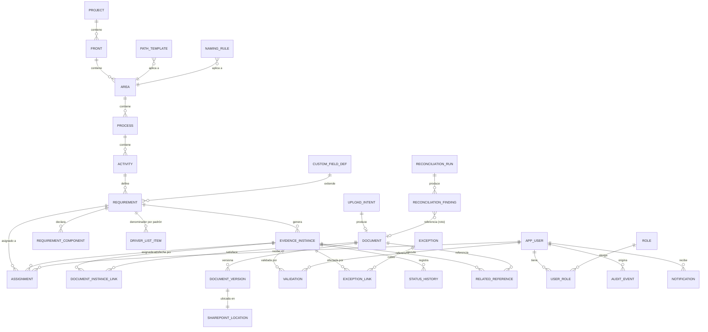
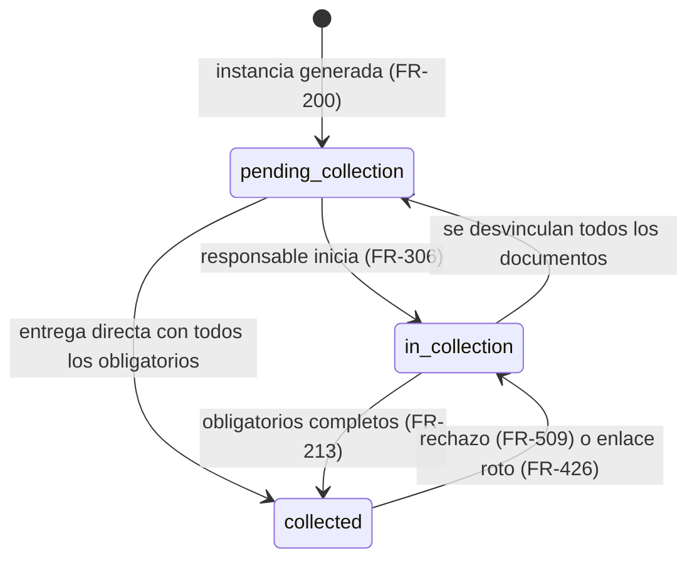
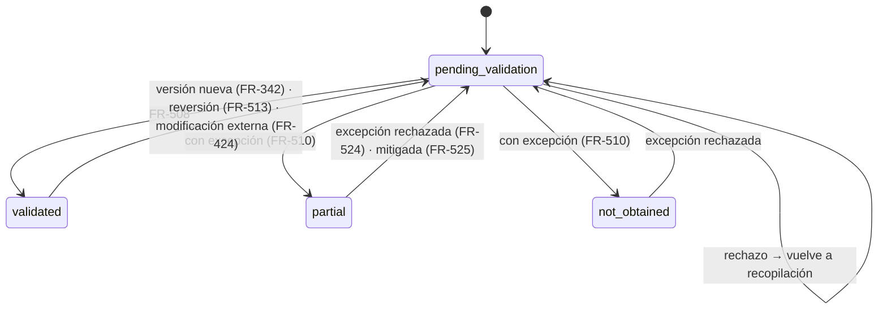
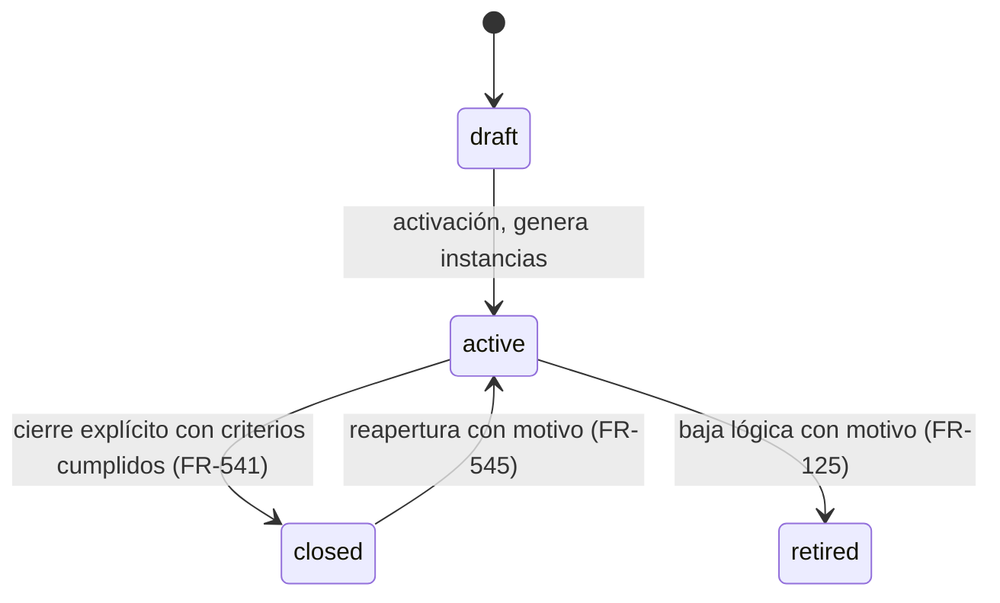
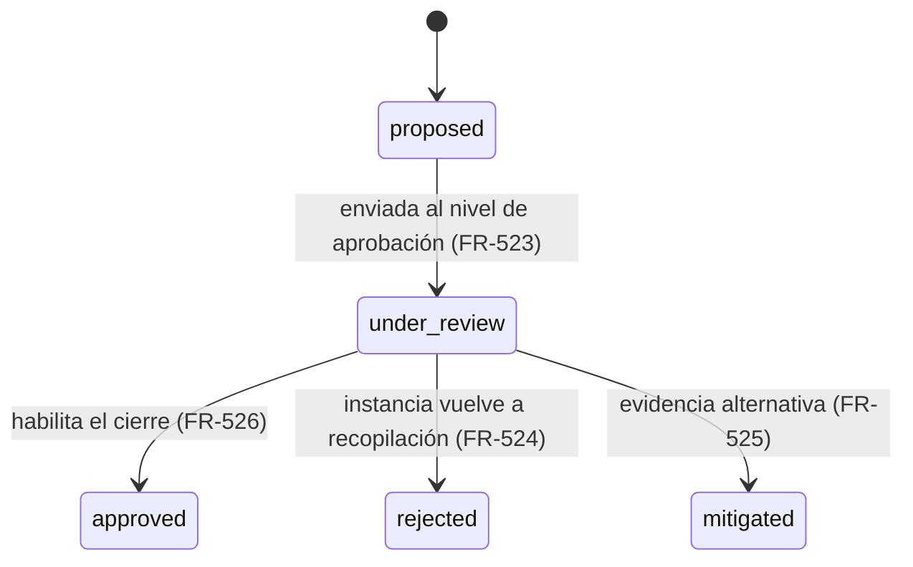
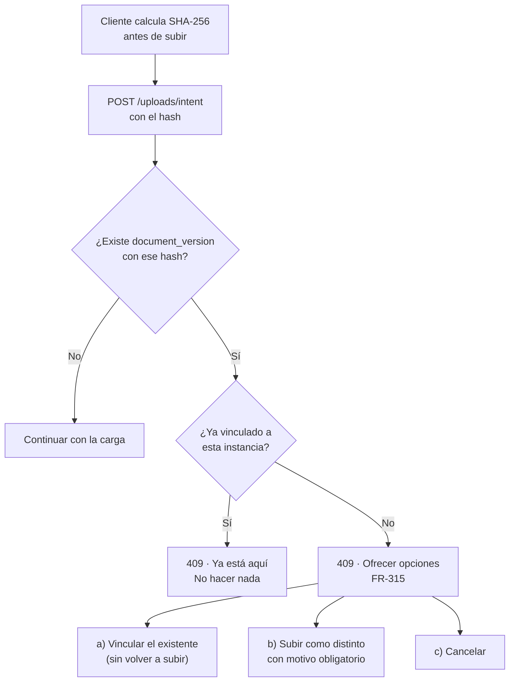
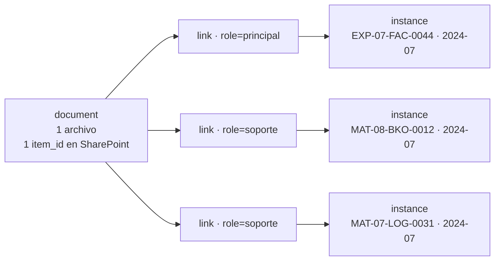

# 04 — Modelo de datos y especificación de API

**Portal de Materialidad y Expediente MSS**
Versión 1.0 · 17 de agosto de 2026

> Deriva de [01_PRD.md](01_PRD.md), [02_UX_UI_FLUJOS.md](02_UX_UI_FLUJOS.md) y [03_ARQUITECTURA_TECNICA.md](03_ARQUITECTURA_TECNICA.md). Terminología en [00_GLOSARIO.md](00_GLOSARIO.md).

---

## Índice

**Parte I — Modelo de datos**
1. [Principios](#1-principios)
2. [Modelo entidad-relación](#2-modelo-entidad-relación)
3. [Catálogo de entidades](#3-catálogo-de-entidades)
4. [Esquema de base de datos](#4-esquema-de-base-de-datos)
5. [Modelos de estatus](#5-modelos-de-estatus)
6. [Integridad referencial](#6-integridad-referencial)
7. [Manejo de duplicados](#7-manejo-de-duplicados)
8. [Manejo de versiones](#8-manejo-de-versiones)
9. [Lógica de generación de periodos](#9-lógica-de-generación-de-periodos)
10. [Documento contra múltiples requisitos](#10-documento-contra-múltiples-requisitos)
11. [Lógica de cálculo analítico](#11-lógica-de-cálculo-analítico)
12. [Identificadores de SharePoint a conservar](#12-identificadores-de-sharepoint-a-conservar)

**Parte II — API**
13. [Convenciones](#13-convenciones)
14. [Taxonomía](#14-taxonomía)
15. [Requisitos](#15-requisitos)
16. [Instancias](#16-instancias)
17. [Documentos y cargas](#17-documentos-y-cargas)
18. [SharePoint y reconciliación](#18-sharepoint-y-reconciliación)
19. [Validación](#19-validación)
20. [Excepciones y cierre](#20-excepciones-y-cierre)
21. [Búsqueda](#21-búsqueda)
22. [Analítica](#22-analítica)
23. [Administración](#23-administración)
24. [Notificaciones y auditoría](#24-notificaciones-y-auditoría)
25. [Índice de endpoints](#25-índice-de-endpoints)

---

# Parte I — Modelo de datos

## 1. Principios

**P-1 · Requisito ≠ Instancia ≠ Documento.** Tres tablas, no una. La instancia es donde vive el estatus y el denominador de cobertura. Es la decisión que estructura todo el modelo ([Glosario §1.2](00_GLOSARIO.md)).

**P-2 · La taxonomía es dato, no código.** Cuatro niveles configurables en tablas, sin `enum` (`FR-003`–`FR-008`).

**P-3 · Nada se destruye.** Sin borrado físico en entidades de negocio. Baja lógica con motivo; instancias fuera de alcance en lugar de eliminadas (`FR-125`, `FR-204`, `FR-346`).

**P-4 · Los estatus derivados no se almacenan como verdad.** El estatus de un requisito, área o frente se calcula desde las instancias. Se persiste solo como caché en las vistas materializadas, nunca como columna editable.

**P-5 · Los identificadores de SharePoint son copia, no origen.** Se guardan para resolver; la reconciliación los refresca ([Arquitectura §1.3](03_ARQUITECTURA_TECNICA.md)).

**P-6 · Toda escritura deja evento de auditoría en la misma transacción** (`FR-920`).

---

## 2. Modelo entidad-relación



---

## 3. Catálogo de entidades

### 3.1 Taxonomía

#### `project`
**Propósito.** Contenedor raíz. Un solo registro activo en la práctica, pero modelado como entidad para soportar el modo archivo y una eventual segunda instancia.
**PK.** `id` UUID.

| Campo | Tipo | Oblig. | Notas |
|---|---|:---:|---|
| `id` | uuid | ✔ | PK |
| `code` | varchar(32) | ✔ | Único. `MSS_CIERRE_2026` |
| `name` | varchar(200) | ✔ | |
| `description` | text | | |
| `target_close_date` | date | | Fecha objetivo de cierre |
| `status` | enum | ✔ | `active` · `closing` · `closed` · `archived` (`FR-001`, `FR-910`) |
| `sharepoint_site_id` | varchar(300) | | Configuración de conexión (`FR-903`) |
| `sharepoint_drive_id` | varchar(300) | | |
| `sharepoint_root_path` | varchar(500) | | `MSS_Cierre_2026` |
| `settings` | jsonb | ✔ | Umbrales, días de anticipación, frecuencias (`FR-907`) |
| `created_at` / `updated_at` | timestamptz | ✔ | |

**Restricciones.** `status = 'archived'` bloquea toda escritura en el proyecto (`FR-910`), verificado en la capa de servicio y por trigger.

---

#### `front`
**Propósito.** Los dos frentes. Cerrado: no se crean ni eliminan por interfaz (`FR-002`).
**PK.** `id` UUID.

| Campo | Tipo | Oblig. | Notas |
|---|---|:---:|---|
| `id` | uuid | ✔ | |
| `project_id` | uuid | ✔ | FK → `project` |
| `code` | varchar(32) | ✔ | `EXPEDIENTE_MSS` · `MATERIALIDAD` |
| `name` | varchar(200) | ✔ | |
| `folder_segment` | varchar(120) | ✔ | `01_Expediente_MSS` |
| `display_order` | smallint | ✔ | |

**Restricciones.** Único `(project_id, code)`. Exactamente dos filas por proyecto, garantizado por semilla y bloqueo de `DELETE` en el rol de aplicación.

---

#### `area`
**Propósito.** Área del Expediente o Servicio de Materialidad. Es el mismo concepto en ambos frentes (`FR-003`).

| Campo | Tipo | Oblig. | Notas |
|---|---|:---:|---|
| `id` | uuid | ✔ | |
| `front_id` | uuid | ✔ | FK → `front` |
| `code` | varchar(32) | ✔ | `TES`, `NOM`, `MAT03` |
| `name` | varchar(200) | ✔ | |
| `description` | text | | |
| `folder_segment` | varchar(120) | ✔ | `04_Tesoreria_y_Bancos` |
| `display_order` | smallint | ✔ | |
| `is_active` | boolean | ✔ | Default `true` (`FR-007`) |
| `default_period_start` | date | | Heredable a requisitos (`FR-010`, `DA-004`) |
| `default_period_end` | date | | |
| `default_sensitivity` | enum | ✔ | `public`·`internal`·`restricted`·`confidential` (`FR-011`) |
| `is_critical_area` | boolean | ✔ | Eleva nivel de aprobación de excepciones (§20) |

**Restricciones.** Único `(front_id, code)`. `is_active = false` impide requisitos nuevos, no oculta los existentes.

---

#### `process` y `activity`
Estructura análoga: `id`, padre (`area_id` / `process_id`), `code`, `name`, `description`, `folder_segment`, `display_order`, `is_active`. Único `(padre, code)`.

`activity` es el único nivel al que se ancla un requisito (`FR-100`), lo que garantiza que todo requisito tiene frente, área, proceso y actividad resolubles por navegación ascendente.

---

### 3.2 Núcleo del inventario

#### `requirement`
**Propósito.** La definición de qué debe recopilarse. Un renglón del Inventario Maestro en su nivel de definición.
**PK.** `id` UUID. **Clave natural:** `readable_id`.

| Campo | Tipo | Oblig. | Notas |
|---|---|:---:|---|
| `id` | uuid | ✔ | |
| `readable_id` | varchar(40) | ✔ | Único. `EXP-04-TES-0017`. Estable ante edición y movimiento (`FR-101`) |
| `activity_id` | uuid | ✔ | FK → `activity` |
| `name` | varchar(300) | ✔ | Nombre corto del documento requerido |
| `description` | text | ✔ | Qué se necesita y para qué (`FR-103`) |
| `information_type_id` | uuid | ✔ | FK → `information_type` |
| `periodicity` | enum | ✔ | Las diez de [Glosario §1.3](00_GLOSARIO.md) |
| `period_start` | date | cond. | Obligatorio si la periodicidad es enumerable (`FR-111`) |
| `period_end` | date | cond. | |
| `denominator_basis` | enum | cond. | `progressive`·`driver_list`. Obligatorio si no es enumerable; `progressive` es el default (`FR-112`, resuelto en `DA-001`) |
| `enumeration_status` | enum | cond. | `open`·`closed`. Solo aplica con `denominator_basis='progressive'` (`FR-113`) |
| `enumeration_closed_at` / `enumeration_closed_by_user_id` | timestamptz / uuid | cond. | Cuándo y quién cerró la enumeración (`FR-113b`) |
| `requires_native_format` | boolean | ✔ | Default `false` (`FR-105`) |
| `expected_extensions` | text[] | | `{pdf}`, `{xlsx,xls}` |
| `default_responsible_id` | uuid | | FK → `app_user` (`FR-300`) |
| `default_due_date` | date | | |
| `sensitivity` | enum | ✔ | Hereda del área, sobrescribible |
| `is_critical` | boolean | ✔ | Default `false` (`FR-106`) |
| `custom_fields` | jsonb | ✔ | Default `{}`. Validado contra `custom_field_def` (`FR-107`) |
| `path_template_override` | varchar(500) | | Plantilla propia a nivel requisito (`FR-441`) |
| `naming_rule_override` | varchar(500) | | |
| `observations` | text | | |
| `status` | enum | ✔ | `draft`·`active`·`closed`·`retired` |
| `closed_at` / `closed_by_user_id` | timestamptz / uuid | | `FR-541` |
| `retired_reason` | text | cond. | Obligatorio si `status='retired'` (`FR-125`) |
| `row_version` | integer | ✔ | Control de concurrencia optimista |
| `created_at` / `updated_at` / `created_by_user_id` | | ✔ | |

**Restricciones clave.**
```sql
CHECK (period_end IS NULL OR period_start IS NULL OR period_end >= period_start)
CHECK (periodicity IN ('monthly','quarterly','annual','date_range','permanent')
       OR denominator_basis IS NOT NULL)
CHECK (denominator_basis <> 'progressive' OR enumeration_status IS NOT NULL)
CHECK (enumeration_status <> 'closed' OR enumeration_closed_at IS NOT NULL)
CHECK (status <> 'retired' OR retired_reason IS NOT NULL)
```

---

#### `requirement_component`
**Propósito.** Qué documentos componen una instancia completa y cuáles son obligatorios (`FR-104`). Es lo que permite distinguir "hay algo cargado" de "está completo".

| Campo | Tipo | Oblig. | Notas |
|---|---|:---:|---|
| `id` | uuid | ✔ | |
| `requirement_id` | uuid | ✔ | FK, `ON DELETE CASCADE` |
| `role` | varchar(60) | ✔ | Del catálogo de papeles: `principal`, `comprobante`, … |
| `label` | varchar(200) | ✔ | "Contrato o cotización" |
| `is_mandatory` | boolean | ✔ | Determina `collection_status` (`FR-213`) |
| `display_order` | smallint | ✔ | |

---

#### `evidence_instance`
**Propósito.** Cada ocurrencia que el requisito exige. **Es el registro sobre el que se calcula toda la analítica de cobertura.** La tabla más consultada del sistema.

| Campo | Tipo | Oblig. | Notas |
|---|---|:---:|---|
| `id` | uuid | ✔ | |
| `requirement_id` | uuid | ✔ | FK |
| `period_label` | varchar(60) | ✔ | `2021-03`, `2021-Q2`, `2021`, `Permanente`, o etiqueta del driver (`FR-202`) |
| `period_start` | date | | Nulo en `permanent` y en instancias por driver sin fecha |
| `period_end` | date | | |
| `driver_key` | varchar(200) | | Identificador del driver cuando aplica |
| `driver_label` | varchar(300) | | "Juan Pérez (E-0412)" |
| `collection_status` | enum | ✔ | `pending_collection`·`in_collection`·`collected` |
| `status_source` | enum | ✔ | `derived`·`manual`. `derived` cuando `collection_status` se calcula desde los componentes obligatorios (§5.1); `manual` en requisitos `progressive`, donde el responsable marca la instancia como recopilada directamente (`DA-001`) |
| `validation_status` | enum | ✔ | `pending_validation`·`validated`·`partial`·`not_obtained` |
| `responsible_id` | uuid | | Sobrescribe el del requisito (`FR-301`) |
| `due_date` | date | | |
| `is_overdue` | boolean | ✔ | Calculado por job (`FR-215`) |
| `out_of_scope` | boolean | ✔ | Default `false`. Excluye del denominador (`FR-204`, `FR-207`) |
| `out_of_scope_reason` | text | cond. | Obligatorio si `out_of_scope` |
| `is_manual` | boolean | ✔ | Agregada a mano, no generada (`FR-206`) |
| `manual_reason` | text | cond. | |
| `forced_collected` | boolean | ✔ | Estatus forzado con justificación (`FR-214`) |
| `forced_reason` | text | cond. | |
| `collected_at` / `collected_by_user_id` | | | "Entregado por / fecha" del Plan Macro |
| `validated_at` / `validated_by_user_id` | | | |
| `created_at` / `updated_at` | | ✔ | |

**Restricciones.**
```sql
UNIQUE (requirement_id, period_label, COALESCE(driver_key,''))   -- idempotencia (§9)
CHECK (NOT out_of_scope OR out_of_scope_reason IS NOT NULL)
CHECK (collection_status = 'collected' OR validation_status = 'pending_validation')
CHECK (validation_status NOT IN ('partial','not_obtained')
       OR EXISTS (excepción vinculada))  -- aplicado por trigger, ver §6
```

**Índices.** `(requirement_id, period_start)`, `(collection_status, validation_status)`, `(responsible_id, due_date) WHERE NOT out_of_scope`, `(validation_status) WHERE collection_status='collected'` para la cola de validación.

---

#### `driver_list_item`
**Propósito.** Padrón cargado que da denominador a periodicidades no enumerables (`FR-114`).

| Campo | Tipo | Oblig. |
|---|---|:---:|
| `id` | uuid | ✔ |
| `requirement_id` | uuid | ✔ |
| `driver_key` | varchar(200) | ✔ |
| `driver_label` | varchar(300) | ✔ |
| `attributes` | jsonb | ✔ |
| `imported_at` / `imported_by_user_id` | | ✔ |

Único `(requirement_id, driver_key)`.

---

### 3.3 Documentos

#### `document`
**Propósito.** Un archivo único. **No** una copia por requisito: es la entidad que hace posible el N:M (`FR-320`).

| Campo | Tipo | Oblig. | Notas |
|---|---|:---:|---|
| `id` | uuid | ✔ | |
| `project_id` | uuid | ✔ | |
| `current_version_id` | uuid | | FK → `document_version` |
| `original_filename` | varchar(400) | ✔ | **Se conserva siempre** (`FR-313`) |
| `canonical_filename` | varchar(400) | ✔ | El generado por la regla de nombrado |
| `information_type_id` | uuid | | |
| `ingestion_path` | enum | ✔ | `app_upload`·`existing_registration`·`reconciliation` ([Glosario §1.4](00_GLOSARIO.md)) |
| `sensitivity` | enum | ✔ | |
| `email_metadata` | jsonb | | Remitente, destinatarios, fecha, asunto, adjuntos (`FR-322`) |
| `status` | enum | ✔ | `active`·`replaced`·`retired`·`broken_link` |
| `retired_reason` | text | cond. | `FR-345` |
| `has_duplicate_content` | boolean | ✔ | Default `false`. `true` cuando otro documento activo comparte el `content_hash` de su versión vigente (`FR-315b`, `DA-002`) |
| `created_at` / `created_by_user_id` | | ✔ | |

**Duplicados de contenido (`DA-002`).** El Portal ya no fuerza una sola copia "maestra" por contenido. Cuando dos o más `document` tienen versiones vigentes con el mismo `content_hash`, cada uno se marca `has_duplicate_content = true` y la ficha de cada uno lista a los demás (resuelto por consulta sobre `document_version.content_hash`, no por una tabla de agrupación separada — ver §7 y §9 de este documento). No hay consolidación automática; es información para quien decida limpiarlo manualmente.

---

#### `document_version`
**Propósito.** Una revisión concreta. La versión nueva no rompe vínculos (`FR-341`).

| Campo | Tipo | Oblig. | Notas |
|---|---|:---:|---|
| `id` | uuid | ✔ | |
| `document_id` | uuid | ✔ | FK |
| `version_number` | integer | ✔ | Comienza en 1 |
| `filename` | varchar(400) | ✔ | Sufijo `_vXX` a partir de la 2 |
| `content_hash` | char(64) | ✔ | SHA-256 (`FR-314`) |
| `size_bytes` | bigint | ✔ | |
| `mime_type` | varchar(200) | ✔ | Detectado por firma, no por extensión |
| `extension` | varchar(20) | ✔ | |
| `change_reason` | text | cond. | Obligatorio desde la versión 2 (`FR-343`) |
| `uploaded_at` / `uploaded_by_user_id` | | ✔ | |

Único `(document_id, version_number)`. Índice sobre `content_hash` para detección de duplicados.

---

#### `sharepoint_location`
**Propósito.** Dónde vive el archivo. Relación 1:1 con `document_version`. Ver §12.

| Campo | Tipo | Oblig. | Notas |
|---|---|:---:|---|
| `id` | uuid | ✔ | |
| `document_version_id` | uuid | ✔ | Único |
| `site_id` | varchar(300) | ✔ | |
| `drive_id` | varchar(300) | ✔ | |
| `item_id` | varchar(300) | ✔ | **El ancla** (`FR-404`) |
| `etag` | varchar(200) | ✔ | Detección de modificación externa (`FR-424`) |
| `ctag` | varchar(200) | | |
| `relative_path` | varchar(1000) | ✔ | Informativa, refrescada por reconciliación |
| `web_url` | varchar(1500) | ✔ | |
| `canonical_path` | varchar(1000) | ✔ | La que la plantilla calcula |
| `path_deviation` | boolean | ✔ | `relative_path` ≠ `canonical_path` (`FR-333`) |
| `name_deviation` | boolean | ✔ | `FR-334` |
| `last_verified_at` | timestamptz | | Última reconciliación que lo resolvió |
| `placed_at` | timestamptz | ✔ | |

Único `(drive_id, item_id)` — impide que dos versiones apunten al mismo ítem de SharePoint.

---

#### `document_instance_link`
**Propósito.** La relación N:M. Es la tabla que materializa "un documento maestro, varios registros del inventario" del Plan Macro.

| Campo | Tipo | Oblig. | Notas |
|---|---|:---:|---|
| `id` | uuid | ✔ | |
| `document_id` | uuid | ✔ | FK |
| `evidence_instance_id` | uuid | ✔ | FK |
| `role` | varchar(60) | ✔ | Papel que cumple aquí (`FR-104`) |
| `requirement_component_id` | uuid | | Contra qué componente declarado satisface |
| `is_active` | boolean | ✔ | Baja lógica al desvincular (`FR-344`) |
| `unlink_reason` | text | cond. | |
| `linked_at` / `linked_by_user_id` | | ✔ | |

Único `(document_id, evidence_instance_id, role) WHERE is_active`.

---

#### `upload_intent`
**Propósito.** Garantizar idempotencia de la colocación (`FR-406`). Sin esta tabla, un reintento tras un fallo de red duplica el archivo en SharePoint.

| Campo | Tipo | Oblig. | Notas |
|---|---|:---:|---|
| `id` | uuid | ✔ | |
| `idempotency_key` | varchar(120) | ✔ | Único. Del encabezado del cliente |
| `evidence_instance_ids` | uuid[] | ✔ | Puede ser multi-instancia (`FR-320`) |
| `original_filename` | varchar(400) | ✔ | |
| `content_hash` | char(64) | ✔ | |
| `size_bytes` | bigint | ✔ | |
| `target_path` / `target_filename` | varchar | ✔ | Resueltos antes de subir |
| `staging_blob_url` | varchar(1000) | | |
| `state` | enum | ✔ | `created`·`uploaded`·`placing`·`placed`·`failed`·`cancelled` |
| `resulting_item_id` | varchar(300) | | Si existe, el reintento **no** vuelve a subir |
| `document_id` | uuid | | Documento producido |
| `attempts` | integer | ✔ | |
| `last_error` | jsonb | | |
| `created_at` / `updated_at` | | ✔ | |

---

### 3.4 Workflow

#### `assignment`
Asignación de responsable con ámbito de requisito o de instancia (`FR-300`, `FR-301`, `FR-304`).

| Campo | Tipo | Oblig. |
|---|---|:---:|
| `id` | uuid | ✔ |
| `requirement_id` | uuid | cond. |
| `evidence_instance_id` | uuid | cond. |
| `assignee_id` | uuid | ✔ |
| `assigned_by_id` | uuid | ✔ |
| `due_date` | date | |
| `is_active` | boolean | ✔ |
| `delegated_from_id` | uuid | |
| `delegation_reason` | text | cond. |
| `assigned_at` | timestamptz | ✔ |

`CHECK (num_nonnulls(requirement_id, evidence_instance_id) = 1)` — exactamente uno de los dos.

---

#### `validation`
Cada acto de validación (`FR-512`). Append-only: una reversión (`FR-513`) crea un registro nuevo, no modifica el anterior.

| Campo | Tipo | Oblig. | Notas |
|---|---|:---:|---|
| `id` | uuid | ✔ | |
| `evidence_instance_id` | uuid | ✔ | |
| `attempt_number` | integer | ✔ | Incremental por instancia |
| `validator_id` | uuid | ✔ | |
| `result` | enum | ✔ | `validated`·`rejected`·`partial`·`not_obtained`·`reverted` |
| `checklist_responses` | jsonb | ✔ | `[{itemCode, checked, auto}]` (`FR-506`) |
| `rejection_reason_code` | varchar(60) | cond. | Obligatorio si `rejected` (`FR-509`) |
| `comment` | text | cond. | Obligatorio si `rejected` o `reverted` |
| `exception_id` | uuid | cond. | Obligatorio si `partial` o `not_obtained` (`FR-510`) |
| `batch_id` | uuid | | Agrupa validaciones en lote (`FR-511`) |
| `validated_at` | timestamptz | ✔ | |

Único `(evidence_instance_id, attempt_number)`.

---

#### `exception`
Excepción / Riesgo documental (`FR-520`–`FR-529`).

| Campo | Tipo | Oblig. | Notas |
|---|---|:---:|---|
| `id` | uuid | ✔ | |
| `readable_id` | varchar(20) | ✔ | Único. `EXC-041` |
| `project_id` | uuid | ✔ | |
| `what_is_missing` | text | ✔ | Los cuatro campos del Plan Macro |
| `why_not_recovered` | text | ✔ | |
| `impact_level` | enum | ✔ | `low`·`medium`·`high` |
| `impact_description` | text | ✔ | |
| `agreed_treatment` | text | ✔ | |
| `status` | enum | ✔ | `proposed`·`under_review`·`approved`·`rejected`·`mitigated` |
| `proposed_by_id` / `proposed_at` | | ✔ | |
| `resolved_by_id` / `resolved_at` | | | Debe ser un usuario con `user_role(role_code='validator', scope_type='project')` — el "validador final" (`FR-523`, `DA-009`) |
| `resolution_comment` | text | cond. | Obligatorio si `rejected` |
| `mitigation_description` | text | cond. | Obligatorio si `mitigated` (`FR-525`) |

> Resuelto en `DA-009`: se eliminó el campo `required_approval_level` (y el escalonamiento por impacto que representaba). Toda excepción, sin importar `impact_level`, la resuelve un validador final — verificado por trigger, análogo a `trg_validator_segregation` (§6.2).

---

#### `exception_link`
Alcance de la excepción: una, varias instancias o un requisito completo (`FR-520`).

`id`, `exception_id`, `evidence_instance_id` (cond.), `requirement_id` (cond.). `CHECK (num_nonnulls(...) = 1)`.

---

#### `related_reference`
Referencias transaccionales (`FR-350`, `FR-351`).

| Campo | Tipo | Oblig. |
|---|---|:---:|
| `id` | uuid | ✔ |
| `evidence_instance_id` | uuid | cond. |
| `document_id` | uuid | cond. |
| `reference_type` | enum | ✔ |
| `reference_key` | varchar(200) | ✔ |
| `reference_label` | varchar(400) | |
| `reference_date` | date | |
| `amount` | numeric(18,2) | |
| `currency` | char(3) | |

`reference_type`: `invoice`·`payment`·`supplier`·`employee`·`client`·`project`·`contract`·`policy`·`other`.
Índice sobre `(reference_type, reference_key)` — es el que sirve la búsqueda por factura de `FR-609`.

---

#### `status_history`
Cada transición de estatus de una instancia (`FR-924`). Complementa la auditoría con una vista específica del ciclo de vida, optimizada para mostrar la línea de tiempo en la ficha.

`id`, `evidence_instance_id`, `field` (`collection`/`validation`), `from_status`, `to_status`, `changed_by_id`, `changed_at`, `reason`, `source_entity`, `source_id`.

---

### 3.5 Identidad y gobierno

#### `app_user`
`id`, `entra_object_id` (único), `email`, `display_name`, `is_active`, `last_login_at`, `notification_preferences` (jsonb), `ui_preferences` (jsonb).

#### `role`
Catálogo cerrado de los cinco roles: `admin`, `area_coordinator`, `contributor`, `validator`, `viewer`.

#### `user_role`
La tabla que implementa **usuario × rol × ámbito** (`FR-901`, `FR-931`).

| Campo | Tipo | Oblig. | Notas |
|---|---|:---:|---|
| `id` | uuid | ✔ | |
| `user_id` | uuid | ✔ | |
| `role_code` | varchar(32) | ✔ | |
| `scope_type` | enum | ✔ | `project`·`front`·`area` |
| `scope_id` | uuid | ✔ | Apunta a `project`, `front` o `area` según `scope_type` |
| `granted_by_id` / `granted_at` | | ✔ | |
| `is_active` | boolean | ✔ | |

Único `(user_id, role_code, scope_type, scope_id) WHERE is_active`.
El polimorfismo de `scope_id` se valida en la aplicación; no hay FK única posible. Es la única concesión a la integridad declarativa del modelo, y se compensa con una prueba de integridad dedicada (documento 05).

---

#### `audit_event`
Append-only, particionada por mes (`FR-920`–`FR-925`).

| Campo | Tipo | Oblig. |
|---|---|:---:|
| `id` | uuid | ✔ |
| `occurred_at` | timestamptz | ✔ |
| `actor_user_id` | uuid | |
| `action` | varchar(80) | ✔ |
| `entity_type` | varchar(60) | ✔ |
| `entity_id` | uuid | ✔ |
| `before` / `after` | jsonb | |
| `origin` | enum | ✔ |
| `correlation_id` | varchar(80) | |
| `ip_address` | inet | |

`origin`: `ui`·`api`·`import`·`job`·`system`. Sin `UPDATE` ni `DELETE`: el rol de aplicación solo tiene `INSERT` y `SELECT`.

---

#### `notification`
`id`, `recipient_id`, `type`, `entity_type`, `entity_id`, `payload` (jsonb), `channel` (`in_app`/`email`), `delivery_mode` (`immediate`/`digest`), `status` (`pending`/`sent`/`failed`/`read`), `dedup_key`, `created_at`, `sent_at`, `read_at`.

Único `(dedup_key) WHERE status = 'pending'` — implementa `FR-807`.

---

### 3.6 Configuración y operación

| Entidad | Propósito | FR |
|---|---|---|
| `information_type` | Catálogo de tipos de documento con extensiones esperadas y sensibilidad predeterminada | `FR-902` |
| `custom_field_def` | Definición de campos de extensión: código, etiqueta, tipo, obligatoriedad, ámbito | `FR-107`, `FR-108` |
| `path_template` | Plantilla de ruta con su nivel de aplicación (`front`/`area`/`process`) | `FR-440`, `FR-441` |
| `naming_rule` | Regla de nombrado, misma lógica de herencia | `FR-445` |
| `checklist_item` | Puntos del checklist con ámbito y obligatoriedad | `FR-507` |
| `rejection_reason` | Catálogo de motivos de rechazo | `FR-509` |
| ~~`approval_matrix`~~ | Eliminada (`DA-009`): sin niveles de aprobación por impacto. Toda excepción se resuelve por `user_role(role_code='validator', scope_type='project')` | `FR-523`, `FR-905` |
| `reconciliation_run` | Cada corrida: inicio, fin, modo, ítems revisados, hallazgos, delta token | `FR-428` |
| `reconciliation_finding` | Hallazgo individual: tipo, ítem, sugerencia, estado de resolución | `FR-421`–`FR-426` |
| `progress_snapshot` | Punto histórico diario de avance por ámbito | `FR-719` |
| `saved_search` | Búsquedas guardadas por usuario | `FR-604` |

`reconciliation_finding.finding_type`: `orphan`·`broken_link`·`moved`·`externally_modified`.
`reconciliation_finding.resolution`: `pending`·`linked`·`new_requirement`·`not_relevant`·`escalated`·`auto_resolved`.

---

## 4. Esquema de base de datos

DDL de las tablas centrales. Las de configuración y catálogo siguen los mismos patrones y se omiten por extensión.

```sql
CREATE EXTENSION IF NOT EXISTS "uuid-ossp";
CREATE EXTENSION IF NOT EXISTS "unaccent";
CREATE EXTENSION IF NOT EXISTS "pg_trgm";

-- ── Tipos ────────────────────────────────────────────────────────────────────
CREATE TYPE periodicity_t AS ENUM (
  'monthly','quarterly','annual','date_range','permanent',
  'per_event','per_employee','per_supplier','per_project','per_transaction');

CREATE TYPE denominator_basis_t AS ENUM ('progressive','driver_list');   -- DA-001
CREATE TYPE enumeration_status_t AS ENUM ('open','closed');              -- DA-001
CREATE TYPE collection_status_t AS ENUM ('pending_collection','in_collection','collected');
CREATE TYPE validation_status_t AS ENUM ('pending_validation','validated','partial','not_obtained');
CREATE TYPE sensitivity_t       AS ENUM ('public','internal','restricted','confidential');
CREATE TYPE ingestion_path_t    AS ENUM ('app_upload','existing_registration','reconciliation');
CREATE TYPE requirement_status_t AS ENUM ('draft','active','closed','retired');
CREATE TYPE exception_status_t  AS ENUM ('proposed','under_review','approved','rejected','mitigated');
CREATE TYPE impact_level_t      AS ENUM ('low','medium','high');
CREATE TYPE scope_type_t        AS ENUM ('project','front','area');

-- ── Taxonomía ────────────────────────────────────────────────────────────────
CREATE TABLE area (
  id                  uuid PRIMARY KEY DEFAULT uuid_generate_v4(),
  front_id            uuid NOT NULL REFERENCES front(id) ON DELETE RESTRICT,
  code                varchar(32)  NOT NULL,
  name                varchar(200) NOT NULL,
  description         text,
  folder_segment      varchar(120) NOT NULL,
  display_order       smallint     NOT NULL DEFAULT 0,
  is_active           boolean      NOT NULL DEFAULT true,
  default_period_start date,
  default_period_end   date,
  default_sensitivity sensitivity_t NOT NULL DEFAULT 'internal',
  is_critical_area    boolean      NOT NULL DEFAULT false,
  created_at          timestamptz  NOT NULL DEFAULT now(),
  updated_at          timestamptz  NOT NULL DEFAULT now(),
  CONSTRAINT uq_area_code UNIQUE (front_id, code),
  CONSTRAINT ck_area_period CHECK (
    default_period_end IS NULL OR default_period_start IS NULL
    OR default_period_end >= default_period_start)
);

-- ── Requisito ────────────────────────────────────────────────────────────────
CREATE TABLE requirement (
  id                      uuid PRIMARY KEY DEFAULT uuid_generate_v4(),
  readable_id             varchar(40) NOT NULL UNIQUE,
  activity_id             uuid NOT NULL REFERENCES activity(id) ON DELETE RESTRICT,
  name                    varchar(300) NOT NULL,
  description             text NOT NULL,
  information_type_id     uuid NOT NULL REFERENCES information_type(id),
  periodicity             periodicity_t NOT NULL,
  period_start            date,
  period_end              date,
  denominator_basis       denominator_basis_t,
  enumeration_status      enumeration_status_t,
  enumeration_closed_at   timestamptz,
  enumeration_closed_by_user_id uuid REFERENCES app_user(id),
  requires_native_format  boolean NOT NULL DEFAULT false,
  expected_extensions     text[],
  default_responsible_id  uuid REFERENCES app_user(id),
  default_due_date        date,
  sensitivity             sensitivity_t NOT NULL DEFAULT 'internal',
  is_critical             boolean NOT NULL DEFAULT false,
  custom_fields           jsonb NOT NULL DEFAULT '{}'::jsonb,
  path_template_override  varchar(500),
  naming_rule_override    varchar(500),
  observations            text,
  status                  requirement_status_t NOT NULL DEFAULT 'draft',
  closed_at               timestamptz,
  closed_by_user_id       uuid REFERENCES app_user(id),
  retired_reason          text,
  row_version             integer NOT NULL DEFAULT 1,
  created_at              timestamptz NOT NULL DEFAULT now(),
  updated_at              timestamptz NOT NULL DEFAULT now(),
  created_by_user_id      uuid NOT NULL REFERENCES app_user(id),

  CONSTRAINT ck_req_period_order CHECK (
    period_end IS NULL OR period_start IS NULL OR period_end >= period_start),

  -- Enumerable exige rango; no enumerable exige base de cálculo
  CONSTRAINT ck_req_denominator CHECK (
    (periodicity IN ('monthly','quarterly','annual','date_range','permanent')
       AND period_start IS NOT NULL)
    OR
    (periodicity NOT IN ('monthly','quarterly','annual','date_range','permanent')
       AND denominator_basis IS NOT NULL)),

  CONSTRAINT ck_req_enumeration CHECK (
    denominator_basis IS DISTINCT FROM 'progressive'
    OR enumeration_status IS NOT NULL),

  CONSTRAINT ck_req_enum_closed CHECK (
    enumeration_status <> 'closed'
    OR (enumeration_closed_at IS NOT NULL AND enumeration_closed_by_user_id IS NOT NULL)),

  CONSTRAINT ck_req_retired CHECK (
    status <> 'retired' OR retired_reason IS NOT NULL)
);

CREATE INDEX ix_req_activity   ON requirement(activity_id);
CREATE INDEX ix_req_status     ON requirement(status) WHERE status = 'active';
CREATE INDEX ix_req_resp       ON requirement(default_responsible_id);
CREATE INDEX ix_req_custom     ON requirement USING gin (custom_fields);
CREATE INDEX ix_req_search     ON requirement USING gin (
  to_tsvector('spanish', unaccent(name || ' ' || description)));

-- ── Instancia ────────────────────────────────────────────────────────────────
CREATE TABLE evidence_instance (
  id                  uuid PRIMARY KEY DEFAULT uuid_generate_v4(),
  requirement_id      uuid NOT NULL REFERENCES requirement(id) ON DELETE RESTRICT,
  period_label        varchar(60) NOT NULL,
  period_start        date,
  period_end          date,
  driver_key          varchar(200),
  driver_label        varchar(300),
  collection_status   collection_status_t NOT NULL DEFAULT 'pending_collection',
  status_source       varchar(10) NOT NULL DEFAULT 'derived',   -- 'derived' | 'manual' (DA-001)
  validation_status   validation_status_t NOT NULL DEFAULT 'pending_validation',
  responsible_id      uuid REFERENCES app_user(id),
  due_date            date,
  is_overdue          boolean NOT NULL DEFAULT false,
  out_of_scope        boolean NOT NULL DEFAULT false,
  out_of_scope_reason text,
  is_manual           boolean NOT NULL DEFAULT false,
  manual_reason       text,
  forced_collected    boolean NOT NULL DEFAULT false,
  forced_reason       text,
  collected_at        timestamptz,
  collected_by_user_id uuid REFERENCES app_user(id),
  validated_at        timestamptz,
  validated_by_user_id uuid REFERENCES app_user(id),
  created_at          timestamptz NOT NULL DEFAULT now(),
  updated_at          timestamptz NOT NULL DEFAULT now(),

  CONSTRAINT uq_instance UNIQUE (requirement_id, period_label, driver_key),
  CONSTRAINT ck_inst_oos    CHECK (NOT out_of_scope     OR out_of_scope_reason IS NOT NULL),
  CONSTRAINT ck_inst_manual CHECK (NOT is_manual        OR manual_reason       IS NOT NULL),
  CONSTRAINT ck_inst_forced CHECK (NOT forced_collected OR forced_reason       IS NOT NULL),
  -- No se puede validar lo que no está recopilado
  CONSTRAINT ck_inst_flow   CHECK (
    collection_status = 'collected' OR validation_status = 'pending_validation')
);

CREATE INDEX ix_inst_req      ON evidence_instance(requirement_id, period_start);
CREATE INDEX ix_inst_status   ON evidence_instance(collection_status, validation_status)
                                 WHERE NOT out_of_scope;
CREATE INDEX ix_inst_resp     ON evidence_instance(responsible_id, due_date)
                                 WHERE NOT out_of_scope;
CREATE INDEX ix_inst_queue    ON evidence_instance(validation_status, collected_at)
                                 WHERE collection_status = 'collected'
                                   AND validation_status = 'pending_validation';
CREATE INDEX ix_inst_period   ON evidence_instance(period_start, period_end)
                                 WHERE NOT out_of_scope;

-- ── Documento ────────────────────────────────────────────────────────────────
CREATE TABLE document (
  id                  uuid PRIMARY KEY DEFAULT uuid_generate_v4(),
  project_id          uuid NOT NULL REFERENCES project(id),
  current_version_id  uuid,
  original_filename   varchar(400) NOT NULL,
  canonical_filename  varchar(400) NOT NULL,
  information_type_id uuid REFERENCES information_type(id),
  ingestion_path      ingestion_path_t NOT NULL,
  sensitivity         sensitivity_t NOT NULL DEFAULT 'internal',
  email_metadata      jsonb,
  status              varchar(20) NOT NULL DEFAULT 'active',
  retired_reason      text,
  has_duplicate_content boolean NOT NULL DEFAULT false,   -- DA-002, recalculado por trigger sobre content_hash
  created_at          timestamptz NOT NULL DEFAULT now(),
  created_by_user_id  uuid NOT NULL REFERENCES app_user(id)
);

CREATE TABLE document_version (
  id                  uuid PRIMARY KEY DEFAULT uuid_generate_v4(),
  document_id         uuid NOT NULL REFERENCES document(id) ON DELETE RESTRICT,
  version_number      integer NOT NULL,
  filename            varchar(400) NOT NULL,
  content_hash        char(64) NOT NULL,
  size_bytes          bigint NOT NULL CHECK (size_bytes > 0),
  mime_type           varchar(200) NOT NULL,
  extension           varchar(20) NOT NULL,
  change_reason       text,
  uploaded_at         timestamptz NOT NULL DEFAULT now(),
  uploaded_by_user_id uuid NOT NULL REFERENCES app_user(id),
  CONSTRAINT uq_docver UNIQUE (document_id, version_number),
  CONSTRAINT ck_docver_reason CHECK (version_number = 1 OR change_reason IS NOT NULL)
);

CREATE INDEX ix_docver_hash ON document_version(content_hash);

ALTER TABLE document
  ADD CONSTRAINT fk_doc_current
  FOREIGN KEY (current_version_id) REFERENCES document_version(id) DEFERRABLE INITIALLY DEFERRED;

CREATE TABLE sharepoint_location (
  id                  uuid PRIMARY KEY DEFAULT uuid_generate_v4(),
  document_version_id uuid NOT NULL UNIQUE
                        REFERENCES document_version(id) ON DELETE RESTRICT,
  site_id             varchar(300) NOT NULL,
  drive_id            varchar(300) NOT NULL,
  item_id             varchar(300) NOT NULL,
  etag                varchar(200) NOT NULL,
  ctag                varchar(200),
  relative_path       varchar(1000) NOT NULL,
  web_url             varchar(1500) NOT NULL,
  canonical_path      varchar(1000) NOT NULL,
  path_deviation      boolean NOT NULL DEFAULT false,
  name_deviation      boolean NOT NULL DEFAULT false,
  last_verified_at    timestamptz,
  placed_at           timestamptz NOT NULL DEFAULT now(),
  CONSTRAINT uq_sp_item UNIQUE (drive_id, item_id)
);

CREATE INDEX ix_sp_deviation ON sharepoint_location(path_deviation)
                               WHERE path_deviation;

-- ── El N:M ───────────────────────────────────────────────────────────────────
CREATE TABLE document_instance_link (
  id                       uuid PRIMARY KEY DEFAULT uuid_generate_v4(),
  document_id              uuid NOT NULL REFERENCES document(id) ON DELETE RESTRICT,
  evidence_instance_id     uuid NOT NULL REFERENCES evidence_instance(id) ON DELETE RESTRICT,
  role                     varchar(60) NOT NULL,
  requirement_component_id uuid REFERENCES requirement_component(id),
  is_active                boolean NOT NULL DEFAULT true,
  unlink_reason            text,
  linked_at                timestamptz NOT NULL DEFAULT now(),
  linked_by_user_id        uuid NOT NULL REFERENCES app_user(id),
  CONSTRAINT ck_link_unlink CHECK (is_active OR unlink_reason IS NOT NULL)
);

CREATE UNIQUE INDEX uq_link_active
  ON document_instance_link(document_id, evidence_instance_id, role)
  WHERE is_active;
CREATE INDEX ix_link_instance ON document_instance_link(evidence_instance_id)
  WHERE is_active;
CREATE INDEX ix_link_document ON document_instance_link(document_id)
  WHERE is_active;

-- ── Auditoría (particionada) ─────────────────────────────────────────────────
CREATE TABLE audit_event (
  id             uuid NOT NULL DEFAULT uuid_generate_v4(),
  occurred_at    timestamptz NOT NULL DEFAULT now(),
  actor_user_id  uuid REFERENCES app_user(id),
  action         varchar(80) NOT NULL,
  entity_type    varchar(60) NOT NULL,
  entity_id      uuid NOT NULL,
  before         jsonb,
  after          jsonb,
  origin         varchar(20) NOT NULL,
  correlation_id varchar(80),
  ip_address     inet,
  PRIMARY KEY (id, occurred_at)
) PARTITION BY RANGE (occurred_at);

CREATE INDEX ix_audit_entity ON audit_event(entity_type, entity_id, occurred_at DESC);
CREATE INDEX ix_audit_actor  ON audit_event(actor_user_id, occurred_at DESC);

REVOKE UPDATE, DELETE ON audit_event FROM portal_app;   -- FR-922
```

---

## 5. Modelos de estatus

### 5.1 Recopilación (instancia)



Transición a `collected`, evaluada tras cada vínculo o desvínculo:

```sql
-- La instancia está recopilada si no falta ningún componente obligatorio
SELECT NOT EXISTS (
  SELECT 1 FROM requirement_component rc
  WHERE rc.requirement_id = :req_id AND rc.is_mandatory
    AND NOT EXISTS (
      SELECT 1 FROM document_instance_link dil
      WHERE dil.evidence_instance_id = :instance_id
        AND dil.is_active
        AND dil.requirement_component_id = rc.id))
OR :forced_collected;
```

Si el requisito no declara componentes, basta un documento activo vinculado.

### 5.2 Validación (instancia)



**Nota deliberada:** `rejected` no es un estatus de validación. Es una transición que devuelve la instancia al ciclo de recopilación. Los estatus terminales son los cuatro del Plan Macro.

### 5.3 Requisito (derivado + acción explícita)



Criterios de elegibilidad para cerrar (`FR-540`):

```sql
SELECT NOT EXISTS (
  SELECT 1 FROM evidence_instance ei
  WHERE ei.requirement_id = :req AND NOT ei.out_of_scope
    AND (ei.validation_status = 'pending_validation'
         OR (ei.validation_status IN ('partial','not_obtained')
             AND NOT EXISTS (SELECT 1 FROM exception_link el
                             JOIN exception e ON e.id = el.exception_id
                             WHERE el.evidence_instance_id = ei.id
                               AND e.status IN ('approved','mitigated')))));
```

### 5.4 Excepción



### 5.5 Intención de carga

`created → uploaded → placing → placed`, con ramas a `failed` (tras agotar reintentos) y `cancelled`. `placing → placed` es idempotente por `resulting_item_id`.

---

## 6. Integridad referencial

### 6.1 Reglas de borrado

| Relación | Regla | Motivo |
|---|---|---|
| `area → front` | `RESTRICT` | P-3 |
| `requirement → activity` | `RESTRICT` | `FR-007` |
| `evidence_instance → requirement` | `RESTRICT` | Nunca se borra en cascada |
| `document_version → document` | `RESTRICT` | |
| `sharepoint_location → document_version` | `RESTRICT` | |
| `document_instance_link → document` | `RESTRICT` | Se desactiva, no se borra |
| `requirement_component → requirement` | `CASCADE` | Es parte de la definición, no tiene vida propia |
| `driver_list_item → requirement` | `CASCADE` | Ídem |
| `exception_link → exception` | `CASCADE` | Ídem |
| `audit_event → *` | Sin FK a entidades de negocio | Los eventos sobreviven al borrado de cualquier registro |

### 6.2 Invariantes aplicadas por la base

```sql
-- No validar lo no recopilado
CHECK (collection_status = 'collected' OR validation_status = 'pending_validation')

-- Partial / not_obtained exigen excepción vinculada (FR-510)
CREATE FUNCTION check_exception_required() RETURNS trigger AS $$
BEGIN
  IF NEW.validation_status IN ('partial','not_obtained') THEN
    IF NOT EXISTS (
      SELECT 1 FROM exception_link el
      WHERE el.evidence_instance_id = NEW.id
         OR el.requirement_id = NEW.requirement_id) THEN
      RAISE EXCEPTION 'FR-510: % requiere una excepción vinculada', NEW.validation_status;
    END IF;
  END IF;
  RETURN NEW;
END; $$ LANGUAGE plpgsql;

CREATE TRIGGER trg_exception_required
  BEFORE UPDATE OF validation_status ON evidence_instance
  FOR EACH ROW EXECUTE FUNCTION check_exception_required();

-- Segregación: quien cargó no valida (FR-504)
CREATE FUNCTION check_validator_not_uploader() RETURNS trigger AS $$
BEGIN
  IF EXISTS (
    SELECT 1 FROM document_instance_link dil
    JOIN document d ON d.id = dil.document_id
    WHERE dil.evidence_instance_id = NEW.evidence_instance_id
      AND dil.is_active
      AND d.created_by_user_id = NEW.validator_id) THEN
    RAISE EXCEPTION 'FR-504: el validador registró documentos de esta instancia';
  END IF;
  RETURN NEW;
END; $$ LANGUAGE plpgsql;

CREATE TRIGGER trg_validator_segregation
  BEFORE INSERT ON validation
  FOR EACH ROW WHEN (NEW.result <> 'reverted')
  EXECUTE FUNCTION check_validator_not_uploader();

-- Toda excepción la resuelve un validador final, sin escalonamiento por impacto (DA-009)
CREATE FUNCTION check_exception_resolver_is_final_validator() RETURNS trigger AS $$
BEGIN
  IF NEW.status IN ('approved','rejected','mitigated') THEN
    IF NOT EXISTS (
      SELECT 1 FROM user_role ur
      WHERE ur.user_id = NEW.resolved_by_id
        AND ur.role_code = 'validator'
        AND ur.scope_type = 'project'
        AND ur.is_active) THEN
      RAISE EXCEPTION 'DA-009: solo un validador final (ámbito de proyecto) puede resolver una excepción';
    END IF;
  END IF;
  RETURN NEW;
END; $$ LANGUAGE plpgsql;

CREATE TRIGGER trg_exception_final_validator
  BEFORE UPDATE OF status ON exception
  FOR EACH ROW EXECUTE FUNCTION check_exception_resolver_is_final_validator();
```

**Por qué en triggers y no solo en la aplicación.** `FR-504` y `FR-510` son las dos reglas que sostienen la credibilidad del cierre ante una revisión externa. Aplicarlas también en la base garantiza que ninguna ruta —importación masiva, corrección administrativa, job— pueda saltárselas.

### 6.3 Regla del modo archivo

Con `project.status = 'archived'`, un trigger sobre las tablas de negocio rechaza toda escritura (`FR-910`). La auditoría y las notificaciones siguen aceptando inserciones.

---

## 7. Manejo de duplicados

### 7.1 Definición

Dos documentos son duplicados si su `content_hash` coincide. La coincidencia de nombre **no** los hace duplicados: dos estados de cuenta de meses distintos pueden llamarse igual en origen.

### 7.2 Flujo



La opción (a) es la que materializa el "una copia maestra, varios registros" del Plan Macro. La opción (b) existe porque dos archivos idénticos pueden ser legítimamente documentos distintos (el mismo formato en blanco entregado en dos periodos), y exige motivo que queda en auditoría.

### 7.3 Duplicados detectados después

La reconciliación calcula hash de los archivos que encuentra. Si dos `document` activos comparten hash, genera un hallazgo de higiene —no una corrección automática—: la decisión de consolidar es humana, porque implica reasignar vínculos.

---

## 8. Manejo de versiones

### 8.1 Dos historiales, dos propósitos

| | Versión lógica (Portal) | Versión nativa (SharePoint) |
|---|---|---|
| Qué representa | Un reemplazo intencional con motivo | Cada escritura sobre el ítem |
| Quién la crea | El usuario, explícitamente | SharePoint, automáticamente |
| Lleva motivo | Sí, obligatorio desde la v2 | No |
| Afecta la validación | Sí, devuelve a pendiente | No, se detecta por reconciliación |

No se sincronizan. El Portal registra su versión lógica y guarda la ubicación resultante; SharePoint mantiene su historial. Intentar unificarlos crearía dos verdades sobre el mismo hecho.

### 8.2 Efectos de una versión nueva

```
1. Se crea document_version con version_number = max + 1 y change_reason obligatorio
2. Se coloca en SharePoint y se crea su sharepoint_location
3. document.current_version_id apunta a la nueva
4. Los document_instance_link NO cambian: siguen apuntando al document        FR-341
5. Toda instancia vinculada con validation_status='validated'
   vuelve a 'pending_validation'                                              FR-342
6. Se notifica a los validadores de esas instancias
7. status_history registra cada transición
8. audit_event registra la creación de versión
```

El paso 5 es la razón de ser de la versión lógica: un documento validado que cambia deja de estar validado, y eso debe ser automático.

### 8.3 Modificación externa

Cuando la reconciliación detecta un `etag` distinto sin versión lógica correspondiente (`FR-424`), aplica el mismo efecto del paso 5 y registra el hallazgo, pero **no** crea una versión lógica: no hubo intención registrada ni motivo. El hallazgo queda para que un humano decida si formalizarlo como versión o revertirlo.

---

## 9. Lógica de generación de periodos

Implementada en `PeriodService`. Es el algoritmo que convierte un renglón del Inventario Maestro en el universo medible.

### 9.1 Algoritmo

```
generarInstancias(requisito):

  si periodicidad es ENUMERABLE:
    switch periodicidad:
      monthly     → una por mes de period_start a period_end
                    period_label = 'AAAA-MM'
      quarterly   → una por trimestre
                    period_label = 'AAAA-QN'
      annual      → una por año
                    period_label = 'AAAA'
      date_range  → exactamente una, cubriendo todo el rango
                    period_label = 'AAAA-MM–AAAA-MM'
      permanent   → exactamente una, sin fechas
                    period_label = 'Permanente'

  si periodicidad NO es ENUMERABLE:
    switch denominator_basis:                                        DA-001
      driver_list  → una por renglón de driver_list_item, generadas desde el inicio
                     period_label = driver_label, driver_key = driver_key
      progressive  → NINGUNA instancia inicial (default)
                     enumeration_status ← 'open'
                     el requisito queda excluido del % de cobertura   FR-704
                     conforme llegan documentos, el responsable agrega
                     y marca instancias manualmente (status_source='manual') FR-208
                     al cerrar la enumeración (enumeration_status ← 'closed'):
                       enumeration_closed_at/by_user_id se registran
                       el conteo marcado hasta ese momento se congela
                       como denominador; el requisito entra al % de cobertura

  para cada instancia proyectada:
    INSERT ... ON CONFLICT (requirement_id, period_label, driver_key) DO NOTHING
    responsible_id ← requirement.default_responsible_id
    due_date       ← requirement.default_due_date

  si total proyectado > project.settings.instance_warning_threshold (def. 200):
    exigir confirmación explícita antes de aplicar          FR-116
```

El `ON CONFLICT DO NOTHING` sobre la clave única es lo que hace la generación **idempotente**: reejecutarla nunca duplica ni pisa el trabajo hecho.

### 9.2 Recálculo ante cambio de definición

Este es el punto donde el sistema puede destruir trabajo si se implementa mal (`DA-011`).

```
recalcularInstancias(requisito, definiciónNueva):

  proyectadas ← conjunto que generaría la definición nueva
  existentes  ← instancias actuales del requisito

  aCrear      ← proyectadas − existentes
  aExcluir    ← existentes − proyectadas
  seMantienen ← intersección

  -- Vista previa obligatoria antes de aplicar                    FR-205
  devolver {
    crear:    |aCrear|,
    excluir:  |aExcluir|,
    conDatos: |aExcluir con documentos, validaciones o excepciones|,
    coberturaAntes, coberturaDespués
  }

  -- Al confirmar:
  para cada i en aCrear:     INSERT (pending_collection, pending_validation)
  para cada i en aExcluir:
      i.out_of_scope        ← true                                 FR-204
      i.out_of_scope_reason ← 'Fuera del rango tras cambio de definición'
      -- NUNCA se elimina. Sus documentos, validaciones e historial se conservan
  para cada i en seMantienen: sin cambios

  audit_event(action='requirement.instances_recalculated', before, after)
```

**Regla invariante:** ninguna instancia con `document_instance_link` activo, `validation` o `exception_link` puede eliminarse jamás. `out_of_scope` es el único mecanismo de exclusión, y es reversible.

### 9.3 Efecto en la cobertura

Ampliar el rango **reduce** el porcentaje del requisito y del área. Es correcto —el universo creció— y por eso `FR-205` obliga a mostrarlo antes de confirmar. Un porcentaje que baja sin explicación destruye la confianza en el tablero más rápido que cualquier defecto técnico.

---

## 10. Documento contra múltiples requisitos

### 10.1 El caso

Del Plan Macro: *"cuando el mismo archivo soporte más de un proceso o servicio, conservar una copia maestra y relacionarla desde los registros correspondientes para evitar duplicidad innecesaria"*.

Casos reales del proyecto:

| Caso | Un archivo | N instancias |
|---|---|---|
| Factura intercompañía | `…_FacturaEmitida_GM_A4471.pdf` | Facturación (Expediente) + Backoffice, Logística, Talento (Materialidad) |
| Contrato marco | `2020-01_Legal_ContratoServicios_GM.pdf` | Todas las instancias mensuales del requisito de marco del servicio |
| Reporte anual de agencia | `2024_Logistica_ReporteAnualAgencia.xlsx` | Las 12 instancias mensuales del requisito |

### 10.2 Modelo



### 10.3 Reglas

1. **Un archivo, un `item_id`.** Vincular a la instancia N+1 no toca SharePoint.
2. **La ruta se calcula con la instancia primaria** —la primera vinculada, o la que el usuario designe—. Las demás lo referencian desde su ubicación.
3. **Los estatus son independientes.** Una instancia puede estar validada y otra rechazada compartiendo documento. La validación es del ajuste documento↔instancia, no del archivo en abstracto.
4. **En volumen cuenta una vez; en cobertura cuenta N veces.** Es la fuente más probable de descuadre entre indicadores y se prueba explícitamente.
5. **Desvincular no borra.** Baja lógica del vínculo con motivo (`FR-344`); el documento y sus otros vínculos siguen.
6. **Una versión nueva afecta a todas las instancias vinculadas** (`FR-342`). Es correcto: si el archivo cambió, todas las validaciones que dependían de él dejan de ser válidas.

### 10.4 Consulta de cobertura correcta

```sql
-- CORRECTO: cuenta instancias
SELECT count(*) FROM evidence_instance
WHERE validation_status = 'validated' AND NOT out_of_scope;

-- INCORRECTO: cuenta documentos, no cobertura
SELECT count(DISTINCT document_id) FROM document_instance_link …;

-- Volumen (complementario): cuenta documentos, una vez
SELECT count(*) FROM document WHERE status = 'active';
```

---

## 11. Lógica de cálculo analítico

### 11.1 Universo

```sql
-- Instancias que cuentan para el denominador
CREATE VIEW v_instances_in_scope AS
SELECT ei.*, r.id AS req_id, a.id AS area_id, f.id AS front_id
FROM evidence_instance ei
JOIN requirement r ON r.id = ei.requirement_id
JOIN activity  ac ON ac.id = r.activity_id
JOIN process    p ON p.id  = ac.process_id
JOIN area       a ON a.id  = p.area_id
JOIN front      f ON f.id  = a.front_id
WHERE NOT ei.out_of_scope                         -- FR-204, FR-207
  AND r.status IN ('active','closed')
  AND NOT (r.denominator_basis = 'progressive' AND r.enumeration_status = 'open');  -- FR-704, DA-001
```

Las tres exclusiones son las que hacen defendible el porcentaje. Los requisitos `progressive` con enumeración todavía **abierta** se reportan por separado, nunca diluidos; en cuanto se cierran (`enumeration_status = 'closed'`), entran al universo con el denominador que quedó congelado.

### 11.2 Vista materializada base

```sql
CREATE MATERIALIZED VIEW mv_coverage_by_requirement AS
SELECT
  r.id AS requirement_id,
  r.readable_id,
  a.id AS area_id, f.id AS front_id,
  count(*)                                                    AS expected,
  count(*) FILTER (WHERE ei.collection_status = 'collected')   AS collected,
  count(*) FILTER (WHERE ei.validation_status = 'validated')   AS validated,
  count(*) FILTER (WHERE ei.validation_status = 'partial')     AS partial,
  count(*) FILTER (WHERE ei.validation_status = 'not_obtained') AS not_obtained,
  count(*) FILTER (WHERE ei.collection_status = 'pending_collection') AS pending_collection,
  count(*) FILTER (WHERE ei.collection_status = 'collected'
                     AND ei.validation_status = 'pending_validation') AS pending_validation,
  count(*) FILTER (WHERE ei.is_overdue)                        AS overdue,
  (r.denominator_basis = 'progressive' AND r.enumeration_status = 'closed') AS is_closed_enumeration,
  now()                                                        AS computed_at
FROM v_instances_in_scope ei
JOIN requirement r ON r.id = ei.requirement_id
JOIN activity ac ON ac.id = r.activity_id
JOIN process   p ON p.id  = ac.process_id
JOIN area      a ON a.id  = p.area_id
JOIN front     f ON f.id  = a.front_id
GROUP BY r.id, r.readable_id, a.id, f.id, r.denominator_basis, r.enumeration_status;

CREATE UNIQUE INDEX ON mv_coverage_by_requirement(requirement_id);
```

Las vistas de área, frente y proyecto **se agregan desde esta**, no desde la tabla base. Es lo que garantiza `FR-722`: los desgloses suman el total por construcción, no por coincidencia.

```sql
CREATE MATERIALIZED VIEW mv_coverage_by_area AS
SELECT area_id, front_id,
       sum(expected) AS expected, sum(collected) AS collected,
       sum(validated) AS validated, sum(partial) AS partial,
       sum(not_obtained) AS not_obtained, sum(overdue) AS overdue,
       count(*) AS requirement_count, now() AS computed_at
FROM mv_coverage_by_requirement
GROUP BY area_id, front_id;
```

### 11.3 Fórmulas

Las de `01_PRD.md §16.1`, implementadas en un solo lugar:

```sql
collection_pct  = (collected + partial + not_obtained)::numeric / NULLIF(expected,0)
validation_pct  = validated::numeric                          / NULLIF(expected,0)
completeness_pct= (validated + partial_approved + not_obtained_approved)::numeric
                                                              / NULLIF(expected,0)
```

`partial_approved` y `not_obtained_approved` son las que tienen excepción en estado `approved` o `mitigated`. Una excepción sin aprobar **no** suma a completitud: el desenlace todavía no es formal.

### 11.4 Cobertura por periodo

```sql
CREATE MATERIALIZED VIEW mv_coverage_by_period AS
SELECT
  to_char(ei.period_start,'YYYY')    AS year,
  to_char(ei.period_start,'MM')      AS month,
  ei.front_id, ei.area_id,
  count(*)                                                  AS expected,
  count(*) FILTER (WHERE ei.collection_status='collected')   AS collected,
  count(*) FILTER (WHERE ei.validation_status='validated')   AS validated
FROM v_instances_in_scope ei
WHERE ei.period_start IS NOT NULL
GROUP BY 1,2,3,4;
```

Las instancias sin `period_start` (permanentes y por driver) se reportan aparte; forzarlas a un periodo produciría una rejilla engañosa.

### 11.5 Volumen

```sql
CREATE MATERIALIZED VIEW mv_document_volume AS
SELECT a.id AS area_id, dv.extension, it.code AS information_type,
       count(DISTINCT d.id)  AS document_count,   -- cada documento UNA vez
       sum(dv.size_bytes)    AS total_bytes
FROM document d
JOIN document_version dv ON dv.id = d.current_version_id
LEFT JOIN information_type it ON it.id = d.information_type_id
JOIN document_instance_link dil ON dil.document_id = d.id AND dil.is_active
JOIN evidence_instance ei ON ei.id = dil.evidence_instance_id
JOIN requirement r ON r.id = ei.requirement_id
JOIN activity ac ON ac.id = r.activity_id
JOIN process   p ON p.id = ac.process_id
JOIN area      a ON a.id = p.area_id
WHERE d.status = 'active'
GROUP BY a.id, dv.extension, it.code;
```

`count(DISTINCT d.id)` es la línea que evita contar N veces un documento vinculado a N instancias.

### 11.6 Reconciliación

`FR-702` exige que el drill-down consulte **los registros base**, no la vista materializada. La prueba de reconciliación (documento 05) verifica que ambos caminos den el mismo número; si difieren, la vista está desactualizada y el sistema lo hace visible en lugar de ocultarlo.

---

## 12. Identificadores de SharePoint a conservar

| Identificador | Para qué | Cambia con |
|---|---|---|
| `site_id` | Resolver la biblioteca | Nunca en la práctica |
| `drive_id` | Resolver el ítem | Nunca en la práctica |
| **`item_id`** | **El ancla.** Resuelve el archivo aunque lo muevan o renombren | Nunca mientras el ítem exista |
| `etag` | Detectar modificación externa (`FR-424`) | Cada escritura |
| `ctag` | Detectar cambio de contenido sin cambio de metadatos | Cambio de contenido |
| `relative_path` | Mostrar y navegar. **Informativa** | Movimiento o renombrado |
| `web_url` | Abrir en SharePoint (`FR-412`) | Movimiento o renombrado |
| `canonical_path` | Comparar contra lo real y detectar desviación | Cambio de plantilla |
| `content_hash` | Duplicados e integridad | Cambio de contenido |

**Regla operativa.** Toda resolución de un archivo parte de `(drive_id, item_id)`, nunca de la ruta. La ruta se usa para presentación y se refresca cuando la reconciliación detecta que cambió. Un sistema que resuelva por ruta se rompe la primera vez que alguien reorganiza una carpeta en SharePoint — que en un proyecto de dos años ocurre con certeza.

---

# Parte II — API

## 13. Convenciones

| Aspecto | Convención |
|---|---|
| Base | `/api/v1` |
| Formato | JSON; `Content-Type: application/json` |
| Autenticación | Cookie de sesión; toda ruta requiere sesión válida |
| Autorización | Resuelta en el handler antes del servicio, siempre en el servidor (`FR-932`) |
| Paginación | `?page=1&pageSize=50` → `{data:[…], meta:{page,pageSize,total,totalPages}}` |
| Orden | `?sort=campo:asc,otro:desc` |
| Filtros | Parámetros de consulta tipados y validados con Zod |
| Errores | `{error:{code, message, details?, correlationId}}` |
| Idempotencia | `Idempotency-Key` en escrituras críticas |
| Concurrencia | `If-Match: <row_version>` en actualización de requisitos → 409 al no coincidir |
| Operaciones largas | `202 Accepted` + `{jobId}`; se consulta en `/jobs/{id}` |

**Códigos de error transversales**

| Código | HTTP | Significado |
|---|---|---|
| `VALIDATION_ERROR` | 400 | Entrada inválida; `details` lleva los campos |
| `UNAUTHENTICATED` | 401 | Sin sesión válida |
| `FORBIDDEN` | 403 | Fuera de ámbito o sin permiso |
| `NOT_FOUND` | 404 | No existe o fuera del ámbito visible |
| `CONFLICT` | 409 | Duplicado o edición concurrente |
| `BUSINESS_RULE_VIOLATION` | 422 | Regla de negocio; `details.rule` lleva el `FR-` |
| `RATE_LIMITED` | 429 | Límite del Portal |
| `UPSTREAM_UNAVAILABLE` | 503 | Graph o SharePoint no disponible; reintentable |
| `PROJECT_ARCHIVED` | 423 | Escritura en proyecto archivado (`FR-910`) |

---

## 14. Taxonomía

| Método | Ruta | Propósito | Permiso |
|---|---|---|---|
| `GET` | `/taxonomy/tree` | Árbol completo con conteos | Autenticado |
| `GET` | `/fronts` | Los dos frentes | Autenticado |
| `GET` | `/areas` | Áreas filtrables por frente y estado | Autenticado |
| `POST` | `/areas` | Crear área | `admin` |
| `PATCH` | `/areas/{id}` | Editar área | `admin`, `coordinator` (su área) |
| `POST` | `/areas/{id}/deactivate` | Desactivar | `admin` |
| `GET` | `/processes` · `POST` · `PATCH` | Procesos | Análogo |
| `GET` | `/activities` · `POST` · `PATCH` | Actividades | Análogo |
| `POST` | `/taxonomy/move` | Mover proceso o actividad de padre | `admin` |
| `POST` | `/taxonomy/import` | Importar taxonomía desde Excel | `admin` |
| `GET` | `/taxonomy/export` | Exportar a Excel | `admin`, `coordinator` |

**`POST /areas`** (`FR-003`)
Entrada: `{frontId, code, name, description?, folderSegment, displayOrder?, defaultPeriodStart?, defaultPeriodEnd?, defaultSensitivity?, isCriticalArea?}`
Salida: `201` con el área creada.
Validaciones: `code` único en el frente; `folderSegment` sin caracteres inválidos de SharePoint; rango coherente.
Errores: `409 CONFLICT` código duplicado · `400` segmento inválido.

**`POST /taxonomy/move`** (`FR-008`)
Entrada: `{nodeType:'process'|'activity', nodeId, newParentId}`
Salida: `200 {movedNode, affectedRequirements, pathChanges:[{requirementId, oldCanonicalPath, newCanonicalPath, placedDocuments}]}`
Validaciones: sin ciclos; el padre nuevo debe estar activo.
**No mueve archivos en SharePoint.** Marca las desviaciones de ubicación resultantes (`FR-333`).

**`POST /taxonomy/import`** (`FR-012`)
Entrada: `multipart/form-data` con el Excel y `{mode:'preview'|'apply'}`.
Salida en `preview`: `200 {valid, warnings, errors:[{row, field, message}]}`.
Salida en `apply`: `202 {jobId}`.

---

## 15. Requisitos

| Método | Ruta | Propósito | Permiso |
|---|---|---|---|
| `GET` | `/requirements` | Listar con filtros y avance | Según ámbito |
| `POST` | `/requirements` | Crear | `admin`, `coordinator` |
| `GET` | `/requirements/{id}` | Detalle completo | Según ámbito |
| `PATCH` | `/requirements/{id}` | Editar | `admin`, `coordinator` |
| `POST` | `/requirements/{id}/preview-change` | Impacto de un cambio estructural | `admin`, `coordinator` |
| `POST` | `/requirements/{id}/activate` | Activar y generar instancias | `admin`, `coordinator` |
| `POST` | `/requirements/{id}/retire` | Baja lógica con motivo | `admin` |
| `POST` | `/requirements/{id}/duplicate` | Duplicar como base | `admin`, `coordinator` |
| `POST` | `/requirements/bulk-update` | Edición en lote de campos no estructurales | `admin`, `coordinator` |
| `GET` | `/requirements/{id}/coverage` | Cobertura por periodo | Según ámbito |
| `GET` | `/requirements/{id}/missing-periods` | Periodos faltantes en texto | Según ámbito |
| `GET` | `/requirements/{id}/history` | Historial de cambios | Según ámbito |
| `GET`/`POST` | `/requirements/{id}/comments` | Comentarios con hilo | Según ámbito |
| `POST` | `/requirements/{id}/driver-list` | Cargar padrón | `admin`, `coordinator` |
| `POST` | `/requirements/import` | Importar desde Excel | `admin`, `coordinator` |
| `GET` | `/requirements/export` | Exportar (requisito o instancia) | Según ámbito |
| `GET` | `/requirements/import-template` | Descargar plantilla | `admin`, `coordinator` |

### Detalle de los endpoints críticos

**`GET /requirements`** (`FR-120`, `FR-121`)
Filtros: `frontId, areaId, processId, activityId, informationTypeId, periodicity, responsibleId, status, sensitivity, isCritical, hasExceptions, coverageBelow, q`.
Salida: cada elemento incluye el avance derivado desde `mv_coverage_by_requirement`.

```json
{
  "data": [{
    "id": "…", "readableId": "EXP-04-TES-0017",
    "name": "Estado de cuenta bancario Banorte 1234",
    "front": {"code":"EXPEDIENTE_MSS","name":"Expediente MSS"},
    "area": {"code":"TES","name":"Tesorería y Bancos"},
    "periodicity": "monthly",
    "periodStart": "2020-01-01", "periodEnd": "2026-12-31",
    "isCritical": true, "sensitivity": "restricted",
    "coverage": {
      "expected": 84, "collected": 60, "validated": 58,
      "partial": 1, "notObtained": 0, "pendingCollection": 24,
      "collectionPct": 0.726, "validationPct": 0.690,
      "isEstimated": false, "hasDenominator": true
    },
    "openExceptions": 2,
    "responsible": {"id":"…","displayName":"M. Ramírez"},
    "rowVersion": 7
  }],
  "meta": {"page":1,"pageSize":50,"total":3680,"totalPages":74}
}
```

**`POST /requirements`** (`FR-100`–`FR-116`)
Entrada:
```json
{
  "activityId":"…", "name":"…", "description":"…",
  "informationTypeId":"…",
  "periodicity":"monthly", "periodStart":"2020-01-01", "periodEnd":"2026-12-31",
  "requiresNativeFormat":true, "expectedExtensions":["pdf"],
  "components":[{"role":"principal","label":"Estado de cuenta","isMandatory":true}],
  "requiredReferences":[{"type":"other","label":"Banco/Cuenta"}],
  "defaultResponsibleId":"…", "defaultDueDate":"2026-09-30",
  "sensitivity":"restricted", "isCritical":true,
  "customFields":{"cuenta":"Banorte-1234"},
  "confirmInstanceCount": 84
}
```
Salida `201`: el requisito, `instancesGenerated`, `readableId`.
Validaciones: la actividad existe y está activa; periodicidad enumerable exige rango; no enumerable exige `denominatorBasis` (`progressive` por defecto, con `enumerationStatus:'open'` implícito, o `driver_list`); los campos de extensión obligatorios están presentes.
Errores: `422 BUSINESS_RULE_VIOLATION` con `rule:"FR-116"` si el conteo proyectado supera el umbral y `confirmInstanceCount` no coincide — **la confirmación explícita es parte del contrato**, no de la interfaz.

**`POST /requirements/{id}/preview-change`** (`FR-205`)
Entrada: los campos que cambiarían.
Salida:
```json
{
  "instancesToCreate": 24,
  "instancesToExclude": 0,
  "instancesWithDataAffected": 0,
  "currentTotal": 84, "resultingTotal": 108,
  "coverageBefore": 0.714, "coverageAfter": 0.556,
  "warnings": ["El porcentaje del requisito y del área disminuirá al ampliar el rango."],
  "affectedInstances": [{"id":"…","periodLabel":"2019-12","hasDocuments":false}]
}
```
**No modifica nada.** Es obligatorio consultarlo antes de un `PATCH` que cambie periodicidad o rango.

**`POST /requirements/import`** (`FR-130`–`FR-135`)
Entrada: `multipart` con el Excel y `{mode:'preview'|'apply', onError:'skip-invalid'|'abort-all', updateExisting:boolean}`.
Salida en `preview`:
```json
{
  "totalRows": 248, "validRows": 231, "warningRows": 5, "errorRows": 12,
  "projectedInstances": 18412,
  "currentAreaInstances": 4120, "resultingAreaInstances": 22532,
  "errors":[{"row":14,"field":"process","message":"No existe \"Cuentas Extranjeras\" en Tesorería"}],
  "warnings":[{"row":103,"message":"Genera 2190 instancias (diario 2020-2026)"},
              {"row":156,"message":"EXP-04-TES-0017 ya existe; se actualizará"}],
  "previewToken":"…"
}
```
En `apply` se envía el `previewToken`: garantiza que se aplica exactamente lo que se revisó. Salida `202 {jobId}`.
Errores: `409` si el archivo cambió respecto del `previewToken` · `422` si `onError='abort-all'` y hay errores.

---

## 16. Instancias

| Método | Ruta | Propósito | Permiso |
|---|---|---|---|
| `GET` | `/instances` | Listar con filtros | Según ámbito |
| `GET` | `/instances/{id}` | Detalle completo | Según ámbito |
| `GET` | `/instances/my-work` | Mis asignaciones agrupadas | Autenticado |
| `PATCH` | `/instances/{id}` | Responsable, fecha objetivo, observaciones | `coordinator`, responsable |
| `POST` | `/instances/{id}/start-collection` | Marcar en recopilación | Responsable |
| `POST` | `/instances/{id}/out-of-scope` | Marcar fuera de alcance con motivo | `admin`, `coordinator` |
| `POST` | `/instances/{id}/force-collected` | Forzar recopilada con justificación | `coordinator` |
| `POST` | `/instances/{id}/declare-unavailable` | Proponer excepción por inexistencia | Responsable |
| `POST` | `/instances/bulk-assign` | Asignación en lote | `admin`, `coordinator` |
| `POST` | `/instances/bulk-due-date` | Fecha objetivo en lote | `admin`, `coordinator` |
| `POST` | `/requirements/{id}/instances` | Agregar instancia manual | `admin`, `coordinator` |
| `POST` | `/instances/{id}/mark-collected` | Marcado manual 1/0 para requisitos `progressive` (`DA-001`) | Responsable |
| `POST` | `/requirements/{id}/close-enumeration` | Cerrar enumeración: congela el conteo marcado como denominador (`DA-001`) | Responsable, `coordinator` |
| `POST` | `/requirements/{id}/reopen-enumeration` | Reabrir enumeración con motivo, auditable | `admin`, `coordinator` |
| `GET` | `/instances/{id}/history` | Línea de tiempo | Según ámbito |
| `GET` | `/instances/{id}/traceability` | Cadena completa de trazabilidad | Según ámbito |

**`GET /instances/my-work`** (`FR-305`) — la consulta que sirve `SC-030`.
Salida: `{rejected:[…], overdue:[…], thisWeek:[…], later:[…], counts:{…}}`. Los rechazados llevan el motivo y el comentario de la última validación, para que el colaborador no tenga que abrir nada.

**`POST /instances/{id}/declare-unavailable`** (`FR-307`)
Entrada: `{whereSearched, whyNotAvailable, suggestedImpact}`.
Salida `201`: la excepción en estado `proposed`.
**El responsable no puede fijar `not_obtained`.** Solo propone; la resuelve el nivel de aprobación correspondiente.

**`GET /instances/{id}/traceability`** (`FR-610`) — sirve `SC-061`.
Salida: la cadena frente → área → proceso → actividad → requisito → instancia → documentos → ubicación → validación → excepciones, más las otras instancias que cada documento satisface.

---

## 17. Documentos y cargas

| Método | Ruta | Propósito | Permiso |
|---|---|---|---|
| `POST` | `/uploads/intent` | Fase 1: reservar, resolver destino, detectar duplicado | Responsable, `coordinator` |
| `POST` | `/uploads/{intentId}/complete` | Fase 2: confirmar subida y encolar colocación | Quien creó el intent |
| `POST` | `/uploads/{intentId}/cancel` | Cancelar sin dejar residuos | Quien creó el intent |
| `GET` | `/uploads/{intentId}` | Estado de la carga | Quien creó el intent |
| `POST` | `/documents/register-existing` | Camino B | Responsable, `coordinator` |
| `GET` | `/documents/{id}` | Detalle con versiones y vínculos | Según ámbito |
| `POST` | `/documents/{id}/versions` | Versión nueva | Responsable, `coordinator` |
| `POST` | `/documents/{id}/links` | Vincular a instancias adicionales | Responsable, `coordinator` |
| `DELETE` | `/documents/{id}/links/{linkId}` | Desvincular con motivo | `coordinator` |
| `POST` | `/documents/{id}/retire` | Retirar con motivo | `coordinator` |
| `POST` | `/documents/{id}/normalize-location` | Mover a ruta canónica | `admin`, `coordinator` |
| `POST` | `/documents/{id}/normalize-name` | Renombrar a nombre canónico | `admin`, `coordinator` |
| `GET` | `/documents/{id}/download-url` | URL temporal respetando permisos | Según sensibilidad |
| `POST` | `/documents/check-duplicate` | Consultar por hash antes de subir | Autenticado |

### La carga en dos fases

**Por qué dos fases.** Si el cliente se cae a mitad de la subida —o el navegador se cierra, o la red falla— el servidor debe poder saber qué estaba pasando y reconciliarlo. Con una sola llamada que subiera bytes y creara registros, un fallo a mitad dejaría el sistema sin forma de distinguir "no se subió" de "se subió y no se registró". Esa distinción es exactamente la que evita duplicados en SharePoint.

**`POST /uploads/intent`** (`FR-310`, `FR-311`, `FR-314`, `FR-315`)
Encabezado: `Idempotency-Key`.
Entrada:
```json
{
  "evidenceInstanceIds": ["…"],
  "originalFilename": "EdoCta_Banorte_Marzo2021.pdf",
  "contentHash": "a3f5…",
  "sizeBytes": 2516582,
  "mimeType": "application/pdf",
  "role": "principal",
  "requirementComponentId": "…",
  "references": [{"type":"other","key":"Banorte-1234","label":"Banorte 1234"}],
  "customFields": {}
}
```
Salida `201`:
```json
{
  "intentId": "…",
  "targetPath": "01_Expediente_MSS/04_Tesoreria_y_Bancos/Banorte_1234/2021/03/Estados_de_Cuenta",
  "proposedFilename": "2021-03_Tesoreria_EdoCuenta_Banorte1234.pdf",
  "originalFilename": "EdoCta_Banorte_Marzo2021.pdf",
  "uploadUrl": "https://…blob…?sv=…",
  "uploadExpiresAt": "2026-08-17T10:15:00Z",
  "pathLengthWarning": null
}
```
Errores:
- `409 DUPLICATE_CONTENT` con `{existingDocument:{…}, linkedInstances:[…], options:["link","upload-anyway","cancel"]}` (`FR-315`).
- `409 ALREADY_LINKED` si ese documento ya cubre esa instancia.
- `400 EXTENSION_NOT_ALLOWED` (`FR-319`).
- `400 PATH_TOO_LONG` con la abreviación propuesta (`FR-444`).
- `403` si la instancia no está en el ámbito del usuario.
- `422` si faltan referencias obligatorias (`FR-352`).

**`POST /uploads/{intentId}/complete`**
Entrada: `{confirmedFilename?, uploadedBytes}`.
Salida `202`: `{intentId, state:"placing", jobId}`.
Validaciones: el `intentId` está en estado `created`; el tamaño coincide; el hash del blob coincide con el declarado.
Errores: `409` si ya está en `placed` (idempotente: devuelve el documento existente) · `422` si el nombre confirmado viola la regla de nombrado (`FR-312`).

**`POST /documents/register-existing`** (`FR-330`–`FR-337`)
Entrada: `{evidenceInstanceIds, driveId, itemId, role, requirementComponentId?, references?}`.
Salida `201`:
```json
{
  "document": {"id":"…","originalFilename":"EdoCta_Banorte_032021.pdf"},
  "location": {
    "relativePath": "…/Migracion_Despacho_2026/EdoCta_Banorte_032021.pdf",
    "canonicalPath": "…/Banorte_1234/2021/03/Estados_de_Cuenta/",
    "pathDeviation": true, "nameDeviation": true
  },
  "linkedInstances": 1,
  "instanceStatusChanged": "collected"
}
```
Validaciones: el ítem existe y es accesible con la identidad del usuario; no es carpeta.
Comportamiento: **no mueve ni renombra** (`DA-002`). Si el ítem ya está registrado, agrega el vínculo en lugar de crear documento (`FR-337`).

**`POST /documents/{id}/versions`** (`FR-340`–`FR-343`)
Entrada: igual que un intent, más `{changeReason}` obligatorio.
Salida `202` con el `jobId`, y en la respuesta `{instancesReturnedToValidation:[…]}` — el efecto de `FR-342` es parte del contrato, no un efecto oculto.

---

## 18. SharePoint y reconciliación

| Método | Ruta | Propósito | Permiso |
|---|---|---|---|
| `GET` | `/sharepoint/browse` | Explorar carpetas y archivos (delegado) | Autenticado |
| `POST` | `/sharepoint/test-connection` | Probar sitio y permisos | `admin` |
| `POST` | `/sharepoint/resolve-path` | Ruta y nombre canónicos de una instancia | Autenticado |
| `GET` | `/reconciliation/runs` | Historial de corridas | `admin`, `coordinator` |
| `POST` | `/reconciliation/run` | Ejecutar a demanda | `admin` |
| `GET` | `/reconciliation/findings` | Hallazgos filtrables | `admin`, `coordinator` |
| `POST` | `/reconciliation/findings/{id}/link` | Vincular huérfano a una instancia | `admin`, `coordinator` |
| `POST` | `/reconciliation/findings/{id}/dismiss` | Marcar no relevante con motivo | `admin`, `coordinator` |
| `POST` | `/reconciliation/findings/{id}/escalate` | Escalar | `admin`, `coordinator` |
| `POST` | `/reconciliation/findings/{id}/resolve-broken` | Resolver enlace roto | `admin`, `coordinator` |
| `GET` | `/sharepoint/failed-operations` | Cola de fallidos | `admin` |
| `POST` | `/sharepoint/failed-operations/{id}/retry` | Reintentar | `admin` |
| `POST` | `/sharepoint/failed-operations/{id}/discard` | Descartar con motivo | `admin` |

**`POST /sharepoint/test-connection`** (`FR-903`)
Salida:
```json
{
  "siteResolved": true, "siteName": "MSS_Cierre_2026",
  "driveResolved": true, "rootFolderExists": true,
  "canRead": true, "canWrite": true, "canCreateFolders": true,
  "permissionGrant": "Sites.Selected",
  "warnings": ["La carpeta 02_Materialidad_Servicios no existe; se creará bajo demanda"],
  "latencyMs": 340
}
```

**`GET /reconciliation/findings`** (`FR-425`, `FR-426`)
Filtros: `findingType, resolution, areaId, detectedAfter`.
Cada huérfano incluye su sugerencia:
```json
{
  "id":"…", "findingType":"orphan",
  "itemId":"…", "path":"…/Banorte_1234/2024/09/Conciliacion_Banorte_Sep2024.xlsx",
  "sizeBytes":860160, "lastModifiedBy":"A. Delgado", "detectedAt":"2026-08-16T06:00:00Z",
  "suggestion": {
    "requirementId":"…", "readableId":"EXP-04-TES-0018",
    "instanceId":"…", "periodLabel":"2024-09",
    "confidence":0.91,
    "reason":"Ruta coincide con la canónica; periodo detectado en el nombre"
  },
  "resolution":"pending"
}
```

**`POST /reconciliation/findings/{id}/resolve-broken`** (`FR-426`)
Entrada: `{action:'relocate'|'mark-deleted'|'create-exception', newItemId?, reason?}`.
`mark-deleted` reabre las instancias afectadas devolviéndolas a `in_collection` y notifica a sus responsables.

---

## 19. Validación

| Método | Ruta | Propósito | Permiso |
|---|---|---|---|
| `GET` | `/validations/queue` | Cola del validador | `validator` |
| `GET` | `/validations/queue/{instanceId}/context` | Todo lo necesario para validar | `validator` |
| `POST` | `/validations` | Registrar una validación | `validator` |
| `POST` | `/validations/batch` | Validación en lote | `validator` |
| `POST` | `/validations/{id}/revert` | Revertir con motivo | `admin`, `validator` |
| `GET` | `/validations/checklist` | Checklist aplicable | `validator` |
| `GET` | `/validations/rejection-reasons` | Catálogo de motivos | `validator` |

**`GET /validations/queue`** (`FR-500`–`FR-503`)
Excluye por construcción las instancias donde el solicitante registró documentos (`FR-504`).
Salida: `{data:[{instanceId, requirement:{…}, periodLabel, area, isCritical, submittedBy, submittedAt, waitingDays, documentCount, batchCandidate:true}], meta:{…}}`.
`batchCandidate` señala instancias del mismo requisito consecutivas en la cola, que la interfaz sugiere validar juntas.

**`GET /validations/queue/{instanceId}/context`** (`FR-505`, `FR-506`)
Salida:
```json
{
  "instance": {…}, "requirement": {…},
  "documents": [{"id":"…","filename":"…","originalFilename":"…","sizeBytes":2516582,
                 "previewUrl":"…","webUrl":"…","version":1,
                 "uploadedBy":"M. Ramírez","uploadedAt":"2026-08-05T14:22:00Z"}],
  "references": [{"type":"other","key":"Banorte-1234"}],
  "location": {"relativePath":"…","canonicalPath":"…","pathDeviation":false},
  "autoChecks": [
    {"code":"location_correct","passed":true,"detail":"Coincide con la canónica"},
    {"code":"native_format","passed":true,"detail":".pdf según lo requerido"},
    {"code":"metadata_complete","passed":true},
    {"code":"transaction_reference","passed":true,"detail":"Banorte-1234 presente"},
    {"code":"period_in_name","passed":true,"detail":"El nombre menciona 2021-03"}
  ],
  "manualChecks": [
    {"code":"correct_document","label":"Documento correcto","mandatory":true},
    {"code":"correct_period","label":"Periodo correcto","mandatory":true},
    {"code":"file_opens","label":"El archivo abre","mandatory":true},
    {"code":"complete_legible","label":"Completo y legible","mandatory":true}
  ],
  "history": [...], "canValidate": true
}
```
Los `autoChecks` son los cinco puntos que el sistema resuelve; los `manualChecks` los cuatro que exigen criterio humano. Es la separación que hace viable el volumen.

**`POST /validations`** (`FR-508`–`FR-512`)
Entrada:
```json
{
  "evidenceInstanceId":"…",
  "result":"validated",
  "checklistResponses":[{"itemCode":"correct_document","checked":true}, …],
  "comment": null,
  "rejectionReasonCode": null,
  "exception": null
}
```
Para `rejected`: `rejectionReasonCode` y `comment` obligatorios.
Para `partial` / `not_obtained`: el objeto `exception` completo, o un `exceptionId` existente.
Salida `201`: `{validation, instanceNewStatus, requirementCoverage, requirementEligibleForClosure, nextInQueue}`.
Errores:
- `422 rule:"FR-504"` — el validador registró documentos de esta instancia.
- `422 rule:"FR-506"` — falta un punto obligatorio del checklist.
- `422 rule:"FR-510"` — `partial`/`not_obtained` sin excepción.
- `409` — la instancia ya fue validada por otro (concurrencia).

---

## 20. Excepciones y cierre

| Método | Ruta | Propósito | Permiso |
|---|---|---|---|
| `GET` | `/exceptions` | Registro filtrable | Según ámbito |
| `POST` | `/exceptions` | Crear | `contributor`, `validator`, `coordinator` |
| `GET` | `/exceptions/{id}` | Detalle | Según ámbito |
| `PATCH` | `/exceptions/{id}` | Editar mientras esté `proposed` | Quien la propuso, `coordinator` |
| `POST` | `/exceptions/{id}/submit` | Enviar a revisión | Quien la propuso |
| `POST` | `/exceptions/{id}/approve` | Aprobar | Validador final (`DA-009`) |
| `POST` | `/exceptions/{id}/reject` | Rechazar con motivo | Validador final |
| `POST` | `/exceptions/{id}/mitigate` | Marcar mitigada con evidencia | Validador final |
| `POST` | `/exceptions/{id}/attachments` | Adjuntar sustento | Quien la propuso |
| `GET` | `/exceptions/export` | Anexo de excepciones del cierre | `admin`, `coordinator` |
| `GET` | `/exceptions/pending-approval` | Mi cola de aprobación | Aprobadores |

| Método | Ruta | Propósito | Permiso |
|---|---|---|---|
| `GET` | `/closure/requirements/{id}/eligibility` | Criterios de cierre del requisito | Según ámbito |
| `POST` | `/closure/requirements/{id}` | Cerrar | `validator`, `coordinator` |
| `POST` | `/closure/requirements/{id}/reopen` | Reabrir con motivo | `admin`, `coordinator` |
| `GET` | `/closure/areas/{id}/eligibility` | Criterios de cierre del área | Según ámbito |
| `POST` | `/closure/areas/{id}` | Cerrar área | `admin`, `coordinator` |
| `GET` | `/closure/project/eligibility` | Criterios de cierre del proyecto | `admin` |
| `POST` | `/closure/project` | Cerrar proyecto | `admin` |
| `POST` | `/closure/package` | Generar paquete de cierre | `admin`, `coordinator` |

**`GET /closure/areas/{id}/eligibility`** (`FR-542`)
Salida: los cuatro criterios del Plan Macro con su estado y su bloqueante:
```json
{
  "eligible": false,
  "criteria": [
    {"code":"all_requirements_closed","met":false,
     "detail":"12 de 142 requisitos sin cerrar","blockers":[…]},
    {"code":"no_pending_collection","met":false,
     "detail":"310 instancias pendientes de recopilar"},
    {"code":"exceptions_documented_approved","met":true,
     "detail":"6 excepciones, todas aprobadas"},
    {"code":"folder_structure_matches","met":true,
     "detail":"Sin desviaciones de ubicación sin resolver"}
  ]
}
```

**`POST /closure/package`** (`FR-544`, `FR-911`)
Entrada: `{scope:'requirement'|'area'|'project', scopeId, formats:['xlsx','pdf','json']}`.
Salida `202 {jobId}`. Genera: Inventario Maestro final a nivel requisito e instancia, registro de excepciones, mapa de ubicaciones (`readableId` → ruta y `item_id`), reporte de cobertura y bitácora de auditoría del ámbito.

---

## 21. Búsqueda

| Método | Ruta | Propósito | Permiso |
|---|---|---|---|
| `GET` | `/search` | Búsqueda facetada global | Autenticado |
| `GET` | `/search/facets` | Conteos por faceta | Autenticado |
| `GET` | `/search/references/{type}/{key}` | Todo lo que menciona una referencia | Autenticado |
| `GET`/`POST`/`DELETE` | `/search/saved` | Búsquedas guardadas | Autenticado |
| `GET` | `/search/export` | Exportar resultados | Autenticado |

**`GET /search`** (`FR-600`–`FR-606`)
Parámetros: `q, type, frontId, areaId, processId, activityId, informationTypeId, periodFrom, periodTo, responsibleId, collectionStatus, validationStatus, referenceType, referenceKey, hasExceptions, page, pageSize`.
Salida: resultados diferenciados por tipo, con la sensibilidad aplicada:
```json
{
  "data": [
    {"type":"document","id":"…","filename":"…","satisfiesInstances":4,
     "path":"…","accessible":true},
    {"type":"instance","id":"…","requirementReadableId":"…","periodLabel":"2024-07",
     "validationStatus":"validated","accessible":true},
    {"type":"instance","id":"…","requirementReadableId":"…","periodLabel":"2024-07",
     "accessible":false, "restrictedReason":"confidential",
     "contactUser":{"displayName":"J. Fuentes"}}
  ],
  "meta":{"total":14,"tookMs":412}
}
```
El tercer resultado implementa `FR-603`: **el registro existe y es visible**, con a quién dirigirse, pero sus metadatos sensibles y su contenido no. La localización nunca se impide.

---

## 22. Analítica

| Método | Ruta | Propósito | Permiso |
|---|---|---|---|
| `GET` | `/analytics/project` | Indicadores globales | Según ámbito |
| `GET` | `/analytics/by-front` | Desglose por frente | Según ámbito |
| `GET` | `/analytics/by-area` | Desglose por área con expansión | Según ámbito |
| `GET` | `/analytics/by-process` | Desglose por proceso y actividad | Según ámbito |
| `GET` | `/analytics/by-period` | Cobertura por periodo | Según ámbito |
| `GET` | `/analytics/by-responsible` | Carga por persona | `admin`, `coordinator` |
| `GET` | `/analytics/volume` | Indicadores de volumen | Según ámbito |
| `GET` | `/analytics/health` | Salud operativa | `admin`, `coordinator` |
| `GET` | `/analytics/trend` | Evolución histórica | Según ámbito |
| `GET` | `/analytics/drill-down` | **Registros base de un indicador** | Según ámbito |
| `GET` | `/analytics/no-denominator` | Requisitos sin denominador | Según ámbito |
| `POST` | `/analytics/refresh` | Forzar recálculo | `admin` |
| `GET` | `/analytics/export` | Exportar con detalle | Según ámbito |

**`GET /analytics/project`** (`FR-710`, `FR-711`)
```json
{
  "universe": {
    "requirements": 1842, "expectedInstances": 125000,
    "outOfScope": 2110,
    "noDenominatorRequirements": 12, "noDenominatorInstances": 480
  },
  "instances": {
    "pendingCollection": 40780, "inCollection": 8340, "collected": 11620,
    "validated": 72600, "partial": 1240, "notObtained": 420
  },
  "percentages": {
    "collection": 0.674, "validation": 0.581, "completeness": 0.598,
    "formulas": {
      "collection": "(collected + partial + notObtained) / expectedInScope",
      "validation": "validated / expectedInScope",
      "completeness": "(validated + partialApproved + notObtainedApproved) / expectedInScope"
    }
  },
  "exceptions": {"open":23,"byImpact":{"high":4,"medium":11,"low":8}},
  "closedRequirements": 412,
  "computedAt": "2026-08-17T09:42:00Z"
}
```
El objeto `formulas` es lo que sirve el icono ⓘ de `SC-010` (`FR-711`): la fórmula se expone, no se explica en documentación aparte.

**`GET /analytics/drill-down`** — el endpoint que hace verdadero a `FR-702`.
Parámetros: `metric` (`collected`, `validated`, `pending_collection`, `partial`, `not_obtained`, `overdue`, `exceptions`) más los mismos filtros de ámbito y periodo que el indicador.
**Consulta los registros base, no la vista materializada.** Su conteo debe coincidir exactamente con el indicador; si no coincide, la vista está desactualizada y la respuesta lo declara:
```json
{
  "data": [...],
  "meta": {
    "total": 72600,
    "aggregateValue": 72600,
    "matchesAggregate": true,
    "aggregateComputedAt": "2026-08-17T09:42:00Z"
  }
}
```
`matchesAggregate: false` es la señal que las pruebas de reconciliación (documento 05) buscan y que la interfaz muestra como advertencia.

---

## 23. Administración

| Método | Ruta | Propósito | Permiso |
|---|---|---|---|
| `GET`/`POST` | `/admin/users` | Listar y dar de alta desde el directorio | `admin` |
| `PATCH` | `/admin/users/{id}` | Editar y desactivar | `admin` |
| `GET` | `/admin/users/{id}/permissions` | Permisos efectivos | `admin` |
| `POST`/`DELETE` | `/admin/users/{id}/roles` | Otorgar y revocar rol con ámbito | `admin` |
| `GET` | `/admin/directory/search` | Buscar en Entra ID | `admin` |
| `GET`/`POST`/`PATCH` | `/admin/information-types` | Catálogo de tipos | `admin` |
| `GET`/`POST`/`PATCH` | `/admin/custom-fields` | Campos de extensión | `admin` |
| `GET`/`POST`/`PATCH` | `/admin/path-templates` | Plantillas de ruta | `admin` |
| `POST` | `/admin/path-templates/preview` | Vista previa con datos reales | `admin` |
| `POST` | `/admin/path-templates/simulate` | Simular sobre N requisitos | `admin` |
| `GET`/`POST`/`PATCH` | `/admin/naming-rules` | Reglas de nombrado | `admin` |
| `GET`/`POST`/`PATCH` | `/admin/checklist-items` | Checklist de validación | `admin` |
| `GET`/`PATCH` | `/admin/approval-matrix` | Matriz de aprobación | `admin` |
| `GET`/`PATCH` | `/admin/project-settings` | Parámetros del proyecto | `admin` |
| `POST` | `/admin/project/archive` | Activar modo archivo | `admin` |
| `GET` | `/admin/system-health` | Panel de salud | `admin` |
| `GET` | `/admin/jobs` | Trabajos en segundo plano | `admin` |
| `POST` | `/admin/jobs/{id}/retry` | Reintentar | `admin` |
| `GET` | `/admin/permissions-report` | Divergencias Portal vs. SharePoint | `admin` |
| `POST` | `/admin/export-all` | Exportación completa | `admin` |

**`POST /admin/path-templates/simulate`** (`FR-447`)
Entrada: `{template, scopeType, scopeId}`.
Salida: `{totalRequirements, samples:[{requirementId, resolvedPath, length, warnings}], longestPath, pathsExceedingLimit, requirementsWithMissingTokens}`.
Existe porque cambiar una plantilla sobre un área con requisitos ya colocados genera desviaciones masivas de ubicación (riesgo R-4 de arquitectura). Simular antes es la mitigación.

**`GET /admin/users/{id}/permissions`** (`FR-931`)
```json
{
  "user": {…},
  "roleAssignments": [
    {"role":"validator","scopeType":"area","scope":{"code":"TES","name":"Tesorería y Bancos"}},
    {"role":"contributor","scopeType":"area","scope":{"code":"NOM","name":"Nómina y Laboral"}},
    {"role":"viewer","scopeType":"project","scope":{"code":"MSS_CIERRE_2026"}}
  ],
  "effectivePermissions": {
    "canValidate": ["TES"], "canUpload": ["NOM"],
    "canViewDashboards": ["*"], "canConfigureSystem": false
  }
}
```

---

## 24. Notificaciones y auditoría

| Método | Ruta | Propósito | Permiso |
|---|---|---|---|
| `GET` | `/notifications` | Mis notificaciones | Autenticado |
| `POST` | `/notifications/{id}/read` | Marcar leída | Destinatario |
| `POST` | `/notifications/read-all` | Marcar todas | Autenticado |
| `GET`/`PATCH` | `/notifications/preferences` | Preferencias por tipo | Autenticado |
| `POST` | `/notifications/remind` | Recordatorio masivo a un filtro | `admin`, `coordinator` |
| `GET` | `/audit/events` | Consulta filtrable | `admin`, `coordinator` |
| `GET` | `/audit/entity/{type}/{id}` | Historial de una entidad | Según ámbito |
| `GET` | `/audit/export` | Exportar bitácora | `admin` |

**`POST /notifications/remind`** (`FR-805`)
Entrada: `{filter:{areaId?, responsibleId?, overdueOnly?, dueBefore?}, message?}`.
Salida: `{recipientCount, instanceCount, notificationsQueued}`.
La interfaz confirma con esas cifras antes de enviar (`SC-013`), para que nadie dispare un recordatorio a 60 personas por accidente.

---

## 25. Índice de endpoints

| Familia | Endpoints | Requisitos principales |
|---|:---:|---|
| Taxonomía | 11 | `FR-003`–`FR-015` |
| Requisitos | 17 | `FR-100`–`FR-138` |
| Instancias | 12 | `FR-200`–`FR-215`, `FR-300`–`FR-307` |
| Documentos y cargas | 13 | `FR-310`–`FR-354` |
| SharePoint y reconciliación | 12 | `FR-400`–`FR-429` |
| Validación | 7 | `FR-500`–`FR-515` |
| Excepciones y cierre | 18 | `FR-520`–`FR-545` |
| Búsqueda | 6 | `FR-600`–`FR-612` |
| Analítica | 13 | `FR-700`–`FR-723` |
| Administración | 24 | `FR-900`–`FR-911`, `FR-440`–`FR-447` |
| Notificaciones y auditoría | 8 | `FR-800`–`FR-809`, `FR-920`–`FR-926` |
| **Total** | **141** | |

---

## Referencias

- [00_GLOSARIO.md](00_GLOSARIO.md) · [01_PRD.md](01_PRD.md) · [02_UX_UI_FLUJOS.md](02_UX_UI_FLUJOS.md) · [03_ARQUITECTURA_TECNICA.md](03_ARQUITECTURA_TECNICA.md) · [05_PLAN_PRUEBAS_UAT.md](05_PLAN_PRUEBAS_UAT.md) · [DECISIONES_ABIERTAS.md](DECISIONES_ABIERTAS.md)
